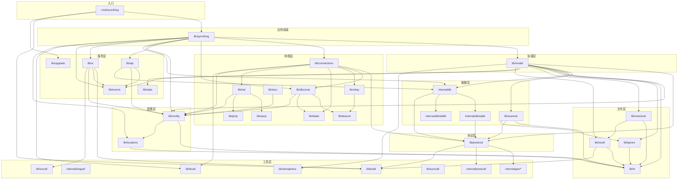

# 依赖图

本页展示 Syncthing 模块间的依赖关系，帮助理解变更影响范围。

## 核心依赖图



## 关键依赖关系详解

### Model 的依赖

`lib/model` 是依赖最广泛的包，它协调几乎所有子系统：

| 依赖 | 用途 | 关键接口 |
| --- | --- | --- |
| `lib/protocol` | BEP 连接、消息类型 | `Connection`, `FileInfo`, `Vector` |
| `lib/scanner` | 文件扫描 | `Walk`, `Blocks` |
| `internal/db` | 文件元数据存储 | `DB`, `FolderDB` |
| `lib/config` | 文件夹和设备配置 | `FolderConfiguration`, `Wrapper` |
| `lib/fs` | 文件系统操作 | `Filesystem` |
| `lib/ignore` | 忽略模式匹配 | `Matcher` |
| `lib/versioner` | 文件版本归档 | `Versioner` |
| `lib/events` | 事件发射 | `Logger` |
| `lib/stats` | 统计记录 | `FolderStatisticsReference` |
| `lib/osutil` | 原子写入、重命名 | `AtomicWriter` |
| `lib/semaphore` | 并发限制 | `Semaphore` |

### Protocol 的依赖反转

`lib/protocol` 通过接口反转依赖，不依赖 `lib/model`：

```go
// lib/protocol/protocol.go:84
type Model interface {
    Index(conn Connection, folder string, files []FileInfo) error
    IndexUpdate(conn Connection, folder string, files []FileInfo) error
    Request(conn Connection, folder, name string, ...) (RequestResponse, error)
    ClusterConfig(conn Connection, config ClusterConfig) error
    Closed(conn Connection, err error)
    DownloadProgress(conn Connection, folder string, updates []FileDownloadProgressUpdate) error
}
```

`lib/model` 实现此接口，`lib/protocol` 通过接口调用。这使 `lib/protocol` 可独立测试。

### Connections 的依赖

`lib/connections` 依赖 `lib/protocol` 创建连接，依赖 `lib/discover` 查找设备地址：

- `NewService` 接收 `discover.Finder` 和 `protocol.Model`
- 通过 `lateAddressLister`（`lib/syncthing/syncthing.go:270`）解决与 `lib/discover` 的循环依赖
- `registry.Registry` 共享给连接服务和发现管理器

### 数据库的分层

```
lib/model
   ↓ (DB 接口)
internal/db (接口层 + Typed)
   ↓ (实现)
internal/db/sqlite (SQLite 后端)
   ↓ (迁移源)
internal/db/olddb (旧 LevelDB)
```

`internal/db` 定义 `DB`/`FolderDB` 接口，`internal/db/sqlite` 提供实现。`internal/db/olddb` 仅用于从旧格式迁移。

### 生成代码依赖

`internal/gen/` 下的包由 protobuf 生成：

| 生成包 | 被谁依赖 | proto 源文件 |
| --- | --- | --- |
| `internal/gen/bep` | `lib/protocol` | `proto/bep/bep.proto` |
| `internal/gen/dbproto` | `internal/db` | `proto/dbproto/` |
| `internal/gen/discoproto` | `lib/discover` | `proto/discoproto/` |
| `internal/gen/apiproto` | `lib/api` | `proto/apiproto/` |

**不要手动编辑生成代码**。修改 proto 文件后运行 `go run build.go proto` 重新生成。

## 循环依赖处理

Syncthing 通过以下方式避免循环依赖：

1. **接口反转**：`lib/protocol` 定义 `Model` 接口，`lib/model` 实现
2. **独立子包**：`lib/ignore/ignoreresult` 独立为子包，打破 `lib/ignore` 与 `lib/model` 的循环
3. **延迟绑定**：`lateAddressLister` 解决 `lib/connections` 与 `lib/discover` 的循环
4. **内部包**：`internal/` 下的包只能被 `lib/` 和 `cmd/` 导入，不能反向依赖

## 变更影响分析

修改某个包时，需检查所有依赖它的包：

| 修改包 | 影响范围 | 检查点 |
| --- | --- | --- |
| `lib/protocol` | 几乎所有包 | 接口变更需更新 model、connections、scanner、db |
| `lib/model` | `lib/syncthing`、`lib/api` | 接口变更需更新 App 组装 |
| `lib/config` | `lib/model`、`lib/connections`、`lib/discover`、`lib/api` | 配置结构变更需更新迁移 |
| `internal/db` | `lib/model`、`lib/api`、`lib/stats` | 接口变更需更新 sqlite 实现 |
| `lib/fs` | 几乎所有文件操作包 | 接口变更需更新所有实现 |
| `lib/scanner` | `lib/model` | 扫描结果变更需更新 model 处理 |
| `lib/connections` | `lib/syncthing` | 连接接口变更需更新 App |

## 外部依赖

关键第三方库（`go.mod`）：

| 库 | 用途 | 被谁使用 |
| --- | --- | --- |
| `github.com/pierrec/lz4/v4` | LZ4 压缩 | `lib/protocol` |
| `github.com/miscreant/miscreant.go` | AES-SIV 加密 | `lib/protocol` (加密文件夹) |
| `golang.org/x/crypto/chacha20poly1305` | ChaCha20-Poly1305 | `lib/protocol` |
| `github.com/jmoiron/sqlx` | SQLite ORM | `internal/db/sqlite` |
| `github.com/mattn/go-sqlite3` | SQLite 驱动 | `internal/db/sqlite` |
| `github.com/thejerf/suture/v4` | 服务管理 | 几乎所有服务 |
| `github.com/gobwas/glob` | glob 模式匹配 | `lib/ignore` |
| `github.com/julienschmidt/httprouter` | HTTP 路由 | `lib/api` |
| `github.com/alecthomas/kong` | CLI 解析 | `cmd/syncthing` |
| `github.com/prometheus/client_golang` | Prometheus 指标 | 多个包 |
| `github.com/ccding/go-stun` | STUN | `lib/stun` |
| `github.com/jackpal/go-nat-pmp` | NAT-PMP | `lib/pmp` |
| `golang.org/x/text/unicode/norm` | Unicode 归一化 | `lib/protocol` (NFC/NFD) |
| `github.com/hashicorp/golang-lru/v2` | LRU 缓存 | `lib/protocol` (密钥缓存) |
