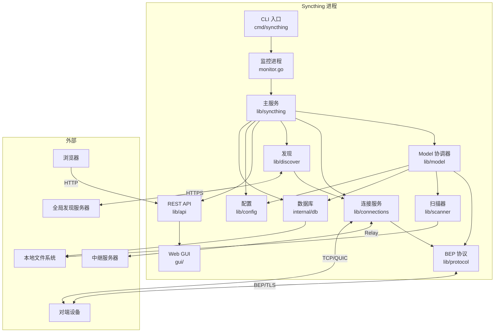
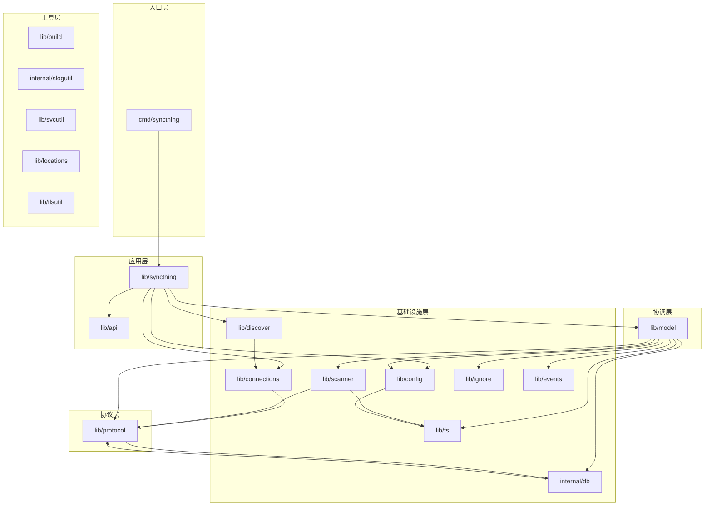

# 架构概览

## 系统定位

Syncthing 是一个**去中心化的持续文件同步程序**。它不依赖中央服务器，设备之间直接通过 BEP（Block Exchange Protocol）同步文件。每台设备持有完整的文件副本，通过版本向量解决冲突。

## 系统边界

## 核心组件

### 1. 双进程监控架构

Syncthing 采用**监控进程 + 工作进程**的双进程架构（`cmd/syncthing/monitor.go`）：

- **监控进程**：负责启动、监控和重启工作进程；捕获 panic 日志并上传崩溃报告
- **工作进程**：实际的 syncthing 服务，包含所有同步逻辑
- **重启策略**：`restartCounts=4`，`restartPause=1s`，`restartLoopThreshold=60s`

这种设计隔离了崩溃影响，工作进程崩溃后监控进程会自动重启它。

### 2. 主服务容器（`lib/syncthing`）

`App` 结构体（`lib/syncthing/syncthing.go:62`）是主服务容器，负责组装和启动所有组件。启动顺序：

1. 添加失败报告处理器（`ur.FailureHandler`）
2. 添加数据库服务
3. 创建事件订阅
4. 最大化文件描述符限制
5. 计算设备 ID（证书 SHA-256）
6. 检查短 ID 冲突
7. 清理已删除文件夹的数据库元数据
8. 执行版本迁移
9. 创建 `KeyGenerator` 和 `Model`
10. 配置 TLS（`NextProtos=["bep/1.0"]`，`InsecureSkipVerify=true` 自验证设备 ID）
11. **解决发现与连接的循环依赖**：使用 `lateAddressLister` 延迟绑定
12. 添加使用报告服务
13. 设置 GUI/API

### 3. Model 协调器（`lib/model`）

Model 是中央协调器，职责包括：

- **连接管理**：跟踪每设备的多个连接，按优先级提升主连接
- **文件夹生命周期**：管理扫描、同步、暂停、恢复
- **索引路由**：将收到的索引分发到对应的 `indexHandler`
- **请求处理**：响应对端的块请求
- **同步流水线**：编排 copier → puller → finisher → dbUpdater

关键设计：使用 `sync.RWMutex` 保护共享状态，**网络操作在锁外执行**以避免死锁。

### 4. BEP 协议（`lib/protocol`）

BEP 是 Syncthing 的核心协议，定义设备间交换的数据格式：

- **握手**：TLS + Hello 消息（魔数 `0x2EA7D90B`）
- **消息类型**：ClusterConfig、Index、IndexUpdate、Request、Response、DownloadProgress、Ping、Close
- **版本向量**：解决并发修改冲突
- **加密支持**：不可信设备场景下的端到端加密
- **流控**：无缓冲 channel 形成天然背压

### 5. 连接服务（`lib/connections`）

统一管理三种连接类型：

| 类型 | 拨号 | 监听 | 优先级 |
| --- | --- | --- | --- |
| TCP | `tcp_dial.go` | `tcp_listen.go` | LAN 高，WAN 中 |
| QUIC | `quic_dial.go` | `quic_listen.go` | LAN 高，WAN 中 |
| Relay | `relay_dial.go` | `relay_listen.go` | 低（最后手段） |

关键机制：
- **并行拨号**：`dialMaxParallel=64`，按优先级分桶，第一个成功即用
- **端口复用**：`SO_REUSEPORT` 让传出端口与监听端口一致
- **冷却机制**：防止对频繁断开的设备过度重拨
- **限速**：全局 + 每设备双层限速

### 6. 数据库（`internal/db`）

采用 **per-folder SQLite 数据库**架构：

- 每个文件夹独立 SQLite 文件，主数据库仅存储 folder 索引和全局 KV
- WAL 模式提高并发读性能
- 触发器自动维护计数表
- 名称和版本规范化减少存储空间
- 6 个 schema 迁移记录设计演进

### 7. 配置系统（`lib/config`）

- **版本迁移**：从 v10 到 v52 的渐进式迁移
- **观察者模式**：`Wrapper` 提供配置变更通知
- **双序列化**：XML（配置文件）+ JSON（API）
- **防抖保存**：`minSaveInterval=5s` 避免频繁写入

## 依赖方向

核心依赖方向遵循**分层架构**：

**关键依赖原则**：
- `lib/protocol` **不依赖** `lib/model`（通过 `Model` 接口反转依赖）
- `lib/model` 依赖 `lib/protocol` 但不依赖 `lib/connections`
- `lib/connections` 依赖 `lib/protocol` 和 `lib/discover`
- 工具层被所有上层依赖，但不依赖上层

## 安全边界

### 信任模型

- **设备 ID**：SHA-256(证书)，32 字节，自验证（不信任 CA 证书链）
- **TLS 配置**：`InsecureSkipVerify=true`，因为 Syncthing 自己验证设备 ID 而非依赖 PKI
- **加密文件夹**：不可信设备只能看到加密数据，文件名和块 hash 均加密

### 路径安全

- `checkFilename`（`lib/protocol/protocol.go:662`）防止路径遍历攻击
- 禁止 `..`、绝对路径、非规范路径
- 违反则视为协议错误，断开连接

### 协议一致性

- `checkIndexConsistency` 校验 FileInfo 不变量
- 已删除文件不能有 blocks
- 非文件类型不能有 blocks
- 违反则断开连接

## 设计决策与权衡

### 1. 去中心化 vs 中央服务器

**选择**：完全去中心化，设备间直接同步。
**权衡**：无需中央服务器，但需要设备发现机制（全局发现服务器仅用于地址查找，不参与同步）。

### 2. 版本向量 vs 时间戳

**选择**：版本向量（`lib/protocol/vector.go`）。
**权衡**：能正确处理并发修改，但需要存储每个设备的计数器。时钟回拨通过 `max(Value+1, now)` 防护。

### 3. Per-folder 数据库 vs 单一数据库

**选择**：每个文件夹独立 SQLite 文件。
**权衡**：减少单个数据库大小，提高并发性能，但增加管理复杂度。

### 4. 无缓冲 channel 流控

**选择**：BEP 消息 channel 全部无缓冲。
**权衡**：天然背压，防止内存爆炸，但可能降低吞吐量。

### 5. 双进程监控

**选择**：监控进程 + 工作进程。
**权衡**：崩溃隔离和自动重启，但增加进程管理复杂度。

### 6. 自验证设备 ID vs PKI

**选择**：设备 ID = SHA-256(证书)，自验证。
**权衡**：无需 CA，但设备 ID 必须通过带外渠道交换。

## 关键不变量

1. **设备 ID = 证书 SHA-256**：确定性，32 字节
2. **版本向量单调递增**：`Update` 取 `max(Value+1, now)` 防回拨
3. **ClusterConfig 优先**：必须是握手后第一条消息
4. **LocalFlags 不上 wire**：内部状态不通过协议传输
5. **wire 文件名规范**：NFC + 正斜杠 + folder-relative + 无 `..`
6. **网络操作在锁外**：Model 的 `mut` 锁内不执行网络调用
7. **folder Serve 串行化**：单 goroutine 处理所有状态变更
8. **copyNeeded + pullNeeded == 0**：sharedPullerState 完成条件
