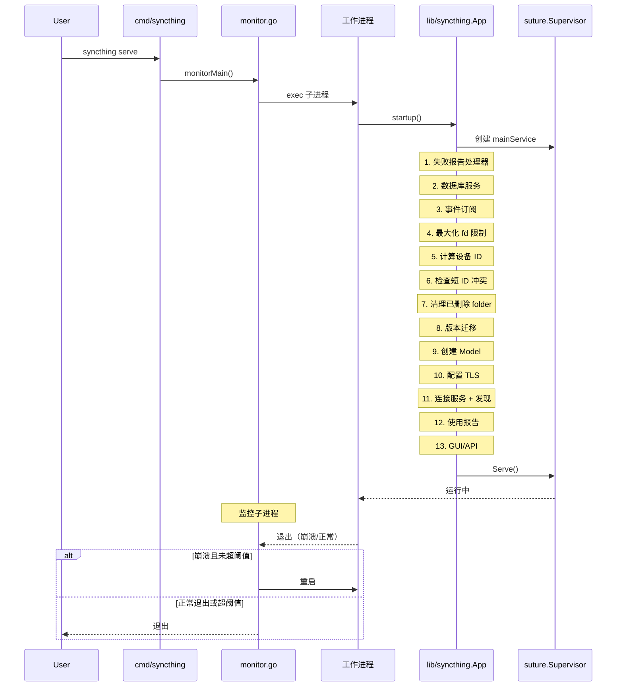
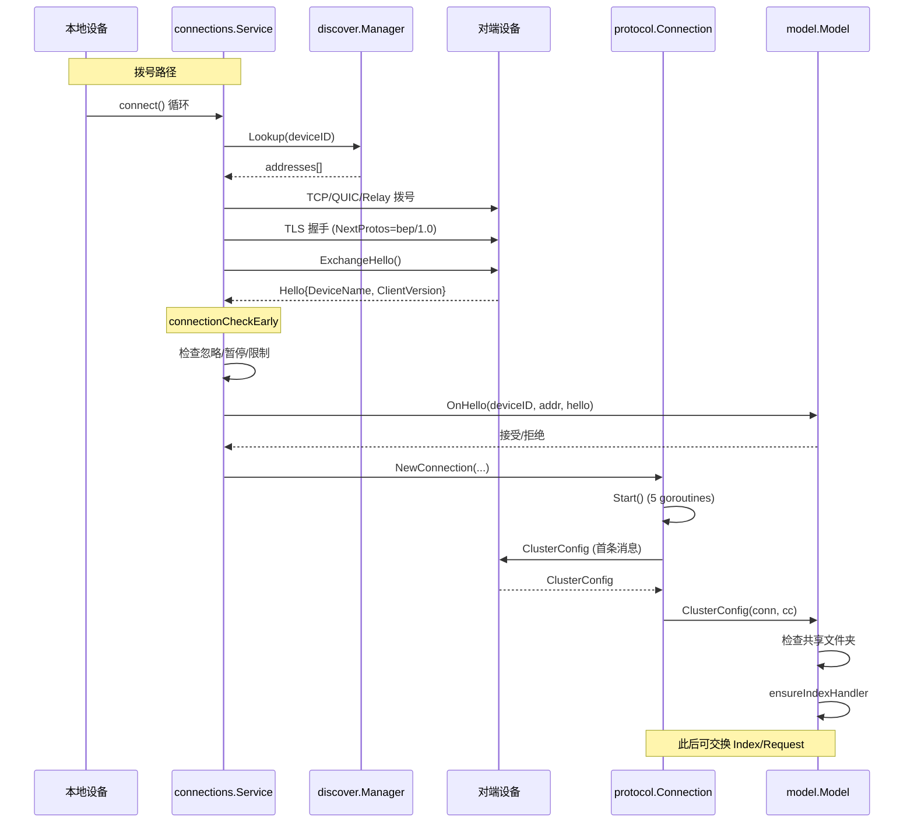
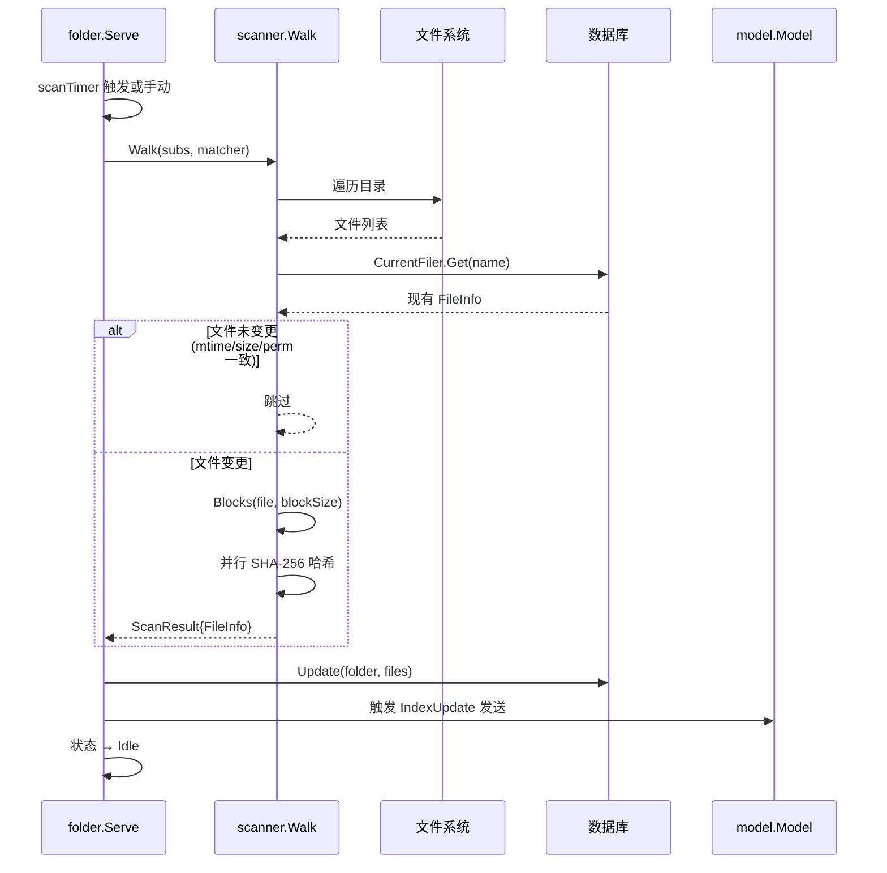
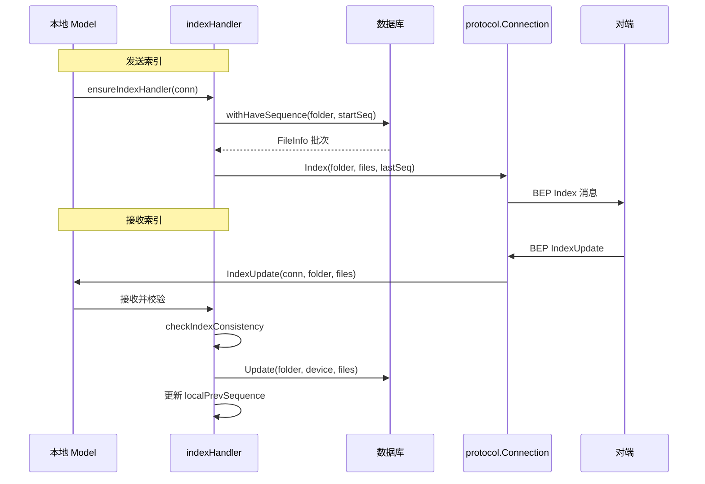
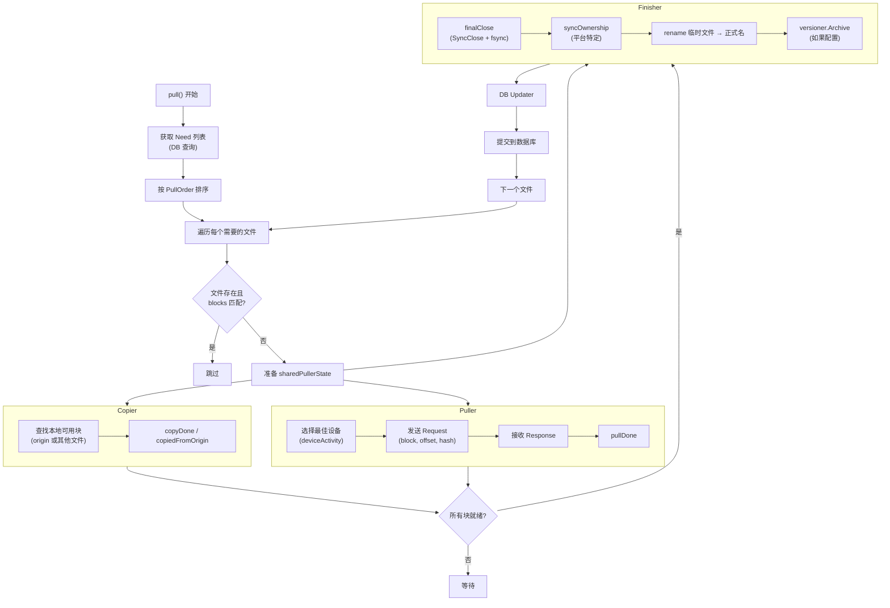
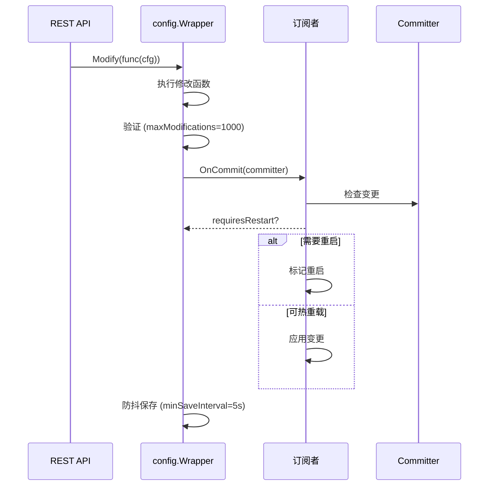
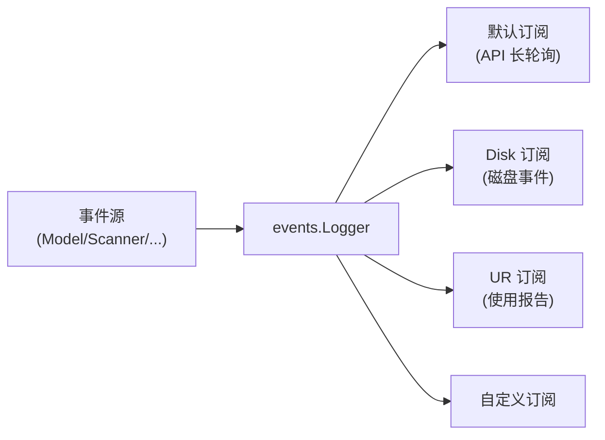

# 运行时流程

本页追踪 Syncthing 的主要运行时路径，从启动到文件同步的完整链路。

## 启动流程

启动顺序的关键细节见 `lib/syncthing/syncthing.go:129-330`。第 11 步使用 `lateAddressLister` 解决发现与连接的循环依赖：先创建 `connectionsService`，再将其绑定到 `discoveryManager` 的 `AddressLister`。

## 连接建立流程

### 拨号策略

拨号循环（`lib/connections/service.go:447`）维护 `nextDialRegistry` 记录每设备+地址的下次拨号时间：

1. **初始退避**：1s → 2s → 4s → ... → `stdConnectionLoopSleep`(60s)
2. **并行拨号**：`dialMaxParallel=64` 信号量，按优先级分桶
3. **冷却机制**：`dialCoolDownInterval=2min`，`dialCoolDownMaxAttempts=3`
4. **队列排序**：最近看到的设备优先，短生命周期设备排后

### 连接接受路径

监听器接受的连接通过 `s.conns` channel 进入 `handleConns`（`service.go:242`）：

1. 检查 BEP 协议协商（警告但不拒绝，兼容 iOS）
2. 验证对端证书数量为 1
3. 计算对端设备 ID
4. 拒绝自连接（NAT hairpinning）
5. `connectionCheckEarly`：拒绝忽略/暂停/超限设备
6. 20 秒超时内异步交换 Hello
7. 生成 connectionID（基于双方时间戳 + 随机数）

## 文件同步流程

### 扫描阶段

扫描器（`lib/scanner/walk.go`）的关键行为：
- **增量扫描**：通过 `Subs` 指定子路径，仅扫描变更部分
- **忽略规则**：`Matcher` 应用 `.stignore` 模式
- **并行哈希**：`Hashers` 控制并行度，`sync.Pool` 复用 buffer 和哈希器
- **块大小**：默认 128KB，大块模式按文件大小动态调整（目标 2000 块/文件）

### 索引交换阶段

索引处理（`lib/model/indexhandler.go`）的关键不变量：
- `localPrevSequence`：DB 迭代游标，单调递增
- `sentPrevSequence`：已发送给对端的序列号，单调递增
- `IndexID`：标识索引序列，重连后判断是否需要全量重发
- `PrevSequence`（IndexUpdate 独有）：让接收方检测缺失批次

### 拉取阶段（send-receive 文件夹）

这是最复杂的流程，在 `lib/model/folder_sendrecv.go` 中实现：

#### sharedPullerState 状态机

每个正在拉取的文件有一个 `sharedPullerState`（`lib/model/sharedpullerstate.go`），跟踪块的就绪状态：

- `copyNeeded`：还需从本地复制的块数
- `pullNeeded`：还需从网络拉取的块数
- **完成条件**：`copyNeeded + pullNeeded == 0`
- `finalClose`：同步并关闭临时文件，写入加密 trailer（如适用），rename 为正式名

#### 块拉取调度

`deviceActivity`（`lib/model/deviceactivity.go`）实现负载均衡：
- 跟踪每设备的在途请求数
- 选择负载最低的设备
- `blockPullReorderer` 优化拉取顺序（顺序/随机/标准）

#### 冲突处理

当本地和远端同时修改同一文件时：
1. `WinsConflict`（`lib/protocol/bep_fileinfo.go:212`）仲裁：
   - 仅一方 invalid → 非 invalid 方胜
   - 修改时间更晚者胜
   - 时间相等 → 版本向量 `ConcurrentGreater` 决定
2. 败方文件被重命名为冲突文件（`name.sync-conflict-YYYYMMDD-HHMMSS-DEVICE.ext`）

## 配置变更流程

配置变更通过观察者模式通知所有订阅者（Model、Connections、Discover 等）。`Committer` 接口允许订阅者区分 `requiresRestart`（需重启）和普通变更。

## 事件流

事件系统（`lib/events/events.go`）使用位掩码订阅，30+ 事件类型。API 端点使用**长轮询**（非 WebSocket）：先 flush 响应头，再阻塞等待事件（`lib/api/api.go:1356`）。

## 关键定时器

| 组件 | 定时器 | 间隔 | 触发条件 |
| --- | --- | --- | --- |
| Folder 扫描 | `scanTimer` | 配置 `RescanInterval` | 默认 1 小时 |
| Folder 拉取 | `pullPause` | 指数退避 | 失败时翻倍，上限 60x |
| 连接拨号 | `connect` 循环 | `stdConnectionLoopSleep` | 60 秒 |
| BEP Ping | `pingSender` | `PingSendInterval/2` | 45 秒 |
| BEP 超时 | `pingReceiver` | `ReceiveTimeout/2` | 150 秒检查 |
| 全局发现 | `sendAnnouncement` | `defaultReannounceInterval` | 30 分钟 |
| 本地发现 | `sendLocalAnnouncements` | `BroadcastInterval` | 30 秒 |
| STUN 保活 | `stunKeepAlive` | 自适应 | 端口变化时减半 |
| 使用报告 | `Service` | 24 小时 | 首次延迟 10s-1m |
