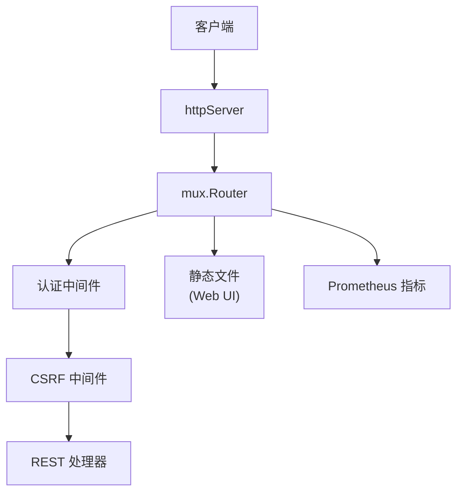

# API 模块

## 概述

`lib/api/` 实现 Syncthing 的 REST API 和 Web UI HTTP 服务器，约 4500 行 Go 代码。

## 职责

- **REST API**：JSON API 供客户端调用
- **Web UI**：静态文件服务器
- **CSRF 防护**：基于 Cookie 的 CSRF 令牌
- **认证**：API Key 或 Basic Auth
- **CORS**：跨域资源共享

## 架构

## 关键文件

| 文件 | 行数 | 职责 |
| --- | ---: | --- |
| `api.go` | ~1500 | REST API 端点 |
| `httpserver.go` | ~300 | HTTP 服务器、路由、中间件 |
| `csrf.go` | ~100 | CSRF 令牌管理 |
| `config.go` | ~200 | 配置相关 API |
| `debug.go` | ~200 | 调试端点 |
| `events.go` | ~100 | 事件订阅端点 |

## REST API 端点

### 系统

| 端点 | 方法 | 说明 |
| --- | --- | --- |
| `/rest/system/ping` | POST | 测试连接 |
| `/rest/system/status` | GET | 系统状态 |
| `/rest/system/version` | GET | 版本信息 |
| `/rest/system/config` | GET/PUT | 配置读写 |
| `/rest/system/connections` | GET | 连接列表 |
| `/rest/system/scan` | POST | 触发扫描 |
| `/rest/system/restart` | POST | 重启 |
| `/rest/system/shutdown` | POST | 关闭 |
| `/rest/system/pause` | POST | 暂停设备 |
| `/rest/system/resume` | POST | 恢复设备 |
| `/rest/system/log` | GET | 日志 |
| `/rest/system/upgrade` | POST | 升级 |

### 数据库

| 端点 | 方法 | 说明 |
| --- | --- | --- |
| `/rest/db/status` | GET | 文件夹状态 |
| `/rest/db/browse` | GET | 浏览文件 |
| `/rest/db/completion` | GET | 完成度 |
| `/rest/db/ignores` | GET/POST | 忽略规则 |
| `/rest/db/need` | GET | 需要的文件 |
| `/rest/db/remoteneed` | GET | 远端需要的文件 |
| `/rest/db/scan` | POST | 扫描文件夹 |

### 文件夹

| 端点 | 方法 | 说明 |
| --- | --- | --- |
| `/rest/folder/versions` | GET | 文件版本 |
| `/rest/folder/errors` | GET | 文件夹错误 |
| `/rest/folder/pullerrors` | GET | 拉取错误（旧） |

### 事件

| 端点 | 方法 | 说明 |
| --- | --- | --- |
| `/rest/events` | GET | 事件流（已废弃） |
| `/rest/events/disk` | GET | 磁盘事件流 |

### 集群

| 端点 | 方法 | 说明 |
| --- | --- | --- |
| `/rest/cluster/pending/devices` | GET | 待处理设备 |
| `/rest/cluster/pending/folders` | GET | 待处理文件夹 |

### 指标

| 端点 | 方法 | 说明 |
| --- | --- | --- |
| `/rest/metrics` | GET | Prometheus 指标 |

## 认证

### API Key

- `X-API-Key` 头
- 配置中的 `GUI.APIKey`

### Basic Auth

- `GUI.User`/`GUI.Password`
- 密码使用 bcrypt 存储

### CSRF

- Cookie `CSRF-Token` 与头 `X-CSRF-Token` 匹配
- GET/HEAD/OPTIONS 豁免

## Web UI

- 静态文件从 `gui/` 目录或嵌入资源提供
- 默认主题 `default`
- 支持自定义主题

## 配置

| 配置项 | 说明 |
| --- | --- |
| `GUI.Address` | 监听地址 |
| `GUI.UnixSocket` | Unix socket |
| `GUI.User`/`Password` | 认证 |
| `GUI.APIKey` | API 密钥 |
| `GUI.Theme` | 主题 |
| `GUI.InsecureAdminAccess` | 跳过认证 |

## 测试覆盖

`api_test.go`、`httpserver_test.go`、`csrf_test.go`：

- 端点测试
- 认证测试
- CSRF 测试
- 配置读写测试
