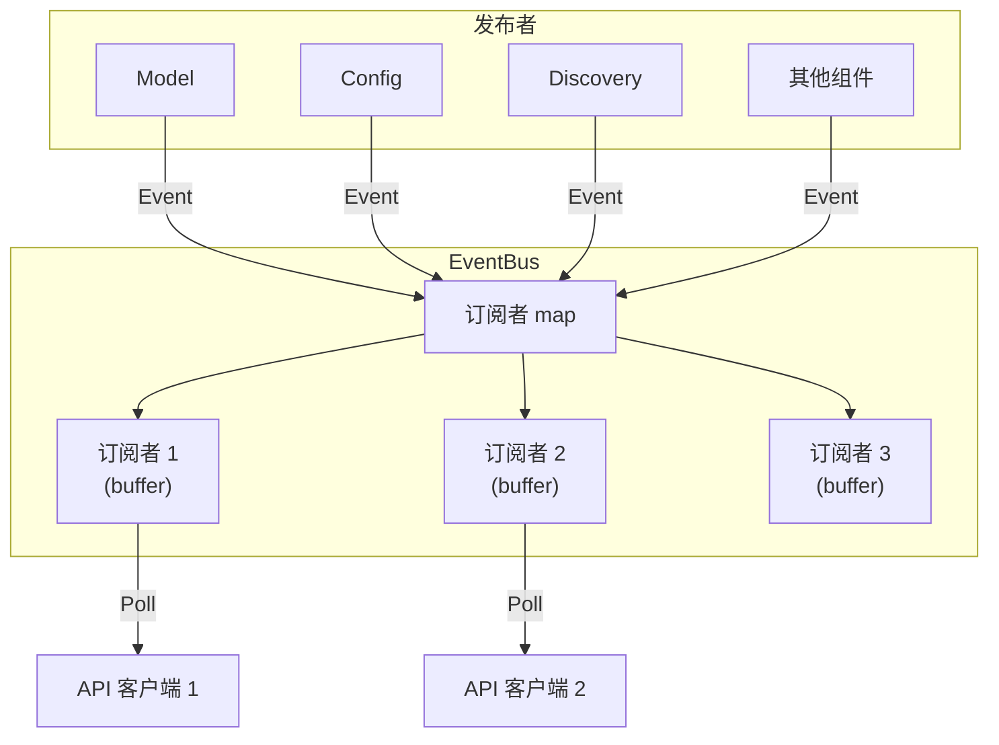

# 事件模块

## 概述

`lib/events/` 实现 Syncthing 的事件总线，约 800 行 Go 代码。基于发布-订阅模式，允许组件广播事件，客户端订阅感兴趣的事件类型。

## 职责

- **事件广播**：组件发布事件
- **事件订阅**：客户端订阅事件
- **事件缓冲**：订阅者独立缓冲，避免相互阻塞
- **超时控制**：订阅者可设置超时

## 架构



## 事件类型

| 类型 | 说明 |
| --- | --- |
| `StartupComplete` | 启动完成 |
| `DeviceConnected` | 设备连接 |
| `DeviceDisconnected` | 设备断开 |
| `DeviceDiscovered` | 设备发现 |
| `DeviceRejected` | 设备拒绝 |
| `DevicePaused` | 设备暂停 |
| `DeviceResumed` | 设备恢复 |
| `FolderRejected` | 文件夹拒绝 |
| `FolderPaused` | 文件夹暂停 |
| `FolderResumed` | 文件夹恢复 |
| `FolderScanProgress` | 扫描进度 |
| `FolderCompletion` | 完成度 |
| `FolderErrors` | 文件夹错误 |
| `FolderSummary` | 文件夹摘要 |
| `FolderWatchStateChanged` | 监视状态变更 |
| `ItemStarted` | 文件开始同步 |
| `ItemFinished` | 文件完成同步 |
| `StateChanged` | 状态变更 |
| `ConfigSaved` | 配置保存 |
| `LocalChangeDetected` | 本地变更检测 |
| `RemoteChangeDetected` | 远端变更检测 |
| `PendingDevicesChanged` | 待处理设备变更 |
| `PendingFoldersChanged` | 待处理文件夹变更 |
| `DownloadProgress` | 下载进度 |

## 关键文件

| 文件 | 行数 | 职责 |
| --- | ---: | --- |
| `events.go` | ~400 | `Event` 结构体、`Logger` 接口 |
| `buffered.go` | ~300 | `BufferedSubscription`、缓冲订阅 |
| `debug.go` | ~100 | 调试订阅 |

## Event 结构体

```go
type Event struct {
    Time      time.Time      `json:"time"`
    Type      EventType      `json:"type"`
    Subsystem string         `json:"subsystem"`
    Data      map[string]interface{} `json:"data"`
}
```

## Logger 接口

```go
type Logger interface {
    Log(t EventType, data map[string]interface{})
}
```

`Logger` 是无操作的默认实现，`BufferedLogger` 提供缓冲订阅。

## BufferedSubscription

```go
type BufferedSubscription struct {
    events chan Event
    mask   EventType
    ...
}
```

### Poll

```go
func (s *BufferedSubscription) Poll(timeout time.Duration) ([]Event, error)
```

- 阻塞等待事件或超时
- 返回所有缓冲的事件
- 超时返回 `ErrTimeout`

### 缓冲

- 每个订阅者独立缓冲
- 缓冲满时丢弃旧事件（避免阻塞发布者）
- 默认缓冲大小 1000

## 集成

### API

`/rest/events` 端点订阅事件：

1. 客户端请求 `/rest/events?since=123`
2. API 创建订阅者
3. 轮询事件
4. 返回 `since` 之后的事件

### 组件

各组件通过 `events.Logger` 发布事件：

```go
model.evLogger.Log(events.FolderScanProgress, map[string]interface{}{
    "folder":  folder,
    "current": current,
    "total":   total,
})
```

## 测试覆盖

`events_test.go`、`buffered_test.go`：

- 发布/订阅测试
- 缓冲溢出测试
- 超时测试
- 掩码过滤测试

## 设计权衡

### 独立缓冲 vs 共享缓冲

**选择**：每个订阅者独立缓冲。
**优势**：慢订阅者不影响快订阅者。
**劣势**：内存使用随订阅者增加。

### 丢弃旧事件 vs 阻塞

**选择**：缓冲满时丢弃旧事件。
**优势**：发布者不被阻塞。
**劣势**：订阅者可能丢失事件。

### 轮询 vs 推送

**选择**：轮询（Poll）。
**优势**：简单，兼容 HTTP。
**劣势**：延迟，增加请求开销。
