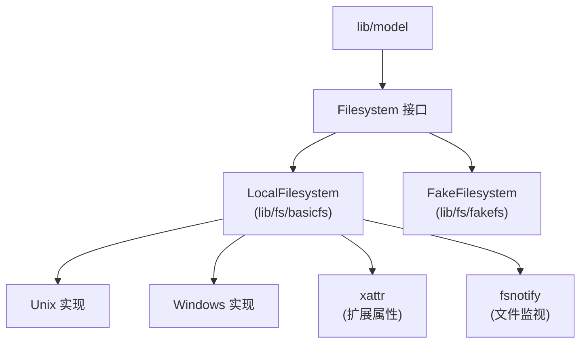

# 文件系统模块

## 概述

`lib/fs/` 实现文件系统抽象层，约 5000 行 Go 代码。支持本地文件系统、fake 文件系统（测试）和多种平台。

## 职责

- **文件系统抽象**：统一接口访问不同文件系统
- **平台适配**：处理 Windows/Unix 差异
- **路径处理**：归一化、清理、相对路径
- **扩展属性**：xattr 支持（平台相关）
- **文件监视**：fsnotify 集成

## 架构



## Filesystem 接口

```go
type Filesystem interface {
    Chmod(name string, mode FileMode) error
    Chtimes(name string, atime, mtime time.Time) error
    Create(name string) (File, error)
    CreateSymlink(target, name string) error
    DirNames(dir string) ([]string, error)
    Lstat(name string) (FileInfo, error)
    Mkdir(name string, perm FileMode) error
    MkdirAll(name string, perm FileMode) error
    Open(name string) (File, error)
    OpenFile(name string, flags int, mode FileMode) (File, error)
    ReadSymlink(name string) (string, error)
    Remove(name string) error
    RemoveAll(name string) error
    Rename(oldname, newname string) error
    Stat(name string) (FileInfo, error)
    Walk(name string, walkFn WalkFunc) error
    ...
}
```

## 关键文件

| 文件 | 位置 | 职责 |
| --- | --- | --- |
| `fs.go` | `lib/fs/` | 接口定义、注册 |
| `basicfs.go` | `lib/fs/basicfs/` | 本地文件系统实现 |
| `fakefs.go` | `lib/fs/fakefs/` | 测试用虚拟文件系统 |
| `xattr.go` | `lib/fs/basicfs/` | 扩展属性 |
| `watch.go` | `lib/fs/basicfs/` | 文件监视 |
| `case_fs.go` | `lib/fs/basicfs/` | 大小写不敏感文件系统 |
| `mfs.go` | `lib/fs/` | 多文件系统注册 |

## 文件系统类型

```go
const (
    FilesystemTypeBasic FilesystemType = 0  // 本地
    FilesystemTypeFake  FilesystemType = 1  // 测试
)
```

`NewFilesystem(type, root)` 根据类型创建文件系统。

## LocalFilesystem

`lib/fs/basicfs/basicfs.go`：

- 包装 `os` 包函数
- 处理路径归一化
- 支持符号链接
- 平台特定的权限处理

### 路径处理

- `URI()` 返回 `file://` URI
- `resolved()` 解析真实路径
- 大小写不敏感文件系统（macOS、Windows）通过 `case_fs.go` 处理

## FakeFilesystem

`lib/fs/fakefs/fakefs.go`：

- 内存中的虚拟文件系统
- 用于测试
- 支持所有 Filesystem 接口方法
- 可模拟错误

## 扩展属性（xattr）

`lib/fs/basicfs/xattr.go`：

- `Getxattr`/`Setxattr`/`Listxattr`/`Removexattr`
- Linux：`user.*` 命名空间
- macOS：任意命名空间
- Windows：不支持

用于存储 Syncthing 特定元数据（如忽略标记）。

## 文件监视

`lib/fs/basicfs/watch.go`：

- 基于 `fsnotify` 库
- `Watch(path, ignoreFn, ctx)` 监视路径
- 通过 channel 通知变更
- 支持递归监视

## 大小写不敏感

`lib/fs/basicfs/case_fs.go`：

- `CaseFilesystem` 包装 `BasicFilesystem`
- 处理大小写不敏感的文件系统（macOS、Windows）
- `realCase` 解析真实大小写路径
- 缓存大小写映射

## 平台差异

### Unix

- 权限位完整支持
- 符号链接完整支持
- xattr 支持

### Windows

- 权限位部分支持（只读 vs 读写）
- 符号链接需要管理员权限
- 无 xattr
- 路径使用反斜杠

### macOS

- 权限位完整支持
- 符号链接完整支持
- xattr 支持
- 大小写不敏感（默认）

## 测试覆盖

`basicfs_test.go`、`fakefs_test.go`、`case_fs_test.go`、`xattr_test.go`：

- 接口方法测试
- 平台差异测试
- 大小写不敏感测试
- xattr 测试

## 设计权衡

### 抽象层 vs 直接使用 os

**选择**：抽象层。
**优势**：支持测试（fakefs）、平台适配。
**劣势**：增加间接性，性能开销。

### fakefs vs 临时目录

**选择**：fakefs 用于测试。
**优势**：快速，不污染文件系统。
**劣势**：可能与真实行为有差异。

### 大小写处理

**选择**：`CaseFilesystem` 包装。
**优势**：透明处理大小写不敏感。
**劣势**：增加复杂度和缓存。
