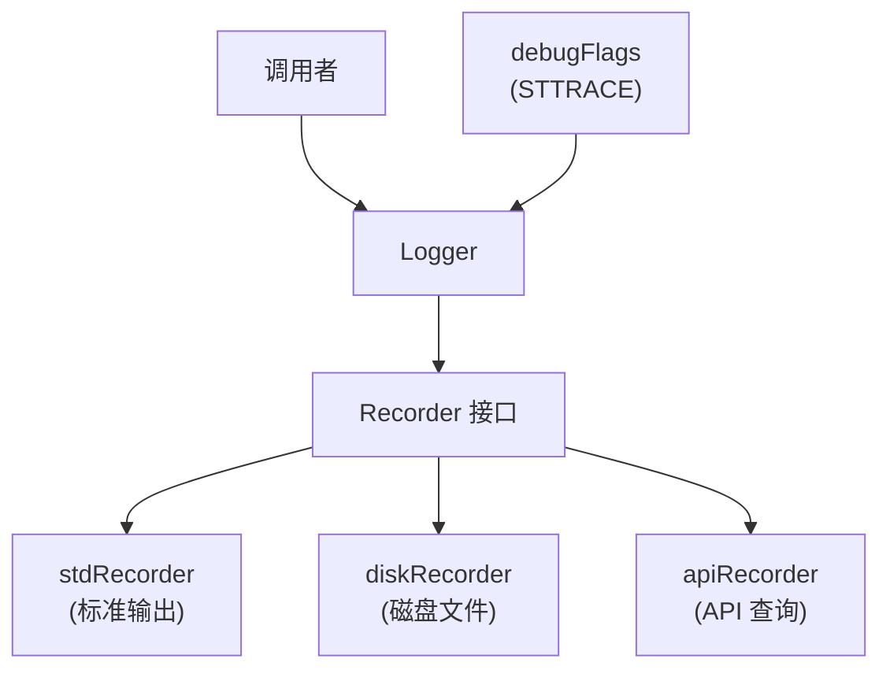

# Logger 模块

## 概述

`lib/logger/` 实现 Syncthing 的日志系统，约 1500 行 Go 代码。支持分级日志、子系统调试、磁盘日志和 API 日志。

## 职责

- **分级日志**：Debug/Info/Warn/Error
- **子系统调试**：`STTRACE` 环境变量
- **磁盘日志**：循环日志文件
- **API 日志**：通过 REST API 查询
- **颜色输出**：终端颜色（可选）

## 架构



## 关键文件

| 文件 | 行数 | 职责 |
| --- | ---: | --- |
| `logger.go` | ~400 | `Logger`、`Recorder` 接口 |
| `recorder.go` | ~300 | `stdRecorder`、`diskRecorder` |
| `api.go` | ~200 | API 日志查询 |
| `debug.go` | ~100 | 调试标志管理 |

## Logger 接口

```go
type Logger interface {
    Debugln(...interface{})
    Debugf(string, ...interface{})
    Infoln(...interface{})
    Infof(string, ...interface{})
    Warnln(...interface{})
    Warnf(string, ...interface{})
    Errorln(...interface{})
    Errorf(string, ...interface{})
    ShouldDebug(facility string) bool
    NewFacility(string) Logger
}
```

## Recorder 接口

```go
type Recorder interface {
    Record(level, facility, msg string)
    MakeLogger(level) Logger
}
```

### stdRecorder

- 输出到 stdout
- 支持颜色（`--color` 标志）
- 格式：`[时间] [级别] [子系统] 消息`

### diskRecorder

- 循环日志文件
- 默认 10 个文件，每个 1MB
- 路径：`~/.local/state/syncthing/logs/`

### apiRecorder

- 内存缓冲
- 通过 `/rest/system/log` 查询
- 最近 1000 条日志

## STTRACE 调试

`STTRACE=model,protocol` 启用指定子系统的 Debug 日志：

```go
func (l *logger) ShouldDebug(facility string) bool {
    return debugFlags.ShouldDebug(facility)
}
```

`debugFlags` 解析 `STTRACE` 环境变量：

- `STTRACE=*` — 所有子系统
- `STTRACE=model,protocol` — 指定子系统
- `STTRACE=help` — 显示可用子系统

## 日志级别

| 级别 | 说明 |
| --- | --- |
| `LevelDebug` | 调试信息（需 STTRACE 启用） |
| `LevelInfo` | 正常操作 |
| `LevelWarn` | 警告 |
| `LevelError` | 错误 |

## logflags

`--logflags` 参数控制日志格式：

| 值 | 说明 |
| --- | --- |
| `1` | 显示日期 |
| `2` | 显示时间 |
| `4` | 显示文件名 |
| `8` | 显示短文件名 |
| `16` | 显示行号 |

默认 `3`（日期+时间）。

## 集成

各组件通过 `logger.DefaultLogger.NewFacility("model")` 创建子系统 logger：

```go
l := logger.DefaultLogger.NewFacility("model")
l.Debugln("scanning folder", folder)
l.Infof("connected to %s", deviceID)
```

## 测试覆盖

`logger_test.go`、`recorder_test.go`：

- 日志记录测试
- 磁盘循环测试
- 调试标志测试

## 设计权衡

### 多 Recorder vs 单一输出

**选择**：多 Recorder（stdout + 磁盘 + API）。
**优势**：同时支持多种消费方式。
**劣势**：增加复杂度。

### 磁盘循环日志

**选择**：固定大小循环（10 × 1MB）。
**优势**：限制磁盘使用。
**劣势**：可能丢失旧日志。

### STTRACE 子系统

**选择**：基于子系统的调试标志。
**优势**：精确控制调试输出。
**劣势**：需要知道子系统名称。
