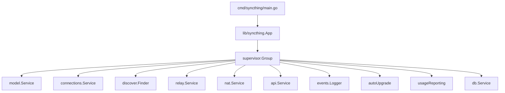

# 顶层服务编排

## 概述

`lib/syncthing/` 是 Syncthing 的顶层服务编排层，约 2000 行 Go 代码。协调所有子系统的启动、停止和配置变更。

## 职责

- **服务编排**：协调所有子系统的生命周期
- **配置管理**：响应配置变更
- **事件分发**：连接各组件的事件流
- **优雅关闭**：有序停止所有服务

## 架构



## App 结构体

```go
type App struct {
    cfg       config.Wrapper
    evLogger  events.Logger
    model     model.Model
    ...
    supervisor *supervisor.Group
}
```

## 启动流程

`App.Start()`：

1. **初始化基础设施**
   - 加载配置
   - 创建事件日志
   - 创建数据库

2. **创建核心服务**
   - `model.NewModel` — 同步引擎
   - `connections.NewService` — 连接管理
   - `discover.NewDiscoverer` — 设备发现
   - `nat.NewService` — NAT 穿透

3. **创建辅助服务**
   - `api.New` — REST API
   - `events.NewBufferedSubscription` — 事件订阅
   - `upgrade.NewAutoUpgrader` — 自动升级
   - `ur.NewUsageReportingManager` — 使用率报告

4. **注册配置订阅者**
   - 所有服务实现 `config.Subscriber`

5. **启动 supervisor**
   - 按依赖顺序启动所有服务
   - 监控服务健康

## Supervisor

`lib/svcutil/supervisor.go`：

```go
type Group struct {
    services []Service
    ...
}

type Service interface {
    Start() error
    Stop() error
    Wait() error
    String() string
}
```

### 服务顺序

1. 数据库
2. 事件日志
3. Model
4. 连接服务
5. 发现服务
6. NAT 服务
7. API
8. 自动升级
9. 使用率报告

### 错误处理

- 任一服务失败，停止所有服务
- `Stop()` 有序停止
- `Wait()` 等待所有服务退出

## 配置变更

`App` 实现配置订阅：

1. `config.Wrapper` 通知变更
2. `App.CommitConfiguration` 分发到各服务
3. 各服务响应自己的配置变更
4. 错误则回滚

## 优雅关闭

`App.Stop()`：

1. 停止接受新连接
2. 完成进行中的同步
3. 保存配置
4. 关闭数据库
5. 退出

## 重启

`STRESTART` 环境变量控制重启行为：

- `0`：不自动重启
- 非 `0`：退出码 3 触发重启

## 关键文件

| 文件 | 行数 | 职责 |
| --- | ---: | --- |
| `syncthing.go` | ~800 | `App` 结构体、启动/停止 |
| `debug.go` | ~200 | 调试支持 |
| `supervisor.go` | `lib/svcutil/` | 服务组管理 |

## 测试覆盖

`syncthing_test.go`：

- 启动/停止测试
- 配置变更测试

## 设计权衡

### Supervisor vs 独立 goroutine

**选择**：Supervisor 统一管理。
**优势**：有序启动/停止，错误处理集中。
**劣势**：增加抽象层。

### 配置订阅 vs 轮询

**选择**：订阅模式。
**优势**：实时响应变更。
**劣势**：顺序依赖复杂。
