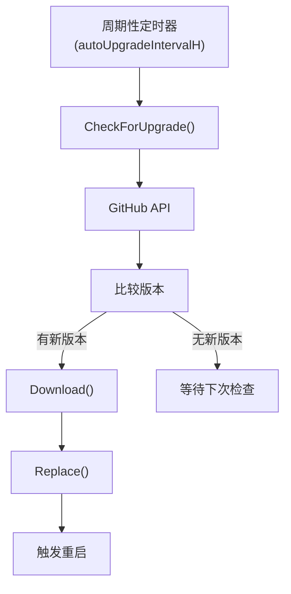

# 升级模块

## 概述

`lib/upgrade/` 和 `internal/upgrade/` 实现 Syncthing 的自动升级功能，约 800 行 Go 代码。支持从 GitHub Releases 下载并替换二进制。

## 职责

- **版本检查**：查询最新版本
- **下载**：下载新版本二进制
- **替换**：替换当前二进制
- **重启**：触发重启

## 架构



## 关键文件

| 文件 | 位置 | 行数 | 职责 |
| --- | --- | ---: | --- |
| `upgrade.go` | `lib/upgrade/` | ~200 | 公共接口 |
| `common.go` | `internal/upgrade/` | ~300 | 通用升级逻辑 |
| `github.go` | `internal/upgrade/` | ~200 | GitHub Releases 集成 |

## 公共接口

```go
func LatestRelease(version string) (Release, error)
func DownloadRelease(url string) (io.ReadCloser, error)
func ReplaceExecutable(url string) error
```

## Release 结构体

```go
type Release struct {
    Tag    string  // 版本标签，如 "v1.27.0"
    Prerelease bool
    Assets []Asset
}

type Asset struct {
    Name string
    URL  string
}
```

## 版本比较

`compareVersions(a, b string)` 比较语义版本号：

1. 解析 `MAJOR.MINOR.PATCH`
2. 逐段比较
3. 预发布版本低于正式版本

## 下载流程

1. `LatestRelease` 查询 GitHub API
2. 找到匹配当前 OS/架构 的 asset
3. `DownloadRelease` 下载
4. 验证校验和（如提供）
5. `ReplaceExecutable` 替换

## ReplaceExecutable

`internal/upgrade/common.go`：

1. 下载新二进制到临时文件
2. 设置可执行权限
3. 重命名替换当前二进制
   - Unix：`rename`（原子）
   - Windows：先删除旧文件再重命名
4. 返回，由调用方触发重启

## 平台特定

### Unix

- 直接 `os.Rename` 替换
- 原子操作

### Windows

- 不能替换运行中的可执行文件
- 标记删除并重命名
- 下次启动时清理

## 配置

| 配置项 | 默认值 | 说明 |
| --- | --- | --- |
| `autoUpgradeIntervalH` | 12 | 检查间隔（小时） |
| `STNOUPGRADE` | — | 禁用升级 |
| `--no-upgrade` | — | 禁用升级 |

## 集成

`lib/syncthing` 中的 `autoUpgrade` 服务：

1. 周期性触发检查
2. 调用 `upgrade.LatestRelease`
3. 比较版本
4. 下载并替换
5. 通过事件总线通知
6. 触发重启

## 测试覆盖

`upgrade_test.go`、`common_test.go`：

- 版本比较测试
- 下载测试（mock HTTP）
- 替换测试

## 设计权衡

### 自动 vs 手动升级

**选择**：默认自动，可禁用。
**优势**：保持最新版本。
**劣势**：可能引入不兼容变更。

### GitHub Releases vs 自定义服务器

**选择**：GitHub Releases。
**优势**：无需维护下载服务器。
**劣势**：依赖 GitHub 可用性。

### 原子替换 vs 覆盖

**选择**：Unix 原子替换，Windows 标记删除。
**优势**：Unix 原子性，Windows 兼容性。
**劣势**：Windows 可能需要重启。
