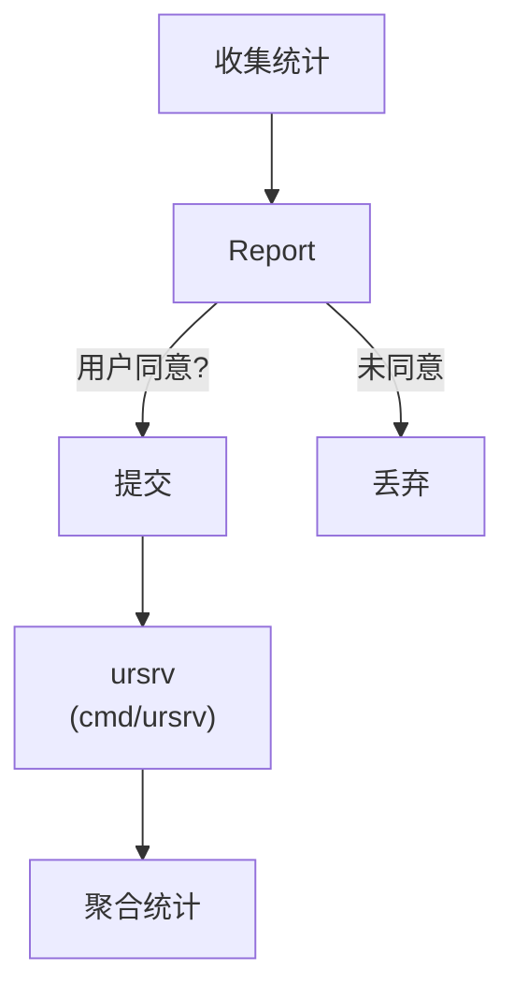

# 使用率报告模块

## 概述

`lib/ur/` 和 `internal/ur/` 实现匿名使用率报告，约 600 行 Go 代码。帮助开发者了解 Syncthing 的使用情况。

## 职责

- **数据收集**：匿名使用统计
- **用户同意**：显式同意机制
- **报告提交**：周期性提交到 ursrv

## 架构



## 关键文件

| 文件 | 位置 | 职责 |
| --- | --- | --- |
| `ur.go` | `lib/ur/` | 公共接口 |
| `usage_report.go` | `internal/ur/` | 报告实现 |
| `cmd/ursrv/` | — | 报告服务器 |

## 报告数据

```go
type Report struct {
    Version        string
    LongVersion    string
    Platform       string
    NumFolders     int
    NumDevices     int
    TotFiles       int
    FolderSize     int64
    MemoryUsage    int64
    SHA256Perf     float64
    MemorySize     int64
    Uptime         int
    NumCPU         int
    FolderUses     map[string]int
    ConnectionMethods map[string]int
    ...
}
```

**注意**：不包含任何个人可识别信息（PII）。

## 用户同意

`Options.URAccepted` 字段：

| 值 | 说明 |
| --- | --- |
| `0` | 未决定 |
| `-1` | 拒绝 |
| `1` | 接受（版本号） |

只有 `URAccepted >= 1` 时才提交报告。

## 提交流程

1. 收集统计数据
2. 检查 `URAccepted`
3. 序列化为 JSON
4. POST 到 ursrv
5. 记录提交时间

## ursrv 服务器

`cmd/ursrv/`：

- 接收报告
- 聚合统计
- 提供可视化（Web UI）
- 默认部署在 `https://data.syncthing.net/`

## 配置

| 配置项 | 说明 |
| --- | --- |
| `Options.URAccepted` | 同意状态 |
| `Options.URUniqueID` | 唯一 ID（可选） |

## 集成

`lib/syncthing` 中的 `usageReportingManager`：

1. 周期性触发（默认 24 小时）
2. 调用 `collect` 收集数据
3. 检查用户同意
4. 提交报告

## 测试覆盖

`usage_report_test.go`：

- 数据收集测试
- 同意检查测试

## 设计权衡

### 匿名 vs 可识别

**选择**：完全匿名，可选唯一 ID。
**优势**：保护隐私。
**劣势**：无法跟踪长期使用。

### 默认关闭 vs 默认开启

**选择**：默认关闭，需显式同意。
**优势**：尊重用户选择。
**劣势**：可能样本不足。
