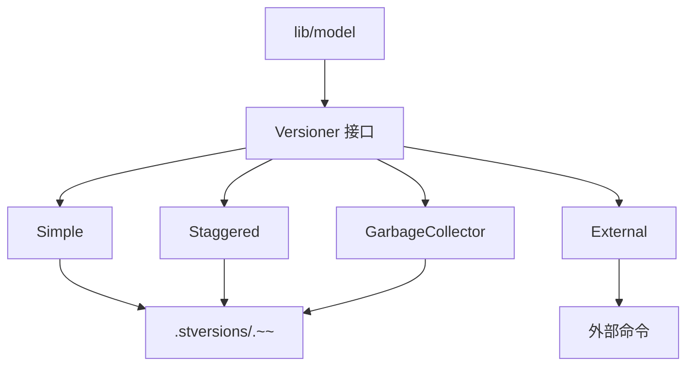

# 版本控制模块

## 概述

`lib/versioner/` 实现文件版本控制，在文件被覆盖或删除前保存旧版本。支持多种版本控制策略。

## 版本控制类型

| 类型 | 文件 | 说明 |
| --- | --- | --- |
| 简单版本控制 | `simple.go` | 移动旧文件到 `.stversions/` |
| 错开版本控制 | `staggered.go` | 按时间间隔保留版本 |
| 垃圾回收版本控制 | `garbage_collector.go` | 定期清理旧版本 |
| 外部版本控制 | `external.go` | 调用外部程序 |

## 架构



## Versioner 接口

```go
type Versioner interface {
    Archive(filePath string) error
    GetVersions(filePath string) ([]FileVersion, error)
    Restore(filePath string, version time.Time) error
}
```

## 简单版本控制

`lib/versioner/simple.go`：

### 工作流程

1. 文件被覆盖前，`Archive` 移动旧文件到 `.stversions/`
2. 文件名添加时间戳后缀：`<name>.~<timestamp>~`
3. 保留所有版本（不自动清理）

### 配置

| 参数 | 说明 |
| --- | --- |
| `keep` | 保留版本数（0=无限） |

## 错开版本控制

`lib/versioner/staggered.go`：

### 保留策略

| 年龄 | 间隔 |
| --- | --- |
| < 1 小时 | 30 分钟 |
| 1 小时 - 1 天 | 1 小时 |
| 1 天 - 1 周 | 6 小时 |
| 1 周 - 1 月 | 1 天 |
| > 1 月 | 1 周 |

### 工作流程

1. `Archive` 移动旧文件到 `.stversions/`
2. 后台 goroutine 周期性清理
3. 根据年龄策略保留版本

### 配置

| 参数 | 默认值 | 说明 |
| --- | --- | --- |
| `maxAge` | 365 天 | 最大保留年龄 |
| `cleanInterval` | 3600 秒 | 清理间隔 |

## 垃圾回收版本控制

`lib/versioner/garbage_collector.go`：

### 工作流程

1. `Archive` 移动旧文件到 `.stversions/`
2. 后台 goroutine 周期性清理
3. 超过 `gcInterval` 的版本被删除

### 配置

| 参数 | 说明 |
| --- | --- |
| `gcInterval` | 清理间隔 |

## 外部版本控制

`lib/versioner/external.go`：

### 工作流程

1. `Archive` 调用外部程序
2. 程序参数：`<command> archive <filePath>`
3. `GetVersions` 调用 `<command> get-versions <filePath>`
4. `Restore` 调用 `<command> restore <filePath> <version>`

### 配置

| 参数 | 说明 |
| --- | --- |
| `command` | 外部程序路径 |

## 集成

1. `lib/model` 根据 folder 配置创建 Versioner
2. 文件覆盖前调用 `Archive`
3. API 端点 `/rest/folder/versions` 查询版本
4. API 端点恢复版本

## 测试覆盖

`simple_test.go`、`staggered_test.go`、`garbage_collector_test.go`、`external_test.go`：

- 归档测试
- 清理测试
- 恢复测试

## 设计权衡

### 移动 vs 复制

**选择**：移动（同文件系统）。
**优势**：快速，原子性。
**劣势**：跨文件系统退化为复制+删除。

### 时间戳命名

**选择**：`<name>.~<timestamp>~`。
**优势**：人类可读，排序方便。
**劣势**：文件名变长。

### 自动清理

**选择**：staggered 和 GC 自动清理。
**优势**：控制磁盘使用。
**劣势**：可能删除需要的版本。
