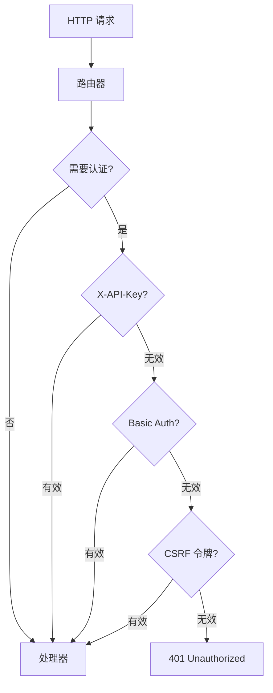

# API 端点深入

## 认证流程

`lib/api/httpserver.go`：



## CSRF 防护

`lib/api/csrf.go`：

### 令牌生成

```go
func (s *service) newCSRFToken() string {
    token := rand.String(32)
    s.csrfTokens.Set(token, time.Now().Add(csrfTokenLifetime))
    return token
}
```

### 令牌验证

```go
func (s *service) validateCSRFToken(token string) bool {
    _, ok := s.csrfTokens.Get(token)
    return ok
}
```

### Cookie 设置

```http
Set-Cookie: CSRF-Token=abc123; HttpOnly; SameSite=Strict
```

### 头验证

```http
X-CSRF-Token: abc123
```

## 系统端点详细

### /rest/system/status

```json
{
    "myID": "DEVICE_ID",
    "goroutines": 42,
    "cpuPercent": 5.2,
    "pathSeparator": "/",
    "tilde": "/home/user",
    "uptime": 3600,
    "startTime": "2024-01-01T00:00:00Z",
    "discoveryEnabled": true,
    "discoveryErrors": {},
    "relayEnabled": true,
    "listenAddresses": ["tcp://0.0.0.0:22000"],
    "guiAddress": "127.0.0.1:8384",
    "guiAddressOverridden": false,
    "version": "v1.27.0",
    "longVersion": "syncthing v1.27.0",
    "platform": "linux-amd64",
    "containers": {},
    "numCPU": 4,
    "alloc": 12345678,
    "sys": 23456789
}
```

### /rest/system/connections

```json
{
    "total": {
        "at": "2024-01-01T00:00:00Z",
        "inBytesTotal": 123456789,
        "outBytesTotal": 987654321,
        "type": "total"
    },
    "connections": {
        "DEVICE_ID": {
            "address": "1.2.3.4:22000",
            "at": "2024-01-01T00:00:00Z",
            "connected": true,
            "id": "DEVICE_ID",
            "inBytesTotal": 123456,
            "outBytesTotal": 654321,
            "paused": false,
            "type": "TCP-client",
            "crypto": "TLS1.3",
            "inbps": 1024,
            "outbps": 2048,
            "lastSeen": "2024-01-01T00:00:00Z"
        }
    }
}
```

### /rest/system/config

```http
GET /rest/system/config
PUT /rest/system/config
```

PUT 请求体为完整配置 JSON，触发配置变更流程。

## 数据库端点详细

### /rest/db/status

```http
GET /rest/db/status?folder=xxx
```

```json
{
    "globalBytes": 123456789,
    "globalDeleted": 10,
    "globalDirectories": 100,
    "globalFiles": 1000,
    "globalSymlinks": 5,
    "globalTotalItems": 1115,
    "ignorePatterns": false,
    "inSyncBytes": 123456,
    "inSyncFiles": 10,
    "invalid": "",
    "localBytes": 123456789,
    "localDeleted": 5,
    "localDirectories": 100,
    "localFiles": 1000,
    "localSymlinks": 5,
    "localTotalItems": 1110,
    "needBytes": 0,
    "needDeletes": 0,
    "needDirectories": 0,
    "needFiles": 0,
    "needSymlinks": 0,
    "needTotalItems": 0,
    "pullErrors": 0,
    "receiveOnlyChangedBytes": 0,
    "receiveOnlyChangedDeletes": 0,
    "receiveOnlyChangedDirectories": 0,
    "receiveOnlyChangedFiles": 0,
    "receiveOnlyChangedSymlinks": 0,
    "sequence": 12345,
    "state": "idle",
    "stateChanged": "2024-01-01T00:00:00Z",
    "version": 12345
}
```

### /rest/db/browse

```http
GET /rest/db/browse?folder=xxx&prefix=docs/&dir=docs
```

```json
{
    "docs/": [
        {"name": "readme.md", "type": "file", "size": 1024, "modified": "2024-01-01T00:00:00Z"},
        {"name": "images/", "type": "dir", "size": 0, "modified": "2024-01-01T00:00:00Z"}
    ]
}
```

### /rest/db/completion

```http
GET /rest/db/completion?folder=xxx&device=yyy
```

```json
{
    "completion": 100,
    "globalBytes": 123456789,
    "needBytes": 0,
    "needItems": 0,
    "remoteState": "valid",
    "sequence": 12345
}
```

## 文件夹端点详细

### /rest/folder/versions

```http
GET /rest/folder/versions?folder=xxx&file=docs/readme.md
```

```json
[
    {"version": "2024-01-01T00:00:00Z", "size": 1024, "modified": "2024-01-01T00:00:00Z"},
    {"version": "2024-01-02T00:00:00Z", "size": 2048, "modified": "2024-01-02T00:00:00Z"}
]
```

### /rest/folder/errors

```http
GET /rest/folder/errors?folder=xxx
```

```json
{
    "folder": "xxx",
    "errors": [
        {"path": "docs/readme.md", "error": "permission denied"}
    ]
}
```

## 事件端点详细

### /rest/events

```http
GET /rest/events?since=123&limit=100&events=FolderCompleted,ItemFinished
```

```json
[
    {
        "id": 124,
        "time": "2024-01-01T00:00:00Z",
        "type": "FolderCompleted",
        "data": {"folder": "xxx", "device": "yyy"}
    },
    {
        "id": 125,
        "time": "2024-01-01T00:01:00Z",
        "type": "ItemFinished",
        "data": {"folder": "xxx", "item": "docs/readme.md", "action": "update"}
    }
]
```

### 长轮询

- 默认 60 秒超时
- 有事件立即返回
- 超时返回空数组

## 集群端点详细

### /rest/cluster/pending/devices

```json
{
    "pendingDevices": [
        {"deviceID": "xxx", "name": "Unknown", "time": "2024-01-01T00:00:00Z"}
    ]
}
```

### /rest/cluster/pending/folders

```json
{
    "pendingFolders": [
        {"folderID": "xxx", "deviceID": "yyy", "time": "2024-01-01T00:00:00Z"}
    ]
}
```

## 指标端点

### /rest/metrics

返回 Prometheus 格式指标：

```
# HELP syncthing_bytes_sent Total bytes sent
# TYPE syncthing_bytes_sent counter
syncthing_bytes_sent 123456789

# HELP syncthing_bytes_received Total bytes received
# TYPE syncthing_bytes_received counter
syncthing_bytes_received 987654321
```

## 错误响应

所有端点错误返回：

```json
{
    "error": "error message"
}
```

HTTP 状态码：

| 状态码 | 说明 |
| --- | --- |
| 200 | 成功 |
| 400 | 请求错误 |
| 401 | 未认证 |
| 403 | 禁止访问 |
| 404 | 未找到 |
| 500 | 服务器错误 |
