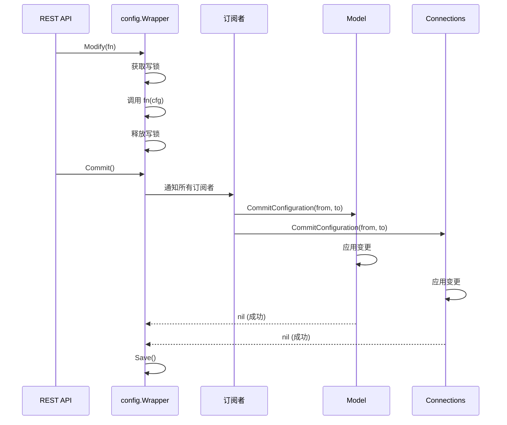

# 配置变更深入

## 配置变更流程



## 订阅者接口

```go
type Subscriber interface {
    CommitConfiguration(from, to Configuration) error
    String() string
}
```

## CommitConfiguration 实现

### Model

`lib/model/model.go`：

```go
func (m *Model) CommitConfiguration(from, to config.Configuration) error {
    // 处理文件夹变更
    for _, folder := range addedFolders(to, from) {
        m.addFolder(folder)
    }
    for _, folder := range removedFolders(to, from) {
        m.removeFolder(folder)
    }
    for _, folder := range modifiedFolders(to, from) {
        m.modifyFolder(folder)
    }

    // 处理设备变更
    ...

    return nil
}
```

### Connections

`lib/connections/service.go`：

```go
func (s *Service) CommitConfiguration(from, to config.Configuration) error {
    // 处理监听地址变更
    if !slicesEqual(from.Options.ListenAddresses, to.Options.ListenAddresses) {
        s.restartListeners()
    }

    // 处理设备变更
    ...

    return nil
}
```

## 变更检测

`lib/config/commit.go`：

```go
func addedFolders(to, from config.Configuration) []FolderConfiguration {
    var added []FolderConfiguration
    for _, folder := range to.Folders {
        if !from.HasFolder(folder.ID) {
            added = append(added, folder)
        }
    }
    return added
}
```

类似函数：`removedFolders`、`modifiedFolders`、`addedDevices`、`removedDevices`、`modifiedDevices`。

## 回滚

如果任一订阅者返回错误：

```go
func (w *Wrapper) Commit() error {
    for sub := range w.subs {
        if err := sub.CommitConfiguration(w.cfg, newCfg); err != nil {
            // 回滚
            w.cfg = oldCfg
            return err
        }
    }
    w.cfg = newCfg
    return nil
}
```

## 文件夹变更处理

### 添加文件夹

1. 创建 `folderRunner`
2. 创建数据库
3. 启动扫描
4. 通知连接服务

### 删除文件夹

1. 停止 `folderRunner`
2. 删除数据库
3. 通知连接服务
4. 清理状态

### 修改文件夹

1. 比较新旧配置
2. 应用变更（路径、设备、暂停等）
3. 如需，重启 `folderRunner`

## 设备变更处理

### 添加设备

1. 创建设备配置
2. 通知连接服务开始拨号
3. 通知 Model 接受连接

### 删除设备

1. 断开现有连接
2. 移除设备配置
3. 通知 Model 拒绝连接

### 修改设备

1. 比较新旧配置
2. 应用变更（地址、暂停等）
3. 如需，重连

## 暂停/恢复

### 文件夹暂停

1. 停止 `folderRunner`
2. 通知对端文件夹暂停
3. 保留数据库和配置

### 设备暂停

1. 断开连接
2. 停止拨号
3. 拒绝传入连接

## 配置保存

`Save()` 将配置写入 XML：

1. 序列化为 XML
2. 写入临时文件
3. `rename` 替换原文件（原子）
4. 触发 `ConfigSaved` 事件

## 测试

`lib/config/wrapper_test.go`：

- 订阅通知测试
- 回滚测试
- 文件夹变更测试
- 设备变更测试
