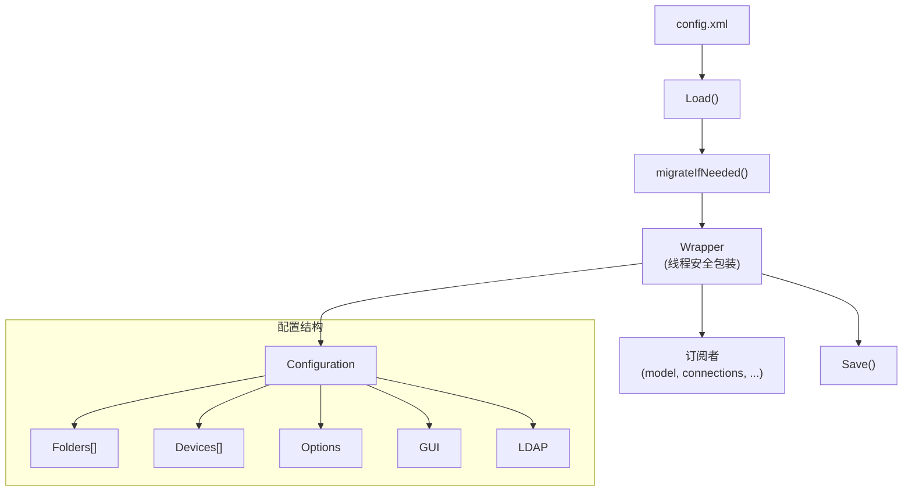

# 配置子系统

## 概述

`lib/config/` 实现 Syncthing 的配置管理，约 5000 行 Go 代码。支持 XML 配置文件、运行时修改、订阅通知和版本迁移。

## 职责

- **配置加载/保存**：XML 格式读写
- **运行时修改**：线程安全的配置更新
- **订阅通知**：观察者模式通知配置变更
- **版本迁移**：旧版本配置自动升级
- **默认值**：合理的默认配置

## 架构



## 关键文件

| 文件 | 行数 | 职责 |
| --- | ---: | --- |
| `config.go` | ~600 | `Configuration` 结构体、加载/保存、迁移 |
| `wrapper.go` | ~400 | `Wrapper` 线程安全包装、订阅通知 |
| `folderconfig.go` | ~300 | `FolderConfiguration` |
| `deviceconfig.go` | ~200 | `DeviceConfiguration` |
| `optionsconfig.go` | ~500 | `OptionsConfiguration` |
| `guiconfig.go` | ~150 | `GUIConfiguration` |
| `ldapconfig.go` | ~100 | `LDAPConfiguration` |
| `commit.go` | ~200 | 提交配置变更 |
| `util.go` | ~100 | 辅助函数 |

## Configuration 结构体

```go
type Configuration struct {
    Version int                   // 配置版本
    Folders []FolderConfiguration
    Devices []DeviceConfiguration
    Options OptionsConfiguration
    GUI     GUIConfiguration
    LDAP    LDAPConfiguration
    IgnoredDevices []ObservedDevice
    PendingDevices []ObservedDevice
    IgnoredFolders []ObservedFolder
    PendingFolders []ObservedFolder
}
```

## 配置版本

当前版本：`37`

`migrateIfNeeded()` 处理旧版本迁移：

- 每个版本有独立的迁移函数
- 迁移是单向的（向前）
- 迁移后自动保存

## Wrapper 线程安全

`Wrapper` 提供线程安全的配置访问：

```go
type Wrapper struct {
    cfg     Configuration
    cfgMut  sync.RWMutex
    subs    map[Subscriber]struct{}
    subsMut sync.Mutex
    path    string
}
```

### 订阅者接口

```go
type Subscriber interface {
    CommitConfiguration(from, to Configuration) error
    String() string
}
```

### 修改流程

1. `Modify(fn func(cfg *Configuration))` — 获取写锁，调用 fn 修改配置
2. `Commit()` — 通知所有订阅者
3. 订阅者 `CommitConfiguration` 返回 error 则回滚
4. `Save()` — 持久化到 XML

## FolderConfiguration

关键字段：

| 字段 | 类型 | 说明 |
| --- | --- | --- |
| `ID` | string | 唯一标识 |
| `Path` | string | 本地路径 |
| `Type` | FolderType | SendOnly/SendReceive/ReceiveOnly/ReceiveEncrypted |
| `Devices` | []FolderDeviceConfiguration | 共享设备列表 |
| `RescanIntervalS` | int | 扫描间隔 |
| `FSWatcherEnabled` | bool | 文件系统监视 |
| `FSWatcherDelayS` | int | 监视延迟 |
| `Copiers` | int | 并行复制器 |
| `Pullers` | int | 并行拉取器 |
| `Hashers` | int | 并行哈希器 |
| `BlockSize` | int | 块大小 |
| `IgnorePerms` | bool | 忽略权限 |
| `AutoNormalize` | bool | 自动归一化 |
| `Versioning` | VersioningConfiguration | 版本控制 |
| `Paused` | bool | 暂停 |

## OptionsConfiguration

关键字段：

| 字段 | 说明 |
| --- | --- |
| `ListenAddresses` | 监听地址 |
| `GlobalAnnounceEnabled` | 全局发现 |
| `LocalAnnounceEnabled` | 本地发现 |
| `RelayEnabled` | 中继 |
| `MaxSendKbps`/`MaxRecvKbps` | 限速 |
| `URAccepted` | 使用率报告 |
| `RestartOnWakeup` | 唤醒重启 |
| `AutoUpgradeIntervalH` | 自动升级 |
| `StunKeepaliveS` | STUN 保活 |
| `LimitBandwidthInLan` | LAN 限速 |
| `CacheIgnoredFiles` | 缓存忽略文件 |
| `KeepTemporariesH` | 临时文件保留 |

## GUIConfiguration

| 字段 | 说明 |
| --- | --- |
| `Enabled` | 启用 Web UI |
| `Address` | 监听地址 |
| `UnixSocket` | Unix socket 路径 |
| `User`/`Password` | 基本认证 |
| `APIKey` | API 密钥 |
| `InsecureAdminAccess` | 不安全的管理访问 |
| `Theme` | 主题 |

## 默认值

`DefaultConfiguration` 提供合理默认：

- 监听 `tcp://0.0.0.0:22000`，`quic://0.0.0.0:22000`
- 全局发现启用
- 本地发现启用
- 中继启用
- Web UI 启用，地址 `127.0.0.1:8384`
- 扫描间隔 3600 秒
- 块大小 0（自动）

## 配置文件位置

- 默认：`~/.local/state/syncthing/config.xml`（Linux）
- 可通过 `--home` 或 `STHOMEDIR` 环境变量覆盖
- `lib/locations/` 管理路径

## 测试覆盖

`config_test.go`、`wrapper_test.go`、`folderconfig_test.go` 等：

- XML 往返序列化
- 迁移测试
- 订阅通知测试
- 默认值测试
- 设备/folder 添加/删除

## 设计权衡

### XML vs JSON

**选择**：XML。
**优势**：人类可读，支持属性和注释。
**劣势**：冗长，解析复杂。

### 订阅者模式

**选择**：观察者模式通知配置变更。
**优势**：解耦，组件响应自己的配置变更。
**劣势**：顺序依赖，错误处理复杂。

### 线程安全

**选择**：`sync.RWMutex` 保护配置。
**优势**：简单，读多写少场景高效。
**劣势**：写时阻塞所有读。
