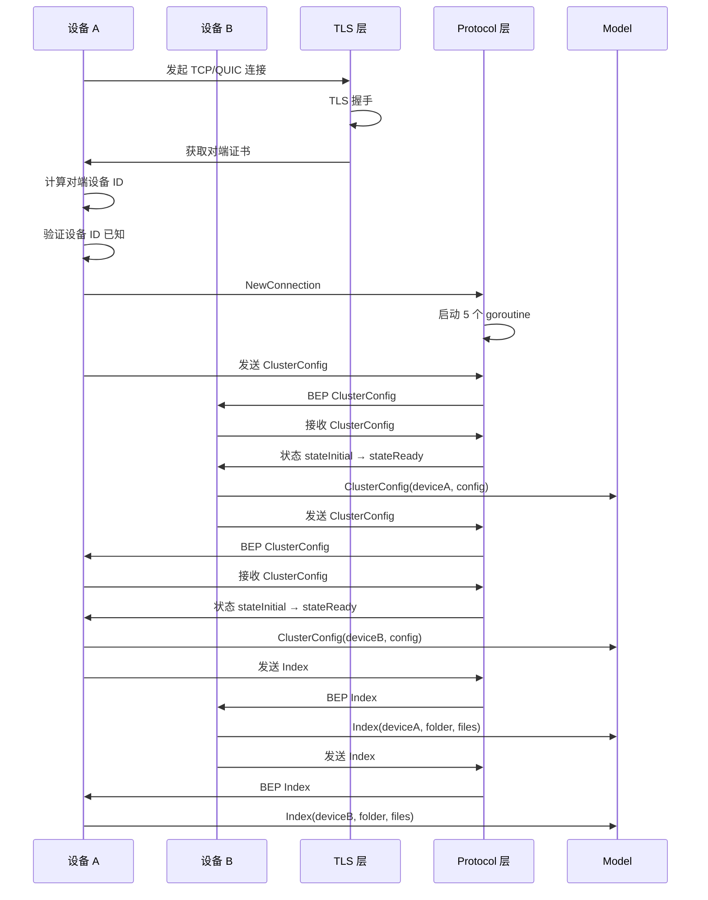

# 连接建立深入

## 连接建立时序



## Hello 交换详细

`handleHellos`（`service.go:358-445`）：

1. **Hello 超时**：20 秒
2. **并行处理**：每个连接独立 goroutine
3. **错误处理**：
   - 版本不匹配 → 拒绝
   - 证书无效 → 拒绝
   - 超时 → 关闭连接

## 连接优先级

`priority`（`structs.go`）：

| 连接类型 | 优先级 |
| --- | --- |
| LAN TCP | 10 |
| LAN QUIC | 20 |
| WAN TCP | 30 |
| WAN QUIC | 40 |
| Relay | 100 |

数值越小优先级越高。`closeWorsePriorityConnectionsLocked` 关闭优先级更差的连接。

## 连接限制

### 全局限制

- `maxNumConnections = 128`

### 每设备限制

- `desiredConnectionsToDevice`：协商双方期望连接数
- 取较大值，上限 128
- 超过则关闭低优先级连接

## 拨号冷却

`nextDialRegistry`（`service.go:1200-1286`）：

```go
type dialTarget struct {
    deviceID  protocol.DeviceID
    addr      string
    nextDial  time.Time
    attempts  int
}
```

- `dialCoolDownInterval = 2 分钟`
- `dialCoolDownDelay = 5 分钟`
- `dialCoolDownMaxAttempts = 3`

连续失败 3 次后，冷却 5 分钟。

## 短生命周期连接

`shortLivedConnectionThreshold = 5 秒`：

- 连接持续时间 < 5 秒视为短生命周期
- 短生命周期设备的拨号优先级降低
- 避免频繁断开的设备占用拨号资源

## 连接统计

`deviceConnectionTracker`（`service.go:1323-1418`）：

```go
type deviceConnectionTracker struct {
    conns map[protocol.DeviceID][]internalConn
    desired map[protocol.DeviceID]int
    ...
}
```

- `addConnection`：添加连接，检查限制
- `removeConnection`：移除连接
- `closeWorsePriorityConnectionsLocked`：关闭低优先级连接

## 连接 ID

`newConnectionID`（`service.go:1427-1437`）：

```go
func newConnectionID(t0, t1 int64) string {
    var buf [16]byte
    binary.BigEndian.PutUint64(buf[:], uint64(t0+t1))
    _, _ = io.ReadFull(rand.Reader, buf[8:])
    enc := base32.HexEncoding.WithPadding(base32.NoPadding)
    return enc.EncodeToString(buf[:8]) + enc.EncodeToString(buf[8:])
}
```

- 基于双方时间戳之和 + 随机数
- 可排序（时间戳部分）
- 唯一（随机数部分）

## 自连接检测

`handleConns`（`service.go:242-302`）：

```go
if remoteDeviceID == s.myID {
    // NAT hairpinning，拒绝自连接
    return
}
```

防止设备连接到自己（NAT hairpinning 场景）。

## 证书验证

`handleHellos`：

1. 检查证书数量为 1
2. 计算设备 ID = SHA-256(证书)
3. 与已知设备 ID 比对
4. 验证证书名称（CommonName 或 SAN）

## BEP 协议协商

`handleConns`：

```go
if nextProto != "bep/1.0" {
    // 警告但不拒绝（兼容 iOS）
    l.Warnf("unexpected ALPN protocol: %s", nextProto)
}
```

iOS 平台可能不正确设置 ALPN，因此仅警告不拒绝。
