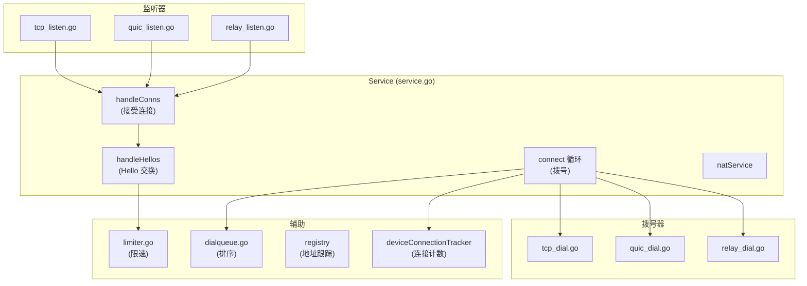

# 连接子系统

## 概述

`lib/connections/` 统一管理 TCP、QUIC、Relay 三种连接类型，约 1438 行核心代码（`service.go`）。负责拨号、监听、限速、连接优先级和冷却。

## 职责

- **拨号**：主动连接已知设备
- **监听**：接受传入连接
- **限速**：全局 + 每设备双层限速
- **连接优先级**：LAN 优于 WAN，TCP 优于 Relay
- **冷却**：防止过度重拨
- **NAT 穿透**：集成 UPnP/PMP/STUN

## 架构



## 连接类型

| 类型 | 拨号 | 监听 | 优先级 | 特点 |
| --- | --- | --- | --- | --- |
| TCP | `tcp_dial.go` | `tcp_listen.go` | LAN 高，WAN 中 | 可靠，端口复用 |
| QUIC | `quic_dial.go` | `quic_listen.go` | LAN 高，WAN 中 | UDP，多路复用 |
| Relay | `relay_dial.go` | `relay_listen.go` | 低 | 最后手段，需中继服务器 |

6 种连接类型枚举（`structs.go:52-59`）：

```go
const (
    connTypeRelayClient connType = iota
    connTypeRelayServer
    connTypeTCPClient
    connTypeTCPServer
    connTypeQUICClient
    connTypeQUICServer
)
```

## 关键常量

| 常量 | 值 | 说明 |
| --- | --- | --- |
| `tlsHandshakeTimeout` | 10 秒 | TLS 握手超时 |
| `minConnectionLoopSleep` | 5 秒 | 最小拨号循环间隔 |
| `stdConnectionLoopSleep` | 60 秒 | 标准拨号循环间隔 |
| `recentlySeenCutoff` | 7 天 | "最近看到"阈值 |
| `shortLivedConnectionThreshold` | 5 秒 | 短生命周期连接阈值 |
| `dialMaxParallel` | 64 | 最大并行拨号数 |
| `dialMaxParallelPerDevice` | 8 | 每设备最大并行拨号 |
| `maxNumConnections` | 128 | 最大连接数 |

## Service 核心服务

`service` 结构体（`service.go:157-185`）持有所有连接管理状态。

### NewService 初始化

1. 创建 supervisor
2. 初始化 limiter 和 natService
3. 订阅配置变更
4. 调用 `CommitConfiguration` 启动监听器（必须在 connect 之前）
5. 添加 4 个核心服务：
   - `service.connect` — 拨号循环
   - `service.handleConns` — 处理接受的连接
   - `service.handleHellos` — 处理 Hello 交换
   - `service.natService` — NAT 服务

## 连接处理流程

### handleConns（`service.go:242-302`）

1. 从 `s.conns` channel 接受连接
2. 检查 BEP 协议协商（警告但不拒绝，兼容 iOS）
3. 验证对端证书数量为 1
4. 计算对端设备 ID
5. 拒绝自连接（NAT hairpinning）
6. `connectionCheckEarly`：拒绝忽略/暂停/超限设备
7. 20 秒超时内异步交换 Hello
8. 生成 connectionID

### handleHellos（`service.go:358-445`）

1. 处理 Hello 错误（版本不匹配等）
2. 调用 `model.OnHello` 让 Model 决策
3. 验证证书名称（CommonName 或 SAN）
4. 包装限速器 `limiter.getLimiters`
5. 创建 `protocol.NewConnection`
6. 跟踪连接生命周期，断开时触发 `dialNow`

## 拨号循环

### connect（`service.go:447-512`）

1. 维护 `nextDialRegistry` 记录每设备+地址的下次拨号时间
2. 初始阶段指数退避（1s→2s→4s...→60s）
3. 每轮：
   - 获取配置快照
   - 计算最佳拨号器优先级
   - 调用 `dialDevices`
   - 计算睡眠时间
   - 等待 `dialNow` 信号或超时

### dialDevices（`service.go:528-634`）

1. 检查连接限制
2. 获取设备统计（最后看到时间）
3. 构建 `dialQueue`，跳过：
   - 自己
   - 暂停的设备
   - 已有足够连接且无更好拨号器的设备
4. 解析拨号目标
5. 排序队列
6. 并行拨号（`dialMaxParallel=64` 信号量）
7. 达到连接限制时取消剩余拨号

### dialParallel（`service.go:1100-1165`）

按优先级分桶拨号：

1. 按优先级分组
2. 从最高优先级（数值最小）开始
3. 每桶内并行拨号（`dialMaxParallelPerDevice=8`）
4. 第一个成功即返回，其余丢弃

## 冷却机制

`nextDialRegistry`（`service.go:1200-1286`）：

| 常量 | 值 | 说明 |
| --- | --- | --- |
| `dialCoolDownInterval` | 2 分钟 | 冷却间隔 |
| `dialCoolDownDelay` | 5 分钟 | 冷却延迟 |
| `dialCoolDownMaxAttempts` | 3 | 最大尝试次数 |

防止对频繁断开的设备过度重拨。

## deviceConnectionTracker

`service.go:1323-1418` 跟踪每设备连接数和期望连接数：

- `desiredConnectionsToDevice`：协商双方期望连接数，取较大值，上限 128
- `closeWorsePriorityConnectionsLocked`：关闭优先级更差的连接

## 连接 ID 生成

`newConnectionID`（`service.go:1427-1437`）：

```go
func newConnectionID(t0, t1 int64) string {
    var buf [16]byte
    binary.BigEndian.PutUint64(buf[:], uint64(t0+t1))
    _, _ = io.ReadFull(rand.Reader, buf[8:])
    enc := base32.HexEncoding.WithPadding(base32.NoPadding)
    return enc.EncodeToString(buf[:8]) + enc.EncodeToString(buf[8:])
}
```

基于双方时间戳之和 + 随机数，可排序且唯一。

## 页面导航

- [拨号与监听](dial-listen.md) — 各连接类型实现
- [限速](limiter.md) — 双层限速机制
- [维护者笔记](maintainer-notes.md) — 安全编辑点、风险

## 拨号队列排序

`dialqueue.go` 排序算法：

1. 短生命周期设备排后面（`shortLived`）
2. 最近看到的设备排前面（`lastSeen.After`）
3. 超过 `recentlySeenCutoff`（7 天）的部分随机 shuffle
