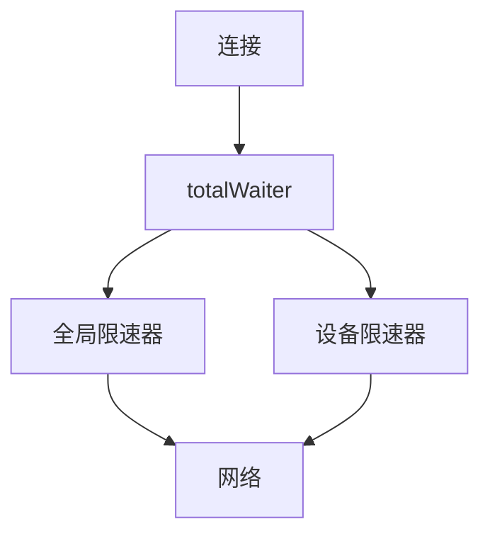

# 连接限速深入

## 限速器架构

`lib/limiter/` 实现独立的全局限速器（与 `lib/connections/limiter.go` 不同）。

## token bucket 算法

```go
type Bucket struct {
    rate       int64       // 每秒令牌数
    burst      int64       // 突发大小
    tokens     int64       // 当前令牌数
    lastUpdate time.Time   // 上次更新时间
    mu         sync.Mutex
}

func (b *Bucket) Take(n int64) {
    b.mu.Lock()
    defer b.mu.Unlock()
    
    // 1. 补充令牌
    now := time.Now()
    elapsed := now.Sub(b.lastUpdate).Seconds()
    b.tokens += int64(elapsed * float64(b.rate))
    if b.tokens > b.burst {
        b.tokens = b.burst
    }
    b.lastUpdate = now
    
    // 2. 等待足够令牌
    for b.tokens < n {
        wait := time.Duration(float64(n-b.tokens) / float64(b.rate) * float64(time.Second))
        b.mu.Unlock()
        time.Sleep(wait)
        b.mu.Lock()
        // 重新补充
        ...
    }
    
    b.tokens -= n
}
```

## 分层限速



## totalWaiter

```go
type totalWaiter struct {
    waiters []waiter
}

type waiter interface {
    Wait(n int) error
}

func (t *totalWaiter) Wait(n int) error {
    for _, w := range t.waiters {
        if err := w.Wait(n); err != nil {
            return err
        }
    }
    return nil
}
```

## 限速器组合

```go
func (l *limiter) getLimiters(conn internalConn, connType connType) (io.Reader, io.Writer) {
    var reader io.Reader = conn
    var writer io.Writer = conn

    // 1. 全局限速（非 LAN 或启用 LAN 限速）
    if !l.limitsLAN() || !conn.isLocal {
        reader = l.newLimitedReader(reader)
        writer = l.newLimitedWriter(writer)
    }

    // 2. 设备限速
    if deviceLimiter := l.deviceReadLimiters[deviceID]; deviceLimiter != nil {
        reader = combine(reader, deviceLimiter)
    }
    if deviceLimiter := l.deviceWriteLimiters[deviceID]; deviceLimiter != nil {
        writer = combine(writer, deviceLimiter)
    }

    return reader, writer
}
```

## 自适应写分块

```go
const singleWriteSize = Limit / 100  // 10ms 数据量

func (w *limitedWriter) Write(p []byte) (int, error) {
    chunkSize := w.limit / 100
    if chunkSize < 1 {
        chunkSize = 1
    }
    
    total := 0
    for len(p) > 0 {
        n := min(len(p), chunkSize)
        w.waiter.Wait(n)
        written, err := w.writer.Write(p[:n])
        total += written
        if err != nil {
            return total, err
        }
        p = p[n:]
    }
    return total, nil
}
```

## LAN 判断

```go
func (l *limiter) limitsLAN() bool {
    return l.limitsLAN.Load()
}

func (c internalConn) isLocal() bool {
    return c.lanChecker.IsLan(c.remoteAddr)
}
```

`lanChecker` 基于本地 IP 地址判断对端是否在 LAN。

## 配置变更

```go
func (l *limiter) SetLimits(readRate, writeRate int64, limitsLAN bool) {
    // 1. 重建全局限速器
    l.read = newBucket(readRate)
    l.write = newBucket(writeRate)
    // 2. 更新 LAN 标志
    l.limitsLAN.Store(limitsLAN)
}

func (l *limiter) SetDeviceLimits(deviceID protocol.DeviceID, readRate, writeRate int64) {
    // 1. 重建设备限速器
    l.deviceReadLimiters[deviceID] = newBucket(readRate)
    l.deviceWriteLimiters[deviceID] = newBucket(writeRate)
}
```

## 突发大小

```go
const limiterBurstSize = 512 * 1024  // 4 × 128KB
```

- 允许短时间突发
- 防止限速过于严格
- 平滑流量

## 性能考虑

### 限速开销

- 令牌计算：O(1)
- 等待：阻塞 goroutine
- 锁竞争：低（每限速器独立锁）

### 内存

- 每限速器约 100 字节
- 全局 2 个（读/写）
- 每设备 2 个

## 测试

`lib/connections/limiter_test.go`：

- 限速准确性测试
- 突发测试
- LAN 判断测试
- 配置变更测试
