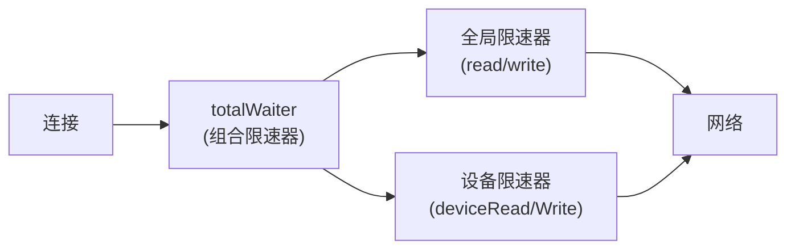

# 限速

## 概述

`lib/connections/limiter.go`（344 行）实现双层限速：全局 + 每设备。

## 限速架构



## 关键参数

| 参数 | 值 | 说明 |
| --- | --- | --- |
| `limiterBurstSize` | 512 KB | 限速器突发大小（4 × 128KB） |
| `singleWriteSize` | Limit/100 | 自适应写分块（10ms 数据量） |

## 全局限速

- `read`/`write`：全局读写限速器
- 基于 `token bucket` 算法
- LAN 连接可选不限速（`limitsLAN` atomic.Bool）

## 每设备限速

- `deviceReadLimiters`/`deviceWriteLimiters`：每设备独立限速器
- 按设备 ID 索引
- 配置变更时重建

## totalWaiter

`totalWaiter` 组合多个限速器，取最严格的：

```go
type totalWaiter struct {
    waiters []waiter
}
```

每次读写操作等待所有限速器放行。

## 自适应写分块

`singleWriteSize = Limit/100`：

- 限速 1MB/s → 每次写 10KB（10ms 数据量）
- 限速 100KB/s → 每次写 1KB
- 避免单次写占用过多令牌，导致其他连接饥饿

## LAN 不限速

`limitsLAN` atomic.Bool 控制是否对 LAN 连接限速：

- 默认 LAN 连接不限速
- 可通过配置启用
- `isLocal` 判断基于 `lanChecker`

## 配置变更

配置变更时：
1. 重建全局限速器
2. 重建每设备限速器
3. 更新 `limitsLAN` 标志

## getLimiters

`getLimiters` 为连接包装限速器：

```go
func (l *limiter) getLimiters(conn internalConn, connType connType) (io.Reader, io.Writer) {
    var reader io.Reader = conn
    var writer io.Writer = conn

    if !l.limitsLAN() || !conn.isLocal {
        reader = l.newLimitedReader(reader)
        writer = l.newLimitedWriter(writer)
    }

    if deviceLimiter := l.deviceReadLimiters[deviceID]; deviceLimiter != nil {
        reader = combine(reader, deviceLimiter)
    }

    return reader, writer
}
```
