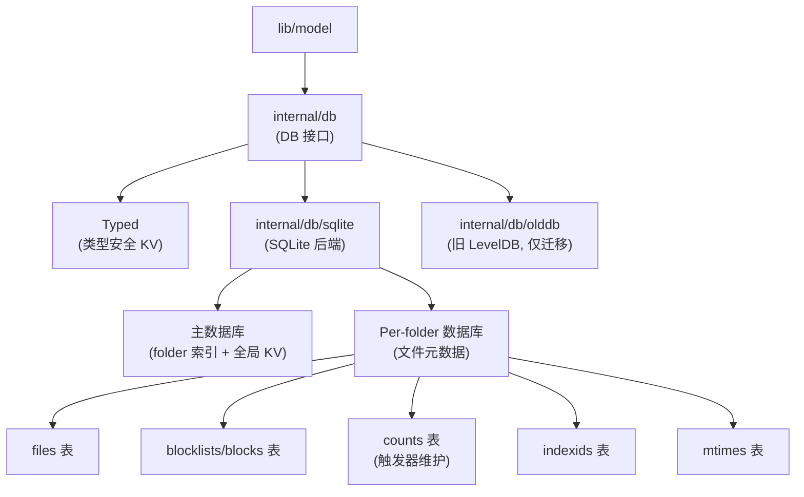

# 数据库子系统

## 概述

`internal/db/` 实现文件元数据存储，采用**双层架构**：接口层（`internal/db/`）与 SQLite 后端（`internal/db/sqlite/`）。旧 LevelDB 后端（`internal/db/olddb/`）仅用于迁移。

## 架构



## Per-folder 数据库架构

每个 folder 拥有独立的 SQLite 文件，主数据库仅存储 folder 索引和全局 KV。

**优势**：
- 减少单个数据库大小
- 提高并发性能（无全局锁）
- 独立 checkpoint

**劣势**：
- 增加管理复杂度（多文件、连接池）
- 跨 folder 查询需要聚合

## 关键文件

### 接口层

| 文件 | 职责 |
| --- | --- |
| `interface.go` | `DB`/`DBService`/`KV` 接口定义 |
| `typed.go` | `Typed` 类型安全 KV 访问 |
| `counts.go` | `Counts` 结构体 |
| `observed.go` | `ObservedDB`（待处理设备/文件夹） |
| `metrics.go` | Prometheus 指标包装 |

### SQLite 后端

| 文件 | 职责 |
| --- | --- |
| `basedb.go` | `baseDB` 结构体、`openBase()` |
| `db_open.go` | `DB` 结构体、连接池管理 |
| `db_folderdb.go` | `getFolderDB()`、folder DB 懒加载 |
| `folderdb_open.go` | `folderDB` 结构体、WAL 模式 |
| `folderdb_update.go` | `Update()` 方法、事务处理、checkpoint |
| `folderdb_global.go` | 全局文件查询 |
| `folderdb_local.go` | 本地文件查询 |
| `folderdb_counts.go` | 计数查询 |
| `folderdb_indexid.go` | IndexID 管理 |
| `folderdb_mtimes.go` | Mtime 管理 |
| `db_kv.go` | KV 存储操作 |
| `db_service.go` | 维护/GC 逻辑 |
| `db_prepared.go` | 预处理语句缓存 |

## DB 接口

```go
type DB interface {
    GetKV(key string) ([]byte, bool, error)
    PutKV(key string, value []byte, opts ...UpdateOption) error
    DeleteKV(key string, opts ...UpdateOption) error
    PrefixKV(prefix string) ([]KVEntry, error)

    GetFolderDB(folder string) (FolderDB, error)
    ListFolders() []string
    DropFolder(folder string) error

    Update(fn func(tx Transaction) error) error
    Read(fn func(tx ReadTransaction) error) error
}
```

## Typed 类型安全访问

```go
type Typed struct {
    db KV
}

func (t Typed) PutInt64(key string, val int64) error
func (t Typed) Int64(key string) (int64, bool, error)
func (t Typed) PutTime(key string, val time.Time) error
func (t Typed) Time(key string) (time.Time, bool, error)
func (t Typed) PutBytes(key string, val []byte) error
func (t Typed) Bytes(key string) ([]byte, bool, error)
func (t Typed) PutString(key string, val string) error
func (t Typed) String(key string) (string, bool, error)
```

## 连接池配置

```go
const (
    maxOpenConns = 8
    maxIdleConns = 4
)
```

支持 cgo 和非 cgo 两种构建模式。

## WAL 模式

每个 folder DB 使用 WAL（Write-Ahead Logging）模式：
- 提高并发读性能
- 允许读写并发
- Checkpoint 机制在 `folderdb_update.go` 中触发

## 预处理语句缓存

`txPreparedStmts` 在事务内缓存预处理语句：

```go
type txPreparedStmts struct {
    *sqlx.Tx
    stmts map[string]*sqlx.Stmt
}
```

`Commit()` 和 `Rollback()` 会关闭所有缓存的语句。

## 页面导航

- [Schema](schema.md) — SQL 表结构详解
- [旧数据库迁移](migration.md) — LevelDB 到 SQLite 迁移
- [维护者笔记](maintainer-notes.md) — 安全编辑点、风险

## 设计权衡

### Per-folder 数据库 vs 单一数据库

**选择**：Per-folder。
**优势**：减少单库大小，提高并发。
**劣势**：管理复杂，跨 folder 查询困难。

### STRICT 表

**选择**：SQLite STRICT 模式强制类型检查。
**优势**：数据完整性。
**劣势**：牺牲一些灵活性。

### WITHOUT ROWID

**选择**：对不需要 rowid 的表使用 `WITHOUT ROWID`。
**优势**：减少存储空间，提高查询性能。

### 触发器维护计数

**选择**：三个触发器自动维护 counts 表。
**优势**：自动维护，避免手动更新。
**劣势**：可能影响写入性能。

### 名称/版本规范化

**选择**：将 name 和 version 提取到独立表（migration v5）。
**优势**：减少存储空间（相同名称/版本只存储一次）。
**劣势**：增加 JOIN 复杂度。
