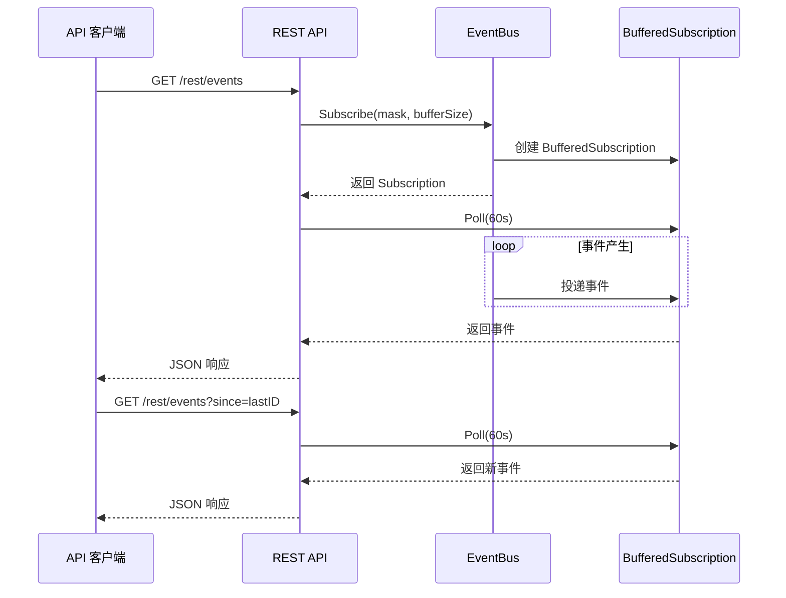

# 事件系统深入

## 事件缓冲管理

`lib/events/buffered.go`：

### 缓冲大小

```go
const DefaultBufferSize = 1000

type BufferedSubscription struct {
    events chan Event
    mask   EventType
    ...
}

func NewBufferedSubscription(src Subscription, mask EventType, size int) *BufferedSubscription {
    return &BufferedSubscription{
        events: make(chan Event, size),
        mask:   mask,
        ...
    }
}
```

### 缓冲溢出

```go
func (s *BufferedSubscription) start() {
    for {
        event, err := s.src.Poll(timeout)
        if err != nil {
            continue
        }
        if s.mask&event.Type == 0 {
            continue  // 不感兴趣
        }
        select {
        case s.events <- event:
            // 成功入队
        default:
            // 缓冲满，丢弃最旧事件
            <-s.events
            s.events <- event
            s.droppedCount++
        }
    }
}
```

## Poll 机制

```go
func (s *BufferedSubscription) Poll(timeout time.Duration) ([]Event, error) {
    var events []Event
    
    timer := time.NewTimer(timeout)
    defer timer.Stop()
    
    select {
    case event := <-s.events:
        events = append(events, event)
        // 非阻塞获取更多事件
        for {
            select {
            case event := <-s.events:
                events = append(events, event)
            default:
                return events, nil
            }
        }
    case <-timer.C:
        return nil, ErrTimeout
    }
}
```

## 事件掩码

```go
type EventType int

const (
    AllEvents EventType = 0
    StartupComplete EventType = 1 << iota
    DeviceConnected
    DeviceDisconnected
    ...
)
```

### 掩码过滤

```go
func (s *BufferedSubscription) shouldSend(event Event) bool {
    return s.mask&event.Type != 0
}
```

## 事件 ID

每个事件有唯一递增 ID：

```go
type Event struct {
    ID   int64  `json:"id"`
    Time time.Time `json:"time"`
    Type EventType `json:"type"`
    ...
}
```

### ID 生成

```go
var eventID int64

func nextEventID() int64 {
    return atomic.AddInt64(&eventID, 1)
}
```

## API 集成

### /rest/events

```go
func (s *service) getEvents(w http.ResponseWriter, r *http.Request) {
    since, _ := strconv.ParseInt(r.URL.Query().Get("since"), 10, 64)
    limit, _ := strconv.Atoi(r.URL.Query().Get("limit"))
    if limit == 0 {
        limit = 100
    }
    
    // 获取事件
    events, err := s.eventSub.Poll(60 * time.Second)
    if err != nil {
        http.Error(w, err.Error(), http.StatusInternalServerError)
        return
    }
    
    // 过滤 since 之后的事件
    var result []Event
    for _, event := range events {
        if event.ID > since {
            result = append(result, event)
            if len(result) >= limit {
                break
            }
        }
    }
    
    json.NewEncoder(w).Encode(result)
}
```

### 长轮询

- 默认 60 秒超时
- 有事件立即返回
- 超时返回空数组

## 磁盘事件

`/rest/events/disk`：

```go
func (s *service) getDiskEvents(w http.ResponseWriter, r *http.Request) {
    // 从磁盘日志读取
    events, err := s.diskLogger.Events(since, limit)
    ...
}
```

### 磁盘日志格式

```
[时间] [类型] [子系统] {JSON 数据}
```

## 事件订阅生命周期



## 性能考虑

### 缓冲大小

- 默认 1000
- 过小：频繁丢弃
- 过大：内存使用高

### 订阅者数量

- 每订阅者独立缓冲
- 订阅者越多内存越多
- 慢订阅者不影响快订阅者

### 事件大小

- 事件数据为 JSON
- 大事件增加内存和序列化开销

## 测试

`lib/events/buffered_test.go`：

- 缓冲溢出测试
- 掩码过滤测试
- Poll 超时测试
- 并发订阅测试
