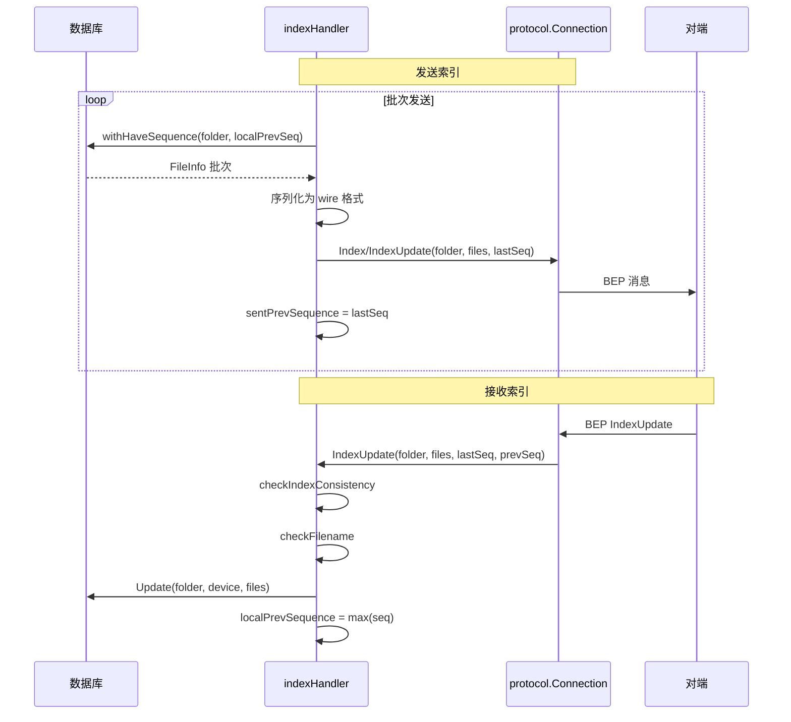
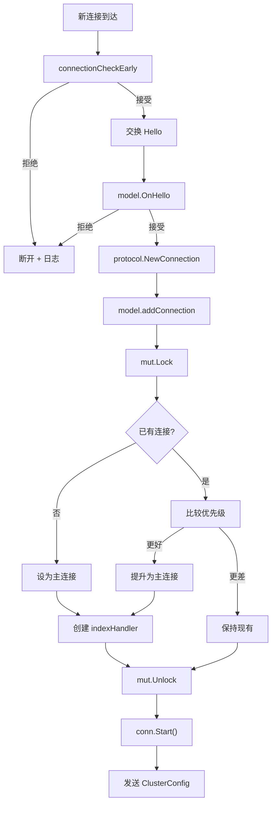
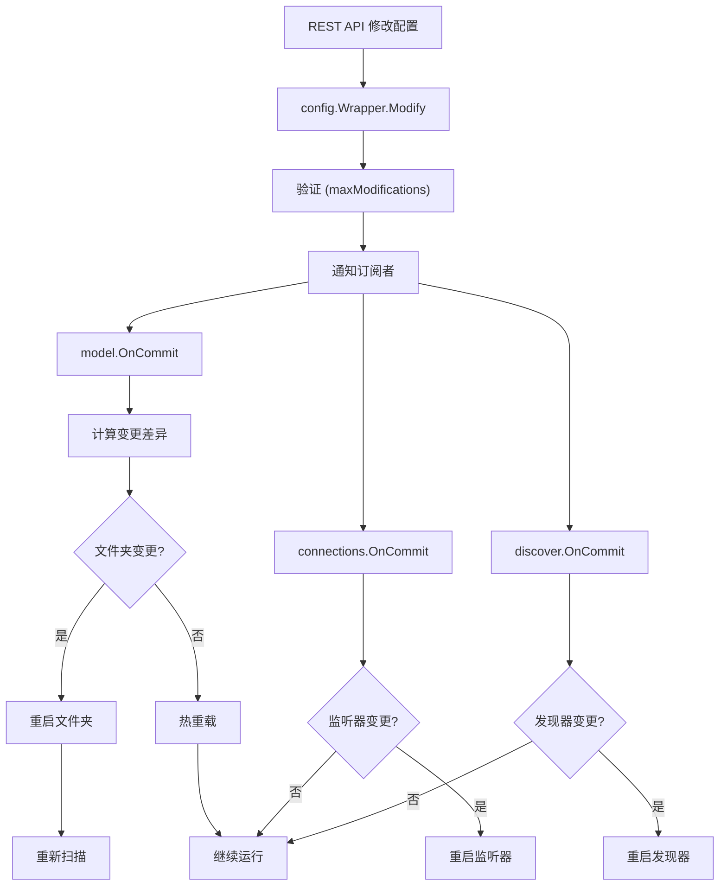
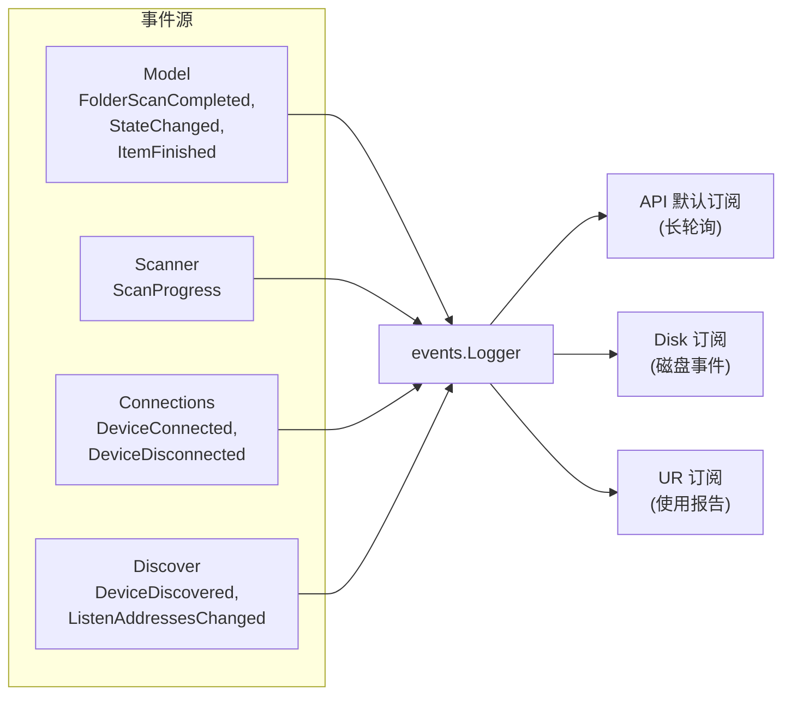
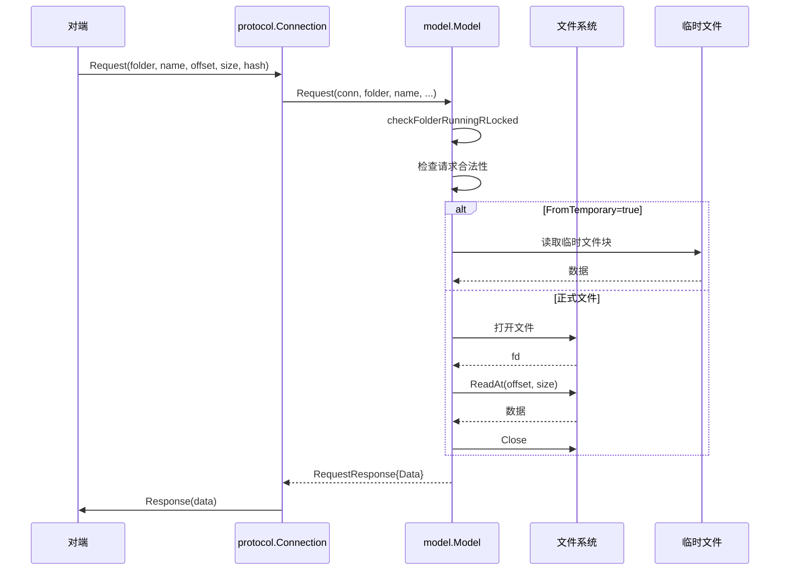
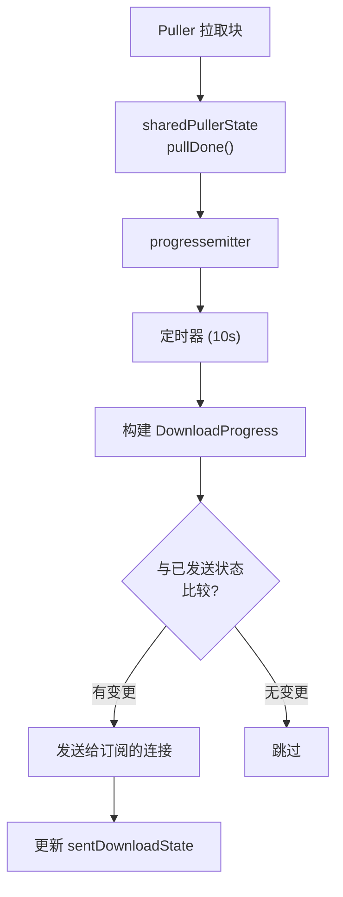

# Model 数据流

## 同步流水线数据流

### 拉取流程数据流

```mermaid
flowchart LR
    DB[("数据库<br/>Need 列表")] --> Pull["pull()"]
    Pull --> Iterate["遍历 Need 文件"]
    Iterate --> CreateState["创建 sharedPullerState"]
    CreateState --> TempFile["创建临时文件<br/>.syncthing.tmp.*"]

    CreateState --> CopierChan["copierChan"]
    CreateState --> PullerChan["pullerChan"]

    subgraph "Copier 阶段"
        CopierChan --> FindLocal["查找本地块"]
        FindLocal --> Origin{"origin 文件<br/>有此块?"}
        Origin -->|是| CopyOrigin["从 origin 复制"]
        Origin -->|否| FindOther["查找其他文件"]
        FindOther --> Found{"找到?"}
        Found -->|是| CopyOther["从其他文件复制"]
        Found -->|否| Skip["跳过(留给 Puller)"]
        CopyOrigin --> CopyDone["copyDone()"]
        CopyOther --> CopyDone
        Skip --> PullerChan
    end

    subgraph "Puller 阶段"
        PullerChan --> SelectDevice["选择设备<br/>(deviceActivity)"]
        SelectDevice --> SendRequest["发送 Request<br/>(block, offset, hash)"]
        SendRequest --> RecvResponse["接收 Response"]
        RecvResponse --> WriteBlock["写入临时文件<br/>(lockedWriterAt)"]
        WriteBlock --> PullDone["pullDone()"]
    end

    CopyDone --> Check{"所有块就绪?"}
    PullDone --> Check
    Check -->|否| Wait["等待"]
    Check -->|是| FinisherChan["finisherChan"]

    subgraph "Finisher 阶段"
        FinisherChan --> FinalClose["finalClose()<br/>SyncClose + fsync"]
        FinalClose --> SyncOwner["syncOwnership<br/>(平台特定)"]
        SyncOwner --> Rename["rename 临时→正式"]
        Rename --> Archive["versioner.Archive<br/>(如果配置)"]
        Archive --> FinisherDone["finisherDone"]
    end

    FinisherDone --> DBUpdateChan["dbUpdaterChan"]

    subgraph "DB Updater 阶段"
        DBUpdateChan --> UpdateDB["更新数据库<br/>(本地 FileInfo)"]
        UpdateDB --> UpdateNeed["更新 Need 标记"]
        UpdateNeed --> NextFile["下一个文件"]
    end
```

### 索引交换数据流

```mermaid
sequenceDiagram
    participant DB as 数据库
    participant IH as indexHandler
    participant Conn as protocol.Connection
    participant Remote as 对端

    Note over IH,Conn: 发送索引
    loop 批次发送
        IH->>DB: withHaveSequence(folder, localPrevSeq)
        DB-->>IH: FileInfo 批次
        IH->>IH: 序列化为 wire 格式
        IH->>Conn: Index/IndexUpdate(folder, files, lastSeq)
        Conn->>Remote: BEP 消息
        IH->>IH: sentPrevSequence = lastSeq
    end

    Note over Remote,IH: 接收索引
    Remote->>Conn: BEP IndexUpdate
    Conn->>IH: IndexUpdate(folder, files, lastSeq, prevSeq)
    IH->>IH: checkIndexConsistency
    IH->>IH: checkFilename
    IH->>DB: Update(folder, device, files)
    IH->>IH: localPrevSequence = max(seq)
```

## 连接管理数据流

```mermaid
flowchart TD
    NewConn["新连接到达"] --> EarlyCheck["connectionCheckEarly"]
    EarlyCheck -->|拒绝| Reject["断开 + 日志"]
    EarlyCheck -->|接受| Hello["交换 Hello"]
    Hello --> OnHello["model.OnHello"]
    OnHello -->|拒绝| Reject
    OnHello -->|接受| CreateProto["protocol.NewConnection"]
    CreateProto --> AddConn["model.addConnection"]
    AddConn --> Lock["mut.Lock"]
    Lock --> CheckExisting{"已有连接?"}
    CheckExisting -->|是| ComparePri["比较优先级"]
    CheckExisting -->|否| SetPrimary["设为主连接"]
    ComparePri -->|更好| Promote["提升为主连接"]
    ComparePri -->|更差| Keep["保持现有"]
    SetPrimary --> CreateIH["创建 indexHandler"]
    Promote --> CreateIH
    CreateIH --> Unlock["mut.Unlock"]
    Unlock --> Start["conn.Start()"]
    Start --> ClusterConfig["发送 ClusterConfig"]
    Keep --> Unlock
```

## 配置变更数据流

```mermaid
flowchart TD
    API["REST API 修改配置"] --> Wrapper["config.Wrapper.Modify"]
    Wrapper --> Validate["验证 (maxModifications)"]
    Validate --> Notify["通知订阅者"]
    Notify --> Model["model.OnCommit"]
    Model --> Diff["计算变更差异"]
    Diff --> FolderChange{"文件夹变更?"}
    FolderChange -->|是| Restart["重启文件夹"]
    FolderChange -->|否| HotReload["热重载"]
    Restart --> ReScan["重新扫描"]
    HotReload --> Continue["继续运行"]
    Notify --> Conn["connections.OnCommit"]
    Conn --> ListenerChange{"监听器变更?"}
    ListenerChange -->|是| RestartListener["重启监听器"]
    ListenerChange -->|否| Continue
    Notify --> Disc["discover.OnCommit"]
    Disc --> FinderChange{"发现器变更?"}
    FinderChange -->|是| RestartFinder["重启发现器"]
    FinderChange -->|否| Continue
```

## 事件数据流

```mermaid
flowchart LR
    subgraph "事件源"
        Model["Model<br/>FolderScanCompleted,<br/>StateChanged,<br/>ItemFinished"]
        Scanner["Scanner<br/>ScanProgress"]
        Conn["Connections<br/>DeviceConnected,<br/>DeviceDisconnected"]
        Disc["Discover<br/>DeviceDiscovered,<br/>ListenAddressesChanged"]
    end

    Model --> Logger["events.Logger"]
    Scanner --> Logger
    Conn --> Logger
    Disc --> Logger

    Logger --> APISub["API 默认订阅<br/>(长轮询)"]
    Logger --> DiskSub["Disk 订阅<br/>(磁盘事件)"]
    Logger --> URSub["UR 订阅<br/>(使用报告)"]
```

## 请求处理数据流

当对端请求块时，Model 的 `Request` 方法被调用：

```mermaid
sequenceDiagram
    participant Remote as 对端
    participant Proto as protocol.Connection
    participant Model as model.Model
    participant FS as 文件系统
    participant Temp as 临时文件

    Remote->>Proto: Request(folder, name, offset, size, hash)
    Proto->>Model: Request(conn, folder, name, ...)

    Model->>Model: checkFolderRunningRLocked
    Model->>Model: 检查请求合法性

    alt FromTemporary=true
        Model->>Temp: 读取临时文件块
        Temp-->>Model: 数据
    else 正式文件
        Model->>FS: 打开文件
        FS-->>Model: fd
        Model->>FS: ReadAt(offset, size)
        FS-->>Model: 数据
        Model->>FS: Close
    end

    Model-->>Proto: RequestResponse{Data}
    Proto->>Remote: Response(data)
```

## 进度报告数据流

```mermaid
flowchart TD
    Puller["Puller 拉取块"] --> SharedState["sharedPullerState<br/>pullDone()"]
    SharedState --> Emitter["progressemitter"]
    Emitter --> Timer["定时器 (10s)"]
    Timer --> BuildUpdate["构建 DownloadProgress"]
    BuildUpdate --> Compare{"与已发送状态<br/>比较?"}
    Compare -->|有变更| Send["发送给订阅的连接"]
    Compare -->|无变更| Skip["跳过"]
    Send --> SentState["更新 sentDownloadState"]
```
