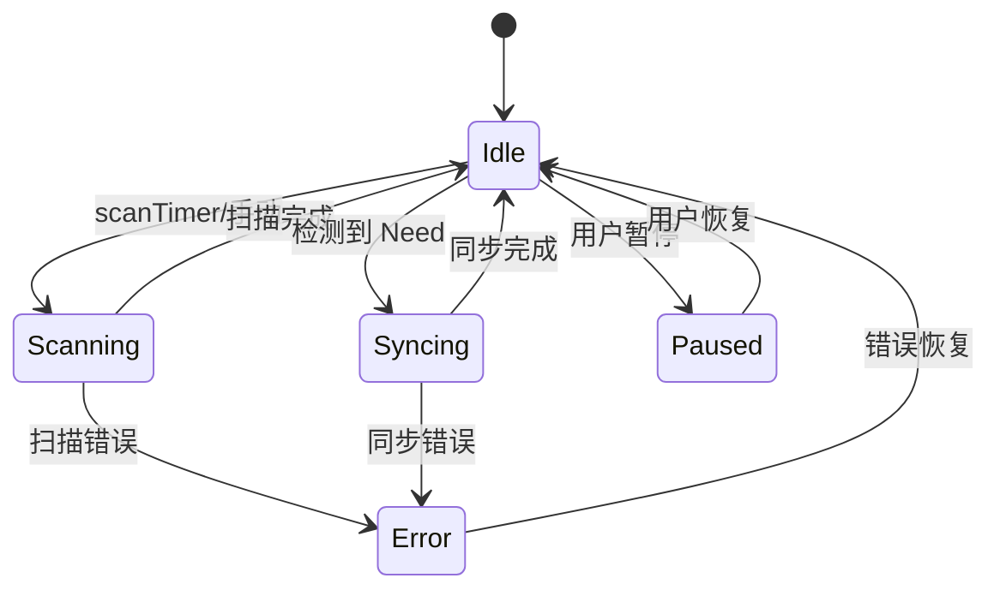

# Model 设计

## 中央协调器设计

### Model 结构体

`model.go` 中的 `model` 结构体是中央协调器，通过 `mut sync.RWMutex` 保护共享状态：

- `deviceConnIDs map[protocol.DeviceID][]connectionID` — 设备到连接的映射
- `folderRunners map[string]*folderRunner` — 文件夹到运行器的映射
- `indexHandlers map[string]map[protocol.DeviceID]*indexHandler` — 索引处理器
- `promotedConnID map[protocol.DeviceID]connectionID` — 已提升的主连接

### 连接管理

每设备可有多个连接（TCP + QUIC + Relay），但只有一个**主连接**（`connIDs[0]`）：

1. 新连接到达时，按优先级决定是否提升为主连接
2. 主连接变更时，重建 `indexHandler`
3. `closeWorsePriorityConnectionsLocked` 关闭优先级更差的连接
4. 连接断开时触发 `dialNow` 信号，鼓励重拨

### 锁策略

**关键设计**：`mut` 锁内**不执行网络操作**，避免死锁。

- 读操作用 `RLock`
- 写操作用 `Lock`
- 网络调用（如 `conn.Index()`）在锁外执行
- 通过快照（copy）方式在锁外传递数据

## 文件夹抽象设计

### folder 结构体

`folder.go` 中的 `folder` 结构体通过**单 goroutine Serve** 串行化所有状态变更：

- 使用 1-buffered channel 实现非阻塞通知
- `scanTimer`、`pullTimer`、`watch` 等事件通过 select 处理
- 状态变更（Idle/Scanning/Syncing/Error）在 Serve 内完成

### 文件夹类型

| 类型 | 文件 | 行为 |
| --- | --- | --- |
| SendReceive | `folder_sendrecv.go` | 双向同步，拉取并应用变更 |
| SendOnly | `folder_sendonly.go` | 只发送，不拉取 |
| ReceiveOnly | `folder_recvonly.go` | 只接收，本地变更标记为 ReceiveOnly |
| ReceiveEncrypted | `folder_recvenc.go` | 接收加密数据，无解密密钥 |

### 状态机

`folderstate.go` 定义文件夹状态：

## 同步流水线设计

### sendReceiveFolder 流水线

`folder_sendrecv.go` 实现四阶段流水线：

1. **Copier**：查找本地可用块（origin 文件或其他文件中的相同块）
2. **Puller**：从远端设备拉取缺失块
3. **Finisher**：组装临时文件，同步关闭，rename 为正式名
4. **DB Updater**：提交文件元数据到数据库

### sharedPullerState 设计

每个正在拉取的文件有一个 `sharedPullerState`（`sharedpullerstate.go`），是流水线各阶段的共享状态：

- **immutable 字段**：文件名、块列表、块大小等（构造后不变）
- **mutable 字段**：`copyNeeded`、`pullNeeded`、`available` 块索引（需锁保护）
- `lockedWriterAt`：支持并发写不同 offset

### 临时文件处理

- 临时文件名：`.syncthing.tmp.<原名>`
- 临时文件默认隐藏（`Hide`），完成时 `Unhide`
- 稀疏文件支持：`Truncate` 创建稀疏文件，减少磁盘占用
- 加密文件需写入 trailer（`writeEncryptionTrailer`）

## 索引处理设计

### indexHandler

`indexhandler.go` 中的 `indexHandler` 管理与单个设备的索引交换：

- **发送**：`withHaveSequence` 从 DB 迭代，批量发送 Index/IndexUpdate
- **接收**：校验一致性后写入 DB
- **序列号跟踪**：`localPrevSequence`（DB 游标）、`sentPrevSequence`（已发送）
- **暂停/恢复**：通过 `cond` 实现暂停时阻塞发送

### IndexID 机制

每个设备对每个文件夹维护一个 `IndexID`（随机 uint64）：
- 重连后对端检查 IndexID 是否匹配
- 不匹配则请求全量 Index
- 匹配则继续发送 IndexUpdate

## 配置提交设计

Model 实现了 `config.Committer` 接口，处理配置变更：

- `OnCommit`：接收配置变更通知
- 检查哪些文件夹/设备变更
- 决定 `requiresRestart`（需重启文件夹）还是热重载
- 文件夹类型不可在 encrypted/非 encrypted 间切换（`VerifyConfiguration`）

## 设计权衡

### 1. 单 goroutine Serve vs 多 goroutine

**选择**：单 goroutine Serve 串行化状态变更。
**权衡**：简化并发控制，但可能成为吞吐瓶颈。通过 1-buffered channel 实现非阻塞通知缓解。

### 2. 网络操作在锁外

**选择**：`mut` 锁内不执行网络调用。
**权衡**：避免死锁，但需要快照数据在锁外传递，增加内存分配。

### 3. 四阶段流水线

**选择**：Copier → Puller → Finisher → DB Updater 分离。
**权衡**：并行化不同阶段，但增加协调复杂度。`sharedPullerState` 是协调中心。

### 4. 每文件独立状态

**选择**：每个拉取文件一个 `sharedPullerState`。
**权衡**：隔离文件间状态，但大量文件时内存开销大。

### 5. 指数退避拉取

**选择**：拉取失败时 `pullPause *= 2`（上限 60x）。
**权衡**：避免频繁重试，但可能延迟恢复。扫描后重置退避。
