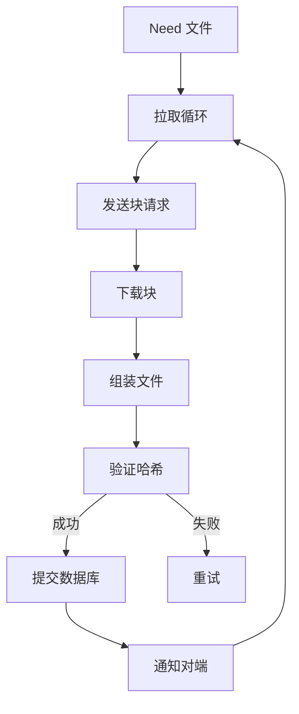

# Model 文件同步深入

## 文件同步流程



## 拉取循环

`lib/model/folder_sendrecv.go` 的 `pull`：

```go
func (f *sendReceiveFolder) pull() {
    // 1. 获取 Need 列表
    need := f.db.GetNeed(f.folder, f.localDeviceID)
    // 2. 排序
    need = f.orderFiles(need)
    // 3. 逐个处理
    for _, file := range need {
        f.pullFile(file)
    }
}
```

## pullFile

```go
func (f *sendReceiveFolder) pullFile(file protocol.FileInfo) {
    // 1. 选择源设备
    source := f.selectSource(file)
    // 2. 检查磁盘空间
    if !f.hasDiskSpace(file.Size) {
        return
    }
    // 3. 下载块
    if file.Type == protocol.FileTypeDirectory {
        f.fs.Mkdir(file.Name)
    } else if file.Type == protocol.FileTypeSymlink {
        f.fs.Symlink(file.SymlinkTarget, file.Name)
    } else {
        f.pullRegularFile(source, file)
    }
    // 4. 更新数据库
    f.db.UpdateLocalFile(f.folder, file)
    // 5. 通知事件
    f.evLogger.Log(events.ItemFinished, ...)
}
```

## pullRegularFile

```go
func (f *sendReceiveFolder) pullRegularFile(source protocol.DeviceID, file protocol.FileInfo) {
    // 1. 创建临时文件
    tempName := ".syncthing." + file.Name + ".tmp"
    fd, _ := f.fs.Create(tempName)

    // 2. 下载所有块
    for _, block := range file.Blocks {
        data := f.requestBlock(source, file.Name, block)
        fd.WriteAt(data, block.Offset)
    }

    // 3. 同步到磁盘
    fd.Sync()
    fd.Close()

    // 4. 验证
    if !f.verifyFile(tempName, file) {
        f.fs.Remove(tempName)
        return
    }

    // 5. 归档旧文件
    if f.versioner != nil {
        f.versioner.Archive(file.Name)
    }

    // 6. 重命名
    f.fs.Rename(tempName, file.Name)

    // 7. 设置权限和时间
    f.fs.Chmod(file.Name, file.Permissions)
    f.fs.Chtimes(file.Name, file.Modified, file.Modified)
}
```

## requestBlock

```go
func (f *sendReceiveFolder) requestBlock(source protocol.DeviceID, name string, block protocol.BlockInfo) []byte {
    // 1. 发送请求
    resp, err := f.conn.Request(source, f.folder, name, block.Offset, block.Size, block.Hash)
    if err != nil {
        return nil
    }
    // 2. 验证响应
    hash := sha256.Sum256(resp.Data)
    if !bytes.Equal(hash[:], block.Hash) {
        return nil
    }
    return resp.Data
}
```

## 源设备选择

```go
func (f *sendReceiveFolder) selectSource(file protocol.FileInfo) protocol.DeviceID {
    // 1. 获取拥有该文件的设备
    devices := f.db.GetDevicesWithFile(f.folder, file.Name)
    // 2. 按连接状态和优先级排序
    // 3. 选择最佳设备
    for _, device := range devices {
        if f.isConnected(device) {
            return device
        }
    }
    return protocol.EmptyDeviceID
}
```

## 冲突检测

`lib/protocol/bep_fileinfo.go` 的 `InConflictWith`：

```go
func (f FileInfo) InConflictWith(previous FileInfo) bool {
    // 1. 若 f.Version >= previous.Version → 非冲突
    if f.Version.GreaterEqual(previous.Version) {
        return false
    }
    // 2. 若任一 BlocksHash 缺失 → 冲突
    if f.BlocksHash == nil || previous.BlocksHash == nil {
        return true
    }
    // 3. 若 f.PreviousBlocksHash == previous.BlocksHash → 非冲突
    if bytes.Equal(f.PreviousBlocksHash, previous.BlocksHash) {
        return false
    }
    // 4. 否则 → 冲突
    return true
}
```

## 冲突文件生成

```go
func (f *sendReceiveFolder) handleConflict(file protocol.FileInfo) {
    // 1. 生成冲突文件名
    conflictName := f.conflictName(file.Name)
    // 2. 重命名本地文件
    f.fs.Rename(file.Name, conflictName)
    // 3. 继续拉取远端版本
    f.pullFile(file)
}
```

冲突文件名格式：`<name>.sync-conflict-<timestamp>-<deviceID>.<ext>`

## 临时文件管理

```go
const tempNamePrefix = ".syncthing."
const tempNameSuffix = ".tmp"
```

- 拉取使用临时文件
- 完成后 `rename` 到目标名
- 失败则删除临时文件
- `keepTemporariesH` 控制保留时间

## 磁盘空间检查

```go
func (f *sendReceiveFolder) hasDiskSpace(size int64) bool {
    usage, _ := f.fs.Usage(".")
    free := usage.Free
    if f.minDiskFree > 0 {
        threshold := int64(f.minDiskFree)
        if free < threshold {
            return false
        }
    }
    return free > size
}
```

## 拉取错误处理

```go
func (f *sendReceiveFolder) handlePullError(file protocol.FileInfo, err error) {
    // 1. 记录错误
    f.pullErrors = append(f.pullErrors, PullError{file.Name, err.Error()})
    // 2. 触发事件
    f.evLogger.Log(events.FolderErrors, ...)
    // 3. 连续错误超过阈值
    if len(f.pullErrors) > maxPullErrors {
        f.pause()
    }
}
```

## 下载进度通知

```go
func (f *sendReceiveFolder) notifyDownloadProgress(name string, blocks []protocol.BlockInfo) {
    // 通知对端正在下载的块
    f.conn.DownloadProgress(f.folder, []protocol.FileDownloadProgressUpdate{
        {Name: name, State: protocol.DownloadProgressUpdateStateDownloadStarted, Blocks: blocks},
    })
}
```

## 文件验证

```go
func (f *sendReceiveFolder) verifyFile(name string, file protocol.FileInfo) bool {
    // 1. 计算文件块哈希
    blocks, _ := scanner.Blocks(f.fs.Open(name), file.BlockSize(), file.Size, nil)
    // 2. 比较块哈希
    for i, block := range blocks {
        if !bytes.Equal(block.Hash, file.Blocks[i].Hash) {
            return false
        }
    }
    return true
}
```
