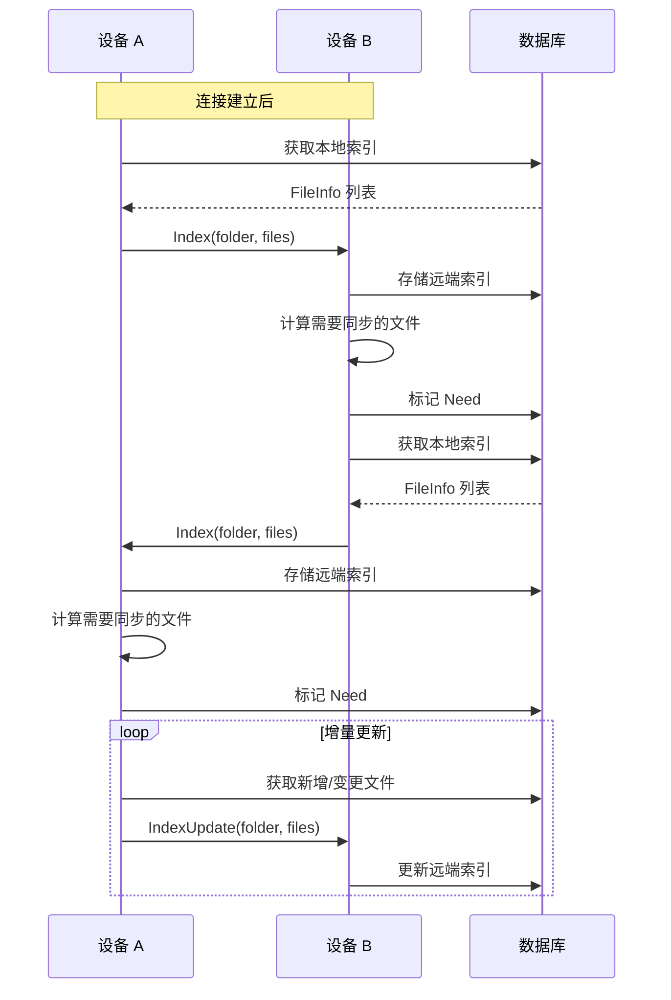

# Model 索引交换深入

## 索引交换流程



## Index 消息处理

`lib/model/model.go` 的 `Index`：

```go
func (m *Model) Index(deviceID protocol.DeviceID, folder string, files []protocol.FileInfo) {
    // 1. 验证设备和文件夹
    // 2. 获取 folderRunner
    // 3. 调用 folderRunner.Index
    m.folderRunners[folder].Index(deviceID, files)
}
```

## folderRunner.Index

`lib/model/folder.go`：

```go
func (f *folderRunner) Index(deviceID protocol.DeviceID, files []protocol.FileInfo) {
    // 1. 更新 IndexID
    // 2. 存储到数据库
    f.db.Update(func(tx Transaction) error {
        for _, file := range files {
            tx.UpdateRemoteFile(deviceID, file)
        }
        return nil
    })
    // 3. 重新计算 Need
    f.recomputeNeed(deviceID)
    // 4. 触发拉取
    f.schedulePull()
}
```

## 增量索引

`lib/model/model.go` 的 `IndexUpdate`：

```go
func (m *Model) IndexUpdate(deviceID protocol.DeviceID, folder string, files []protocol.FileInfo) {
    // 类似 Index，但只处理增量
    m.folderRunners[folder].IndexUpdate(deviceID, files)
}
```

## IndexID

每个设备对每个文件夹维护一个 IndexID：

```go
type IndexID struct {
    ID       uint64
    Sequence int64
}
```

- `ID`：随机生成的索引标识
- `Sequence`：最后发送的序列号

### 增量同步

```go
func (f *folderRunner) sendIndex(deviceID protocol.DeviceID) {
    // 1. 获取对端的 IndexID
    indexID := f.db.GetIndexID(deviceID, f.folder)
    // 2. 获取 sequence 之后的新文件
    files := f.db.GetFiles(f.folder, f.localDeviceID, indexID.Sequence)
    // 3. 发送 Index 或 IndexUpdate
    if indexID.ID == 0 {
        // 全量索引
        conn.Index(f.folder, files)
    } else {
        // 增量索引
        conn.IndexUpdate(f.folder, files)
    }
    // 4. 更新 IndexID
    f.db.SetIndexID(deviceID, f.folder, IndexID{ID: f.myIndexID, Sequence: f.lastSequence})
}
```

## Need 计算

`lib/model/folder_sendrecv.go`：

```go
func (f *sendReceiveFolder) recomputeNeed(deviceID protocol.DeviceID) {
    // 1. 获取远端文件列表
    remoteFiles := f.db.GetFiles(f.folder, deviceID)
    // 2. 对每个文件
    for _, remote := range remoteFiles {
        // 3. 获取本地版本
        local := f.db.GetFile(f.folder, f.localDeviceID, remote.Name)
        // 4. 比较版本
        if remote.Version.GreaterThan(local.Version) {
            // 5. 标记 Need
            f.db.SetNeed(f.folder, f.localDeviceID, remote.Name)
        }
    }
}
```

## 序列号

`sequence` 是文件元数据的单调递增序列号：

- 本地变更时递增
- 用于增量索引
- 存储在数据库 `files.sequence`

## 索引一致性

`lib/protocol/protocol.go` 的 `checkIndexConsistency`：

- 已删除文件不能有 blocks
- 非文件类型不能有 blocks
- 目录 size 只能是 0 或 128
- 符号链接 size 必须为 0
- 非删除、非无效的文件必须有至少一个 block

违反一致性视为协议错误，断开连接。

## 索引发送调度

`lib/model/folder.go`：

```go
func (f *folderRunner) scheduleIndexSend(deviceID protocol.DeviceID) {
    // 1. 检查是否已连接
    // 2. 检查是否已发送全量索引
    // 3. 调度发送
    go f.sendIndex(deviceID)
}
```

## 索引压缩

`lib/protocol/protocol.go`：

- `CompressionMetadata`：仅压缩元数据（默认）
- `CompressionAlways`：压缩所有消息
- `CompressionNever`：不压缩

索引消息通常可压缩（文件名重复）。
