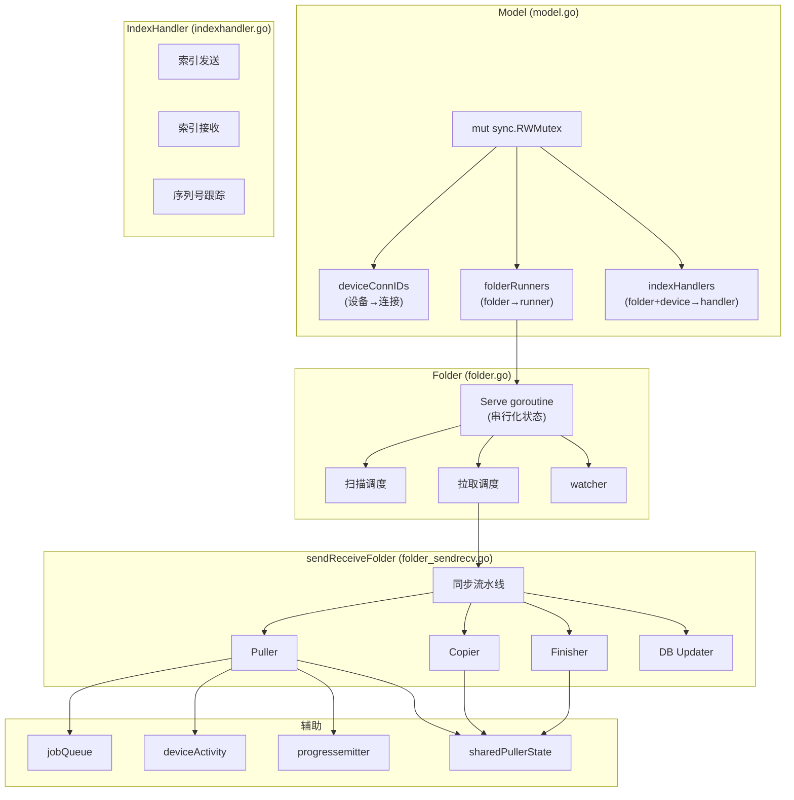

# Model 子系统

## 概述

`lib/model/` 是 Syncthing 的核心同步协调器，约 21035 行 Go 代码，42 个文件。它管理文件夹生命周期、连接路由、索引交换和同步流水线。

## 职责

- **连接管理**：跟踪每设备的多个连接，按优先级提升主连接
- **文件夹生命周期**：管理扫描、同步、暂停、恢复
- **索引路由**：将收到的索引分发到对应的 `indexHandler`
- **请求处理**：响应对端的块请求
- **同步流水线**：编排 copier → puller → finisher → dbUpdater
- **进度报告**：通过 `progressemitter` 发射下载进度

## 架构

## 关键文件

| 文件 | 行数 | 职责 |
| --- | ---: | --- |
| `model.go` | 3486 | 中央协调器，连接管理、索引路由、配置提交 |
| `folder.go` | 1491 | 文件夹抽象，单 goroutine Serve 串行化状态 |
| `folder_sendrecv.go` | 2253 | 发送接收文件夹，同步流水线 |
| `folder_recvonly.go` | ~400 | 只接收文件夹 |
| `folder_sendonly.go` | ~200 | 只发送文件夹 |
| `folder_recvenc.go` | ~300 | 加密接收文件夹 |
| `indexhandler.go` | 687 | 索引发送/接收，序列号跟踪 |
| `sharedpullerstate.go` | 462 | 每文件同步状态 |
| `progressemitter.go` | 340 | 下载进度发射 |
| `deviceactivity.go` | ~200 | 设备负载均衡 |
| `queue.go` | ~150 | 拉取作业队列 |
| `blockpullreorderer.go` | ~150 | 块拉取顺序优化 |
| `folderstate.go` | ~100 | 文件夹状态机 |
| `devicedownloadstate.go` | ~200 | 设备下载状态跟踪 |
| `sentdownloadstate.go` | ~150 | 已发送下载状态 |
| `fileinfobatch.go` | ~150 | 批量索引处理 |
| `service_map.go` | ~120 | 服务管理 |

## 页面导航

- [设计](design.md) — 设计决策、不变量、契约
- [算法](algorithms.md) — 拉取调度、冲突解决、负载均衡
- [数据流](data-flow.md) — 同步流水线数据流
- [失败模式](failure-modes.md) — 错误处理、重试、恢复
- [测试](testing.md) — 测试覆盖和策略
- [维护者笔记](maintainer-notes.md) — 安全编辑点、风险、常见变更

## 核心不变量

1. `deviceConnIDs[deviceID]` 长度 ≥ 1 时，`connIDs[0]` 是主连接
2. `promotedConnID` 与 `connIDs[0]` 一致
3. `indexHandler` 连接 ID 匹配主连接
4. `copyNeeded + pullNeeded == 0` 是 sharedPullerState 完成条件
5. `localPrevSequence` 单调递增（DB 迭代游标）
6. `sentPrevSequence` 单调递增（已发送序列号）
7. folder 类型不可在 encrypted/非 encrypted 间切换
8. Serve goroutine 串行化所有状态变更
9. **网络操作在锁外执行**（避免死锁）
