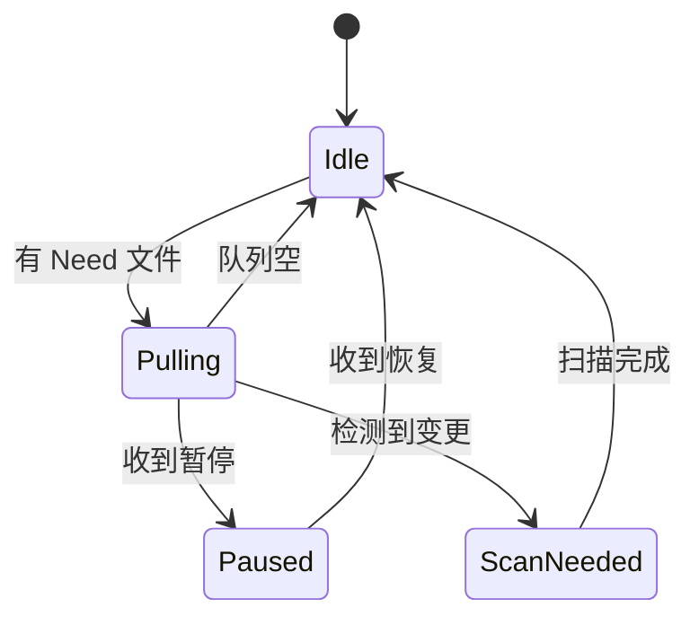

# Model 拉取调度深入

## 拉取队列状态机

`sendReceiveFolder` 的拉取循环维护多个队列：



## 文件排序策略

`lib/model/folder_sendrecv.go` 的 `orderFiles`：

| 策略 | 实现 | 适用场景 |
| --- | --- | --- |
| `random` | `rand.Shuffle` | 默认，避免热点 |
| `alphabetic` | 字符串排序 | 可预测 |
| `smallestFirst` | 按 size 升序 | 快速完成小文件 |
| `largestFirst` | 按 size 降序 | 优先大文件 |
| `oldestFirst` | 按 mtime 升序 | 优先旧文件 |
| `newestFirst` | 按 mtime 降序 | 优先新文件 |

## 块拉取顺序

`lib/model/folder_sendrecv.go` 的 `blockPullOrder`：

| 策略 | 说明 |
| --- | --- |
| `standard` | 从头到尾 |
| `random` | 随机顺序 |
| `fromEnd` | 从末尾开始 |

配置：`Options.BlockPullInitialOrder`

## 并发控制

### 文件级并发

- `Copiers`：并行复制的文件数
- `Pullers`：并行拉取的块数
- 默认 0（自动，基于 CPU 数）

### 块级并发

每个文件的块拉取使用 `Pullers` 个 goroutine：

```go
sem := semaphore.NewSemaphore(pullers)
for _, block := range blocks {
    sem.Acquire(ctx)
    go func() {
        defer sem.Release()
        pullBlock(block)
    }()
}
```

## 拉取失败重试

`lib/model/folder_sendrecv.go`：

1. 块拉取失败，记录错误
2. 文件标记为拉取失败
3. 下次拉取循环重试
4. 连续失败超过阈值，暂停文件夹

## 临时文件

拉取使用临时文件：

1. 下载到 `.syncthing.<name>.tmp`
2. 完成后 `rename` 到目标名
3. 失败则删除临时文件
4. `keepTemporariesH` 控制保留时间

## 磁盘空间检查

`minDiskFree` 配置：

1. 拉取前检查磁盘空间
2. 空间不足则跳过
3. 记录 `diskSpaceMissing` 错误

## 拉取进度通知

通过 `DownloadProgress` 消息通知对端：

```go
model.evLogger.Log(events.DownloadProgress, map[string]interface{}{
    "folder":  folder,
    "device":  deviceID,
    "updates": updates,
})
```

## 冲突文件命名

冲突文件格式：`<name>.sync-conflict-<timestamp>-<deviceID>.<ext>`

- `timestamp`：Unix 时间戳
- `deviceID`：短设备 ID
- 保留原扩展名
