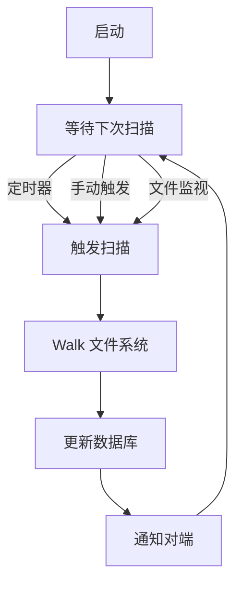

# Model 扫描调度深入

## 扫描调度

`lib/model/folder.go` 的 `scanScheduler`：



## 扫描类型

### 全量扫描

```go
func (f *folderRunner) scan() error {
    // 1. 调用 scanner.Walk
    results := scanner.Walk(f.scanConfig)
    // 2. 处理结果
    for result := range results {
        f.handleScanResult(result)
    }
    return nil
}
```

### 增量扫描

```go
func (f *folderRunner) scanSubs(subs []string) error {
    // 仅扫描指定子路径
    f.scanConfig.Subs = subs
    return f.scan()
}
```

## 扫描间隔

`RescanIntervalS` 配置：

- 默认 3600 秒（1 小时）
- 最小 30 秒
- 0 表示禁用定时扫描

```go
func (f *folderRunner) scanScheduler() {
    interval := time.Duration(f.cfg.RescanIntervalS) * time.Second
    ticker := time.NewTicker(interval)
    for {
        select {
        case <-ticker.C:
            f.scan()
        case subs := <-f.scanNow:
            f.scanSubs(subs)
        case <-f.ctx.Done():
            return
        }
    }
}
```

## 文件系统监视

`FSWatcherEnabled` 配置：

- 实时检测文件变更
- 减少全量扫描需求
- `FSWatcherDelayS` 聚合延迟

```go
func (f *folderRunner) watchScheduler() {
    // 1. 启动 fsnotify watcher
    events, _ := f.fs.Watch(f.folder, f.shouldIgnore, f.ctx)
    // 2. 聚合事件
    var pending []string
    timer := time.NewTimer(f.watchDelay)
    for {
        select {
        case event := <-events:
            pending = append(pending, event.Name)
            timer.Reset(f.watchDelay)
        case <-timer.C:
            // 3. 触发增量扫描
            f.scanSubs(pending)
            pending = nil
        case <-f.ctx.Done():
            return
        }
    }
}
```

## 扫描结果处理

```go
func (f *folderRunner) handleScanResult(result scanner.ScanResult) {
    if result.Error != nil {
        // 记录错误
        f.scanErrors = append(f.scanErrors, ScanError{result.Path, result.Error.Error()})
        return
    }
    // 更新数据库
    f.db.UpdateLocalFile(f.folder, result.File)
    // 触发索引更新
    f.scheduleIndexUpdate(result.File)
}
```

## 索引更新调度

```go
func (f *folderRunner) scheduleIndexUpdate(file protocol.FileInfo) {
    // 1. 添加到待发送队列
    f.pendingUpdates = append(f.pendingUpdates, file)
    // 2. 调度批量发送
    if !f.updateScheduled {
        f.updateScheduled = true
        time.AfterFunc(updateBatchDelay, f.flushUpdates)
    }
}
```

## 批量索引更新

```go
func (f *folderRunner) flushUpdates() {
    f.updateMutex.Lock()
    updates := f.pendingUpdates
    f.pendingUpdates = nil
    f.updateScheduled = false
    f.updateMutex.Unlock()

    // 发送给所有连接的设备
    for _, device := range f.connectedDevices {
        f.conn.IndexUpdate(device, f.folder, updates)
    }
}
```

## 扫描进度

```go
func (f *folderRunner) reportScanProgress(current, total int) {
    f.evLogger.Log(events.FolderScanProgress, map[string]interface{}{
        "folder":  f.folder,
        "current": current,
        "total":   total,
    })
}
```

## 扫描错误

```go
func (f *folderRunner) reportScanErrors() {
    if len(f.scanErrors) > 0 {
        f.evLogger.Log(events.FolderErrors, map[string]interface{}{
            "folder": f.folder,
            "errors": f.scanErrors,
        })
    }
}
```

## 扫描状态

```go
type ScanState int

const (
    ScanIdle ScanState = iota
    ScanRunning
    ScanScheduled
)
```

通过 `events.StateChanged` 事件通知状态变更。

## 暂停时扫描

文件夹暂停时：

- 停止扫描调度
- 完成进行中的扫描
- 保留数据库

## 测试

`lib/model/folder_test.go`：

- 扫描调度测试
- 文件监视测试
- 增量扫描测试
