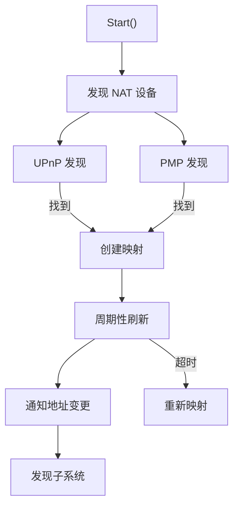

# NAT 穿透深入

## UPnP IGD 协议

`lib/nat/upnp.go`：

### 发现

```http
M-SEARCH * HTTP/1.1
HOST: 239.255.255.250:1900
MAN: "ssdp:discover"
MX: 2
ST: urn:schemas-upnp-org:device:InternetGatewayDevice:1
```

### 获取外部地址

```http
GET /ctrlRoot/IGD/GetExternalIPAddress
SOAPAction: "urn:schemas-upnp-org:service:WANIPConnection:1#GetExternalIPAddress"
```

### 添加端口映射

```http
POST /ctrlRoot/IGD/AddPortMapping
SOAPAction: "urn:schemas-upnp-org:service:WANIPConnection:1#AddPortMapping"

<NewRemoteHost></NewRemoteHost>
<NewExternalPort>22000</NewExternalPort>
<NewProtocol>TCP</NewProtocol>
<NewInternalPort>22000</NewInternalPort>
<NewInternalClient>192.168.1.100</NewInternalClient>
<NewEnabled>1</NewEnabled>
<NewPortMappingDescription>Syncthing</NewPortMappingDescription>
<NewLeaseDuration>3600</NewLeaseDuration>
```

### 删除端口映射

```http
POST /ctrlRoot/IGD/DeletePortMapping
SOAPAction: "urn:schemas-upnp-org:service:WANIPConnection:1#DeletePortMapping"

<NewRemoteHost></NewRemoteHost>
<NewExternalPort>22000</NewExternalPort>
<NewProtocol>TCP</NewProtocol>
```

## NAT-PMP 协议

`lib/nat/pmp.go`：

### 获取外部地址

```
UDP 包到网关:5351
[0x00][0x00][2字节长度]
```

响应：

```
[0x00][版本][2字节结果码][4字节时间戳][4字节外部IP]
```

### 添加端口映射

```
UDP 包到网关:5351
[0x00][0x01][2字节内部端口][2字节外部端口][4字节生命周期]
```

响应：

```
[0x00][版本][2字节结果码][4字节时间戳][2字节内部端口][2字节外部端口][4字节生命周期]
```

## PCP 协议

PCP 是 NAT-PMP 的后继，支持 IPv6：

### 添加端口映射

```
[1字节版本=2][1字节操作码=1][2字节保留][8字节客户端IP]
    [32字节协议数据]
```

## natService 工作流程

`lib/nat/service.go`：



## Mapping 生命周期

```go
type Mapping struct {
    protocol      string
    listenPort    int
    externalPort  int
    address       string
    enabled       bool
    lastSeen      time.Time
}
```

### 创建

1. `NewMapping(protocol, listenPort)`
2. 发现 NAT 设备
3. 创建端口映射
4. 记录外部地址

### 刷新

- `refreshInterval = 5 分钟`
- 续期端口映射
- 更新外部地址

### 删除

- 服务停止时
- 端口变更时
- NAT 设备不可达时

## 地址通知

`RegisterChangedCallback`：

```go
func (s *Service) RegisterChangedCallback(cb func(*Mapping)) {
    s.callbacks = append(s.callbacks, cb)
}
```

映射变更时通知所有回调：

1. 发现子系统更新广播地址
2. 连接服务更新监听地址
3. 全局发现更新注册

## 集成

### 监听器

`lib/connections/tcp_listen.go`：

```go
func (l *tcpListener) Serve(ctx context.Context) {
    // 1. 创建监听
    // 2. 注册 NAT 映射
    // 3. 接受连接
}
```

### 发现

`lib/discover/local.go`：

- 广播包含 NAT 映射的外部地址
- 其他设备可直接连接

## 错误处理

### NAT 设备不可达

- 记录日志
- 重试发现
- 使用中继作为后备

### 映射失败

- 记录日志
- 尝试其他协议
- 使用中继作为后备

### 映射过期

- 周期性刷新
- 检测过期并重新映射

## 测试

`lib/nat/service_test.go`：

- 模拟 NAT 设备
- 映射创建/刷新测试
- 地址通知测试

`lib/nat/upnp_test.go`：

- SSDP 发现测试
- SOAP 请求测试

## 设计权衡

### 多协议支持

**选择**：同时尝试 UPnP、PMP、PCP。
**优势**：兼容各种路由器。
**劣势**：增加网络流量和复杂度。

### 主动映射 vs STUN

**选择**：两者都支持。
**优势**：UPnP 主动映射更可靠；STUN 无需路由器支持。
**劣势**：UPnP 可能被路由器禁用。

### 刷新策略

**选择**：周期性刷新。
**优势**：保持映射有效。
**劣势**：增加网络流量。
