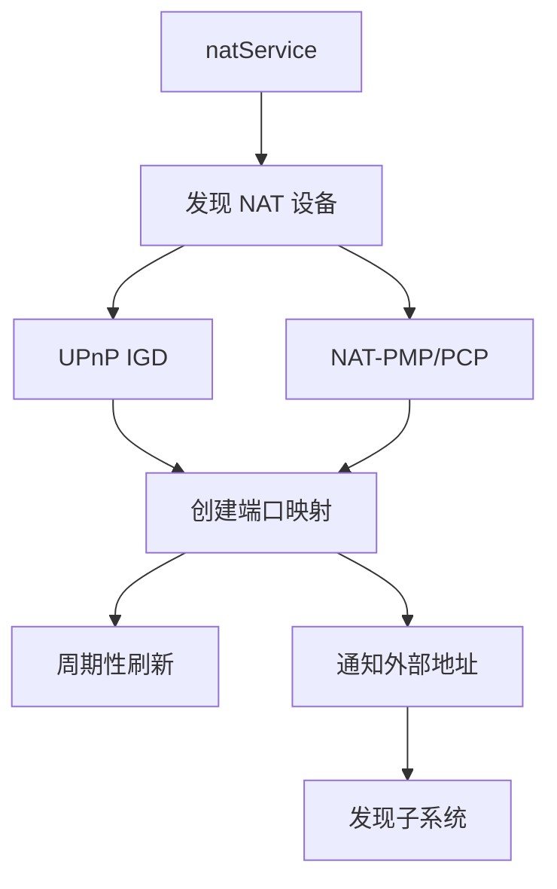

# NAT 穿透子系统

## 概述

`lib/nat/` 实现 NAT 穿透，帮助设备在 NAT 后建立可外部访问的端口映射。支持 UPnP、NAT-PMP 和 PCP 协议。

## 职责

- **端口映射**：通过 UPnP/PMP/PCP 创建端口映射
- **映射维护**：周期性刷新映射
- **地址通知**：将外部地址通知给发现子系统

## 支持的协议

| 协议 | 文件 | 说明 |
| --- | --- | --- |
| UPnP IGD | `upnp.go` | 通用即插即用 |
| NAT-PMP | `pmp.go` | NAT 端口映射协议（Apple） |
| PCP | `pmp.go` | 端口控制协议（PMP 后继） |

## 架构



## natService

`lib/nat/service.go`：

### 工作流程

1. **发现 NAT 设备**：通过 SSDP（UPnP）或广播（PMP）发现网关
2. **创建端口映射**：为监听端口创建外部映射
3. **维护映射**：周期性刷新（避免过期）
4. **通知地址**：将外部地址通知发现子系统

### 关键方法

```go
func (s *Service) Start()
func (s *Service) Stop()
func (s *Service) RegisterChangedCallback(cb func(*Mapping))
func (s *Service) NewMapping(protocol string, listenPort int) *Mapping
```

## Mapping

```go
type Mapping struct {
    protocol      string    // "tcp" 或 "udp"
    listenPort    int       // 内部端口
    externalPort  int       // 外部端口
    address       string    // 外部地址
    enabled       bool
    lastSeen      time.Time
}
```

## UPnP 实现

`lib/nat/upnp.go`：

- SSDP 发现网关
- SOAP 请求创建映射
- 支持 IGDv1 和 IGDv2

## NAT-PMP/PCP 实现

`lib/nat/pmp.go`：

- UDP 广播到网关（5351 端口）
- 简单的二进制协议
- PCP 是 PMP 的后继，支持 IPv6

## 集成

1. `lib/syncthing` 创建 `natService`
2. 监听器注册端口映射
3. 外部地址通知发现子系统
4. 发现子系统广播外部地址

## 配置

| 配置项 | 说明 |
| --- | --- |
| `Options.NATEnabled` | 启用 NAT 穿透 |
| `Options.LocalAnnouncePort` | 本地发现端口 |

## 测试覆盖

`service_test.go`、`upnp_test.go`：

- 模拟 NAT 设备
- 映射创建/刷新测试

## 设计权衡

### 多协议支持

**选择**：同时支持 UPnP、PMP、PCP。
**优势**：兼容各种路由器。
**劣势**：增加复杂度。

### 周期性刷新

**选择**：周期性刷新映射。
**优势**：避免映射过期。
**劣势**：增加网络流量。

### 外部地址通知

**选择**：将外部地址通知发现子系统。
**优势**：其他设备可直接连接。
**劣势**：外部地址可能变化。
