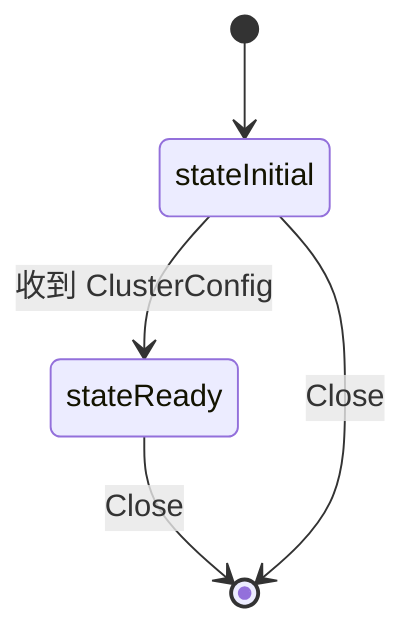

# Protocol 连接与消息路由

## 连接分层

`NewConnection`（`protocol.go:222`）构造一个分层装饰器栈：

```
wireFormatConnection          (最外，对调用者暴露)
  └─ encryptedConnection      (加密文件夹支持)
       └─ rawConnection       (最内，实际协议)
            model 栈:
            connectionWrappingModel (最外)
              └─ nativeModel        (平台路径归一化)
                   └─ encryptedModel (加解密元数据)
                        └─ 用户 Model
```

**分层顺序**（`protocol.go:234-237`）：
- wire format 转换在最外（保证元数据到达加密层时已是 wire 格式）
- encryption/decryption 在 native path 转换之前

## rawConnection 结构

```go
type rawConnection struct {
    ConnectionInfo
    deviceID  DeviceID
    model     rawModel
    cr        *countingReader
    cw        *countingWriter
    closer    io.Closer

    awaitingMut sync.Mutex
    awaiting    map[int]chan asyncResult  // 请求 ID -> 响应通道
    nextID      int
    idxMut      sync.Mutex  // 序列化 Index 调用

    inbox            chan proto.Message    // 无缓冲
    outbox           chan asyncMessage     // 无缓冲
    closeBox         chan asyncMessage     // 无缓冲
    clusterConfigBox chan *ClusterConfig   // 无缓冲
    closed           chan struct{}
    closeOnce        sync.Once
    sendCloseOnce    sync.Once
}
```

**关键设计**：四个独立 channel 解耦读写与控制流。`awaiting` map 实现 request-response 配对。

## 启动与 goroutine

`Start()`（`protocol.go:274`）启动 **5 个 goroutine**：

1. `readerLoop` — 读消息入 `inbox`
2. `dispatcherLoop` — 分发 `inbox` 消息到 model
3. `writerLoop` — 从各 box 取消息写出
4. `pingSender` — 周期性 ping
5. `pingReceiver` — 检测读超时

`startStopMut` 保证 Start/Close 串行化；`started` channel 防止重复启动。

## 状态机

两态状态机（`protocol.go:66-69`）：



**关键不变量**：在 `stateInitial` 状态下，只允许 `ClusterConfig` 消息；任何其他消息类型触发协议错误并断开连接（`protocol.go:461-463`）。

## 读写循环

### readerLoop

循环 `readMessage`，未知消息类型跳过（未来兼容），其他错误调用 `internalClose`。消息通过 `inbox` 传递给 dispatcher。

### dispatcherLoop

核心状态机与分发逻辑（`protocol.go:429-512`）：

1. 检查 `closed`
2. 从 `inbox` 取消息，更新指标
3. **状态机检查**：
   - `ClusterConfig` 在 `stateInitial` 时切换到 `stateReady`
   - `Close` 消息直接返回 `"closed by remote"`
   - 其他消息在非 `stateReady` 时返回协议错误
4. **消息处理**：
   - `ClusterConfig` → `model.ClusterConfig`
   - `Index` → `checkIndexConsistency` + `handleIndex`
   - `IndexUpdate` → `checkIndexConsistency` + `handleIndexUpdate`
   - `Request` → 校验后 **`go c.handleRequest`**（异步避免阻塞）
   - `Response` → `handleResponse`
   - `DownloadProgress` → `model.DownloadProgress`
5. 任何错误经 `newHandleError` 包装后返回，触发 `Close`

### writerLoop

精心设计的优先级选择（`protocol.go:732-785`）：

1. **首条消息**：`clusterConfigBox` 与 `closeBox` 与 `closed` 三选一。保证 ClusterConfig 是第一条发出的消息。
2. **后续循环**：先非阻塞检查 `closeBox`/`closed`（高优先级），再阻塞选择。
3. **背压机制**：所有 channel 无缓冲，发送方阻塞直到对应 loop 取走。

## 消息编解码

### readMessage / readHeader

线格式：`[2字节头长度][Header][4字节消息长度][Message]`

- 头长度为 `int16`（有符号），负值报错
- 消息长度为 `int32`，负值或超过 `MaxMessageLen` 报错
- 使用 `BufferPool.Get/Put` 复用缓冲
- 支持 LZ4 解压

### writeMessage / writeCompressedMessage

- 先序列化消息，若 `shouldCompressMessage` 为真则尝试压缩
- **压缩策略**（`protocol.go:935-952`）：
  - `CompressionNever` — 不压缩
  - `CompressionAlways` — 大于阈值就压缩
  - `CompressionMetadata` — 大于阈值且**非 Response** 才压缩
- **压缩收益门槛**：压缩后大小必须至少节省 3.125%（`n - n/32`），否则放弃压缩
- LZ4 压缩前缀 4 字节存原始大小

## 请求-响应配对

### Request 方法

1. 分配唯一递增 ID（`nextID`），存入 `awaiting` map
2. 发送 wire 请求
3. 阻塞等待 `rc` channel、`ctx.Done()` 或 `closed`

### handleResponse

根据 `resp.ID` 查找 `awaiting`，删除并投递 `asyncResult{Data, codeToError(Code)}`，然后 close channel。

### handleRequest

调用 model.Request；成功则发送带数据的 Response 并等待 `done`（确保数据写出后才 `res.Close()`），失败则发送仅含错误码的 Response。

## 关闭路径

两级关闭（`protocol.go:957-1012`）：

- **`Close(err)`**：发送 `bep.Close` 消息（带 `CloseTimeout` 超时），然后 `go c.internalClose(err)`。用 `sendCloseOnce` 防重入。注释说明用 goroutine 避免从 dispatcherLoop 调用 Close 导致死锁。
- **`internalClose(err)`**：用 `closeOnce` 保证只执行一次。关闭底层连接、`close(c.closed)`、关闭所有 `awaiting` channel、等待 dispatcher 退出、最后调用 `model.Closed(err)`。

## Ping 机制

- **`pingSender`**：每 `PingSendInterval/2` 检查；若距上次写超过 `PingSendInterval/2` 则发 ping。有效 ping 间隔在 `PingSendInterval/2` 到 `PingSendInterval` 之间。
- **`pingReceiver`**：每 `ReceiveTimeout/2` 检查；若距上次读超过 `ReceiveTimeout` 则 `internalClose(ErrTimeout)`。

## 一致性校验

### checkIndexConsistency

对每个 FileInfo 调用 `checkFileInfoConsistency`（`protocol.go:630-657`）：

- 已删除文件不能有 blocks（`errDeletedHasBlocks`）
- 非文件类型不能有 blocks（`errNonFileHasBlocks`）
- 目录 size 只能是 0 或 `deprecatedSyntheticDirectorySize`(128)
- 符号链接 size 必须为 0
- 非删除、非无效的文件必须有至少一个 block（`errFileHasNoBlocks`）

### checkFilename

安全关键，防止路径遍历（`protocol.go:662-686`）：

- `path.Clean(name)` 必须等于原 name
- 禁止 `""`、`.`、`..`
- 禁止以 `/` 开头（folder-relative）
- 禁止以 `../` 开头

违反任何一致性或 filename 规则都视为**协议错误**，断开连接。

## 平台适配

### nativemodel_unix.go

`!windows && !darwin`：直通，wire 格式（NFC + `/`）即本地格式。

### nativemodel_darwin.go

macOS 使用 NFD 归一化。`nativeModel` 装饰 rawModel，在入站方向将文件名转为 NFD。

### nativemodel_windows.go

Windows 使用反斜杠。`fixupFiles`：
- 含 `\` 的条目被丢弃（已删除项静默丢弃，其他记 Error 日志）
- 其余 `filepath.FromSlash` 转换
- `Request` 中含 `\` 直接返回 `ErrNoSuchFile`
