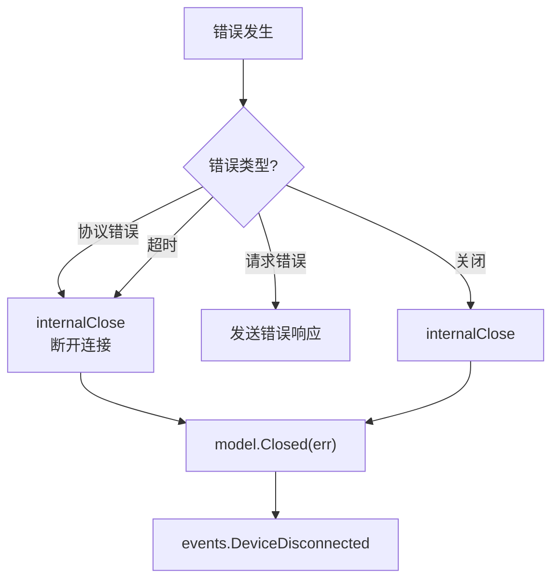

# Protocol 错误处理深入

## 错误类型

`lib/protocol/protocol.go`：

```go
var (
    ErrClosed             = errors.New("connection closed")
    ErrTimeout            = errors.New("read timeout")
    ErrProtocolError      = errors.New("protocol error")
    ErrTooOldVersion      = errors.New("too old protocol version")
    ErrUnknownMagic       = errors.New("unknown hello magic")
    ErrDeviceUnknown      = errors.New("device unknown")
    ErrDeviceIgnored      = errors.New("device ignored")
    ErrDevicePaused       = errors.New("device paused")
    ErrFolderMissing      = errors.New("folder missing")
    ErrFolderPaused       = errors.New("folder paused")
    ErrNoSuchFile         = errors.New("no such file")
    ErrInvalidFile        = errors.New("invalid file")
)
```

## ErrorCode

`lib/protocol/bep_request_response.go`：

```go
type ErrorCode int32

const (
    ErrorCodeNoError     ErrorCode = 0
    ErrorCodeGeneric     ErrorCode = 1
    ErrorCodeNoSuchFile  ErrorCode = 2
    ErrorCodeInvalidFile ErrorCode = 3
    ErrorCodeTimeout     ErrorCode = 4
)

func codeToError(code ErrorCode) error {
    switch code {
    case ErrorCodeNoError:
        return nil
    case ErrorCodeGeneric:
        return errors.New("generic error")
    case ErrorCodeNoSuchFile:
        return ErrNoSuchFile
    case ErrorCodeInvalidFile:
        return ErrInvalidFile
    case ErrorCodeTimeout:
        return ErrTimeout
    default:
        return fmt.Errorf("unknown error code: %d", code)
    }
}
```

## 协议错误处理

### dispatcherLoop 错误

```go
func (c *rawConnection) dispatcherLoop() error {
    for {
        msg, err := c.readMessage()
        if err != nil {
            return newHandleError("read", err, true)  // fatal
        }
        
        if err := c.handleMessage(msg); err != nil {
            return newHandleError("handle", err, true)  // fatal
        }
    }
}
```

### newHandleError

```go
type handleError struct {
    op      string
    err     error
    fatal   bool
}

func (e *handleError) Error() string {
    return fmt.Sprintf("%s: %v", e.op, e.err)
}

func newHandleError(op string, err error, fatal bool) *handleError {
    return &handleError{op, err, fatal}
}
```

## 一致性错误

`checkIndexConsistency` 和 `checkFilename` 的错误视为协议错误：

```go
var (
    errDeletedHasBlocks    = errors.New("deleted file has blocks")
    errNonFileHasBlocks    = errors.New("non-file has blocks")
    errFileHasNoBlocks     = errors.New("file has no blocks")
    errDirectorySize       = errors.New("directory has non-zero size")
    errSymlinkSize         = errors.New("symlink has non-zero size")
    errFilenameEmpty       = errors.New("filename is empty")
    errFilenameDot         = errors.New("filename is .")
    errFilenameDotDot      = errors.New("filename is ..")
    errFilenameAbsolute    = errors.New("filename is absolute")
    errFilenameParentRef   = errors.New("filename contains parent reference")
)
```

这些错误触发 `internalClose`，断开连接。

## 请求错误

### 请求校验

```go
func (c *rawConnection) handleRequest(req *Request) error {
    // 1. 校验请求大小
    if req.Size < 0 || req.Size > MaxRequestSize {
        return ErrProtocolError
    }
    // 2. 校验文件名
    if err := checkFilename(req.Name); err != nil {
        return err
    }
    // 3. 校验文件夹
    if !c.model.HasFolder(req.Folder) {
        return ErrFolderMissing
    }
    // 4. 处理请求
    data, err := c.model.Request(c.deviceID, req.Folder, req.Name, ...)
    if err != nil {
        // 发送错误响应
        c.sendResponse(req.ID, nil, errorToCode(err))
        return nil  // 非致命
    }
    // 5. 发送成功响应
    c.sendResponse(req.ID, data, ErrorCodeNoError)
    return nil
}
```

### errorToCode

```go
func errorToCode(err error) ErrorCode {
    switch {
    case err == nil:
        return ErrorCodeNoError
    case errors.Is(err, ErrNoSuchFile):
        return ErrorCodeNoSuchFile
    case errors.Is(err, ErrInvalidFile):
        return ErrorCodeInvalidFile
    case errors.Is(err, ErrTimeout):
        return ErrorCodeTimeout
    default:
        return ErrorCodeGeneric
    }
}
```

## 关闭错误

### Close

```go
func (c *rawConnection) Close(err error) {
    // 发送 Close 消息
    c.sendClose(err)
    // 内部关闭
    go c.internalClose(err)
}
```

### internalClose

```go
func (c *rawConnection) internalClose(err error) {
    c.closeOnce.Do(func() {
        // 1. 关闭底层连接
        c.closer.Close()
        // 2. 关闭 closed channel
        close(c.closed)
        // 3. 关闭所有 awaiting channel
        c.awaitingMut.Lock()
        for _, ch := range c.awaiting {
            close(ch)
        }
        c.awaiting = nil
        c.awaitingMut.Unlock()
        // 4. 等待 dispatcher 退出
        <-c.dispatcherDone
        // 5. 通知 model
        c.model.Closed(err)
    })
}
```

## 超时错误

### 读超时

```go
func (c *rawConnection) pingReceiver() {
    for {
        select {
        case <-time.After(ReceiveTimeout / 2):
            if time.Since(c.lastRead) > ReceiveTimeout {
                c.internalClose(ErrTimeout)
                return
            }
        case <-c.closed:
            return
        }
    }
}
```

### 请求超时

```go
func (c *rawConnection) Request(ctx context.Context, ...) (ResponseMessage, error) {
    // 1. 注册请求
    rc := make(chan asyncResult, 1)
    c.awaitingMut.Lock()
    c.nextID++
    id := c.nextID
    c.awaiting[id] = rc
    c.awaitingMut.Unlock()
    
    // 2. 发送请求
    c.outbox <- asyncMessage{req, ...}
    
    // 3. 等待响应
    select {
    case res := <-rc:
        return res, res.err
    case <-ctx.Done():
        // 清理
        c.awaitingMut.Lock()
        delete(c.awaiting, id)
        c.awaitingMut.Unlock()
        return nil, ctx.Err()
    case <-c.closed:
        return nil, ErrClosed
    }
}
```

## 错误传播



## 测试

`lib/protocol/protocol_test.go`：

- `TestClose` — 关闭路径
- `TestCloseOnBlockingSend` — 阻塞发送时关闭
- `TestCloseRace` — 并发关闭
- `TestRequestMaxSize` — 请求大小限制
- `TestRequestInvalidFilename` — 文件名校验
