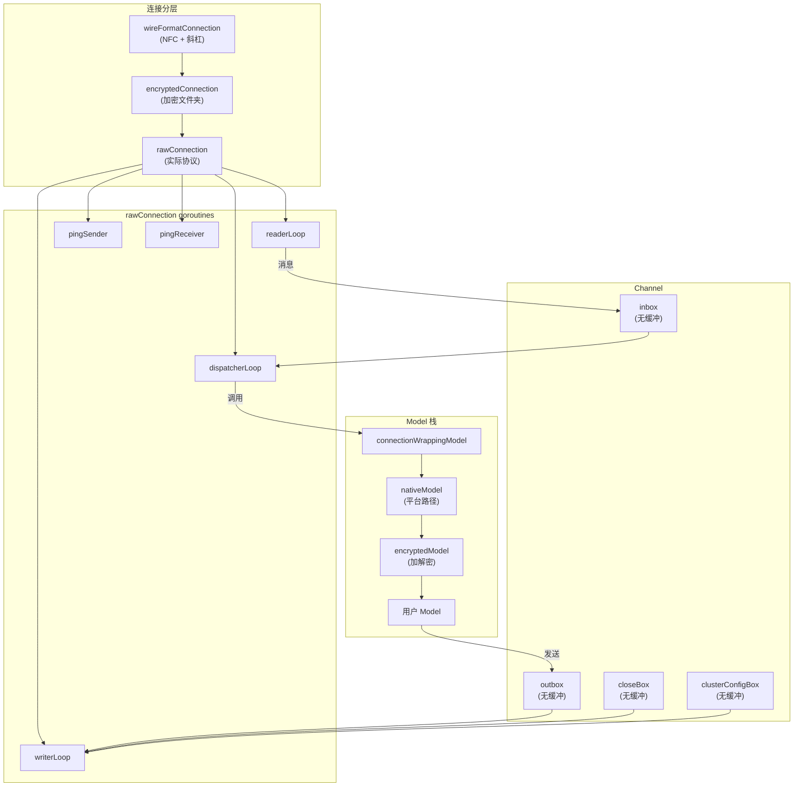

# Protocol 子系统

## 概述

`lib/protocol/` 实现 Syncthing 的 Block Exchange Protocol (BEP)，约 7569 行 Go 代码，35 个文件。配套的 protobuf 定义位于 `proto/bep/bep.proto`（262 行），生成代码在 `internal/gen/bep/bep.pb.go`（2401 行）。

## 职责

- **协议握手**：TLS + Hello 消息交换
- **消息路由**：读写循环、消息分发、状态机
- **数据结构**：FileInfo、BlockInfo、Vector、DeviceID
- **加密支持**：不可信设备场景的端到端加密
- **流控**：无缓冲 channel 背压、压缩、缓冲池

## BEP 协议概览

### 消息类型

| 类型 | 用途 | 方向 |
| --- | --- | --- |
| ClusterConfig | 集群配置（文件夹、设备） | 双向，首条 |
| Index | 全量索引 | 双向 |
| IndexUpdate | 增量索引 | 双向 |
| Request | 块请求 | 双向 |
| Response | 块响应 | 双向 |
| DownloadProgress | 下载进度 | 双向 |
| Ping | 心跳 | 双向 |
| Close | 关闭通知 | 双向 |

### 线格式

```
[2字节 Header 长度][Header proto][4字节 Message 长度][Message proto(可能 LZ4 压缩)]
```

压缩的消息前 4 字节是原始大小（LZ4 格式）。

### 关键常量

| 常量 | 值 | 说明 |
| --- | --- | --- |
| `MaxMessageLen` | 500 MB | 单消息上限 |
| `MinBlockSize` | 128 KiB | 最小块大小 |
| `MaxBlockSize` | 16 MiB | 最大块大小 |
| `MaxRequestSize` | 32 MiB | 单请求上限 |
| `DesiredPerFileBlocks` | 2000 | 每文件目标块数 |
| `PingSendInterval` | 90 秒 | Ping 间隔 |
| `ReceiveTimeout` | 300 秒 | 读超时 |
| `HelloMessageMagic` | `0x2EA7D90B` | 握手魔数 |

## 架构



## 关键文件

| 文件 | 行数 | 职责 |
| --- | ---: | --- |
| `protocol.go` | 1175 | 核心 Connection、握手后消息路由、读写循环 |
| `bep_fileinfo.go` | 929 | FileInfo/BlockInfo/PlatformData 数据结构 |
| `encryption.go` | 698 | 加密文件夹的协议支持 |
| `vector.go` | 329 | 版本向量及比较算法 |
| `bep_clusterconfig.go` | 171 | ClusterConfig 消息映射 |
| `deviceid.go` | 239 | 设备 ID 计算、Luhn 校验、编解码 |
| `bep_hello.go` | 135 | 协议握手 Hello 消息 |
| `bufferpool.go` | 101 | 分级字节缓冲池 |
| `bep_index_updates.go` | 78 | Index/IndexUpdate 消息映射 |
| `bep_request_response.go` | 77 | Request/Response 消息映射 |
| `bep_download_progress.go` | 79 | DownloadProgress 消息映射 |
| `wireformat.go` | 39 | 线格式归一化（NFC + 斜杠） |
| `luhn.go` | 50 | Luhn-32 校验算法 |
| `counting.go` | 68 | 带计数和指标的 io 包装器 |

## 页面导航

- [连接与消息路由](connection.md) — rawConnection、读写循环、状态机
- [版本向量](version-vector.md) — Vector 类型、比较算法、防回拨
- [加密](encryption.md) — 加密文件夹协议支持
- [设备 ID](device-id.md) — 设备 ID 计算、Luhn 校验、编解码
- [测试](testing.md) — 测试覆盖
- [维护者笔记](maintainer-notes.md) — 安全编辑点、风险

## 核心不变量

1. **ClusterConfig 优先**：必须是 `stateReady` 后才能处理其他消息
2. **wire 文件名规范**：NFC + 正斜杠 + folder-relative + 无 `..`
3. **版本向量排序**：`Counters` 按 `ID` 升序
4. **版本向量防回拨**：`Value = max(Value+1, now)`
5. **LocalFlags 不上 wire**：内部状态不通过协议传输
6. **设备 ID = 证书 SHA-256**：32 字节，确定性
7. **加密文件名确定性**：相同 name+folderKey 产生相同密文名
8. **加密块 hash 绑定 offset**：相同数据不同 offset 产生不同密文 hash
9. **Hello 必须带 timestamp**：`h.Timestamp == 0` 时 panic
10. **BufferPool 桶精确**：桶内切片 cap 必须等于对应 BlockSize
