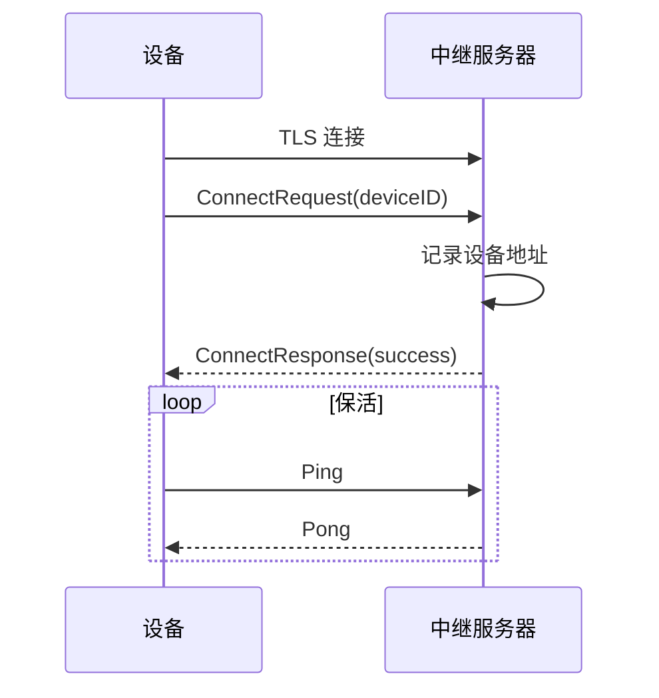
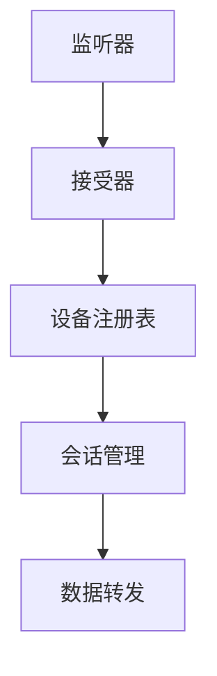

# 中继协议深入

## 中继协议消息

`lib/relay/protocol/protocol.go`：

### 消息头

```
[4字节 magic: 0x9E79BC40][4字节 消息类型][4字节 消息长度]
```

### 消息类型

| 类型 | 值 | 说明 |
| --- | --- | --- |
| `Ping` | 0 | 心跳 |
| `Pong` | 1 | 心跳响应 |
| `JoinSessionRequest` | 2 | 加入会话请求 |
| `JoinSessionResponse` | 3 | 加入会话响应 |
| `ConnectRequest` | 4 | 连接请求 |
| `ConnectResponse` | 5 | 连接响应 |
| `SessionInvitation` | 6 | 会话邀请 |

## 客户端注册流程



## 会话邀请流程

```mermaid
sequenceDiagram
    participant A as 设备 A
    participant Relay as 中继服务器
    participant B as 设备 B

    A->>Relay: 注册
    B->>Relay: 注册

    B->>Relay: 查询 A 的邀请
    Relay-->>B: SessionInvitation(A, token)

    B->>Relay: JoinSessionRequest(token)
    Relay->>A: 通知有设备加入
    A->>Relay: JoinSessionRequest(token)

    Relay->>Relay: 配对 A 和 B
    Relay-->>A: JoinSessionResponse(success)
    Relay-->>B: JoinSessionResponse(success)

    A<-->Relay<-->B: 数据转发
```

## 中继服务器

`cmd/strelaysrv/`：

### 架构



### 配置

| 参数 | 默认值 | 说明 |
| --- | --- | --- |
| `--listen` | `:22067` | 监听地址 |
| `--token` | (空) | 认证令牌 |
| `--global-rate` | 0 | 全局限速（bytes/s） |
| `--per-session-rate` | 0 | 每会话限速 |
| `--provided-by` | (空) | 提供者信息 |
| `--status-srv` | `:22070` | 状态服务端口 |

### 限速

```go
type rateLimiter struct {
    global    *rate.Limiter
    perSession *rate.Limiter
}
```

- 全局限速：所有会话共享
- 每会话限速：单会话限制

### 状态服务

`cmd/strelaysrv/status.go`：

```http
GET http://relay:22070/status
```

响应：

```json
{
    "uptime": 3600,
    "numSessions": 10,
    "numClients": 20,
    "bytesProxied": 123456789,
    "goVersion": "1.26.2"
}
```

## 中继池

`cmd/strelaypoolsrv/`：

- 中继池服务器
- 跟踪多个中继服务器的状态
- 客户端查询池获取可用中继

### 池查询

```http
GET https://relays.syncthing.net/endpoint
```

响应：

```json
{
    "relays": [
        {
            "url": "relay://1.2.3.4:22067",
            "stats": {
                "numSessions": 10,
                "uptime": 3600
            }
        }
    ]
}
```

## 客户端集成

`lib/relay/client/client.go`：

### GetInvitationFromRelay

```go
func GetInvitationFromRelay(ctx context.Context, relayAddr string, deviceID protocol.DeviceID, cert tls.Certificate) (Invitation, error) {
    // 1. 连接中继服务器
    // 2. TLS 握手
    // 3. 发送查询请求
    // 4. 接收邀请
    return invitation, nil
}
```

### JoinSession

```go
func JoinSession(ctx context.Context, addr string, id protocol.DeviceID, cert tls.Certificate, invitation Invitation) (net.Conn, error) {
    // 1. 连接中继服务器
    // 2. TLS 握手
    // 3. 发送 JoinSessionRequest
    // 4. 等待配对
    // 5. 返回转发的连接
    return conn, nil
}
```

## 连接子系统集成

`lib/connections/relay_dial.go`：

```go
func (d *relayDialer) Dial(ctx context.Context, id protocol.DeviceID, addr string) (internalConn, error) {
    // 1. 解析中继地址
    // 2. GetInvitationFromRelay
    // 3. JoinSession
    // 4. 包装为 internalConn
    return conn, nil
}
```

`lib/connections/relay_listen.go`：

```go
func (l *relayListener) Serve(ctx context.Context) {
    // 1. 创建 relay.Client
    // 2. 注册到中继服务器
    // 3. 接收 SessionInvitation
    // 4. JoinSession
    // 5. 投递连接到 conns channel
}
```

## 安全考虑

### TLS 加密

- 中继连接使用 TLS
- 设备 ID 自验证
- 中继服务器无法解密数据

### 令牌认证

- 会话邀请包含令牌
- 令牌由中继服务器生成
- 防止未授权加入

### 限速

- 防止滥用
- 全局和每会话限速

## 测试

`lib/relay/client/client_test.go`：

- 协议消息测试
- 连接测试

`lib/relay/protocol/protocol_test.go`：

- 序列化测试
- 消息往返测试
