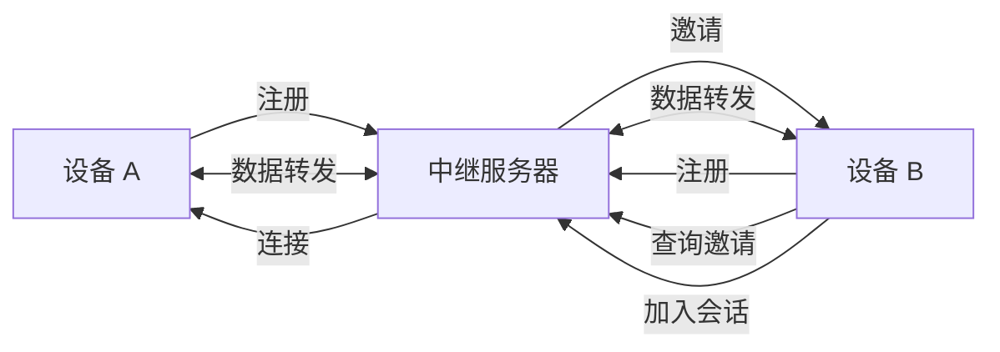

# 中继子系统

## 概述

`lib/relay/` 实现中继连接支持，当设备无法直接连接时，通过中继服务器转发流量。中继服务器代码在 `cmd/strelaysrv/`。

## 职责

- **中继客户端**：连接中继服务器，转发流量
- **中继服务器**：接受客户端注册，转发邀请
- **协议**：中继协议（基于 TLS）

## 架构



## 关键文件

| 文件 | 位置 | 职责 |
| --- | --- | --- |
| `client.go` | `lib/relay/client/` | 中继客户端 |
| `server.go` | `cmd/strelaysrv/` | 中继服务器 |
| `protocol.go` | `lib/relay/protocol/` | 中继协议 |

## 中继客户端

`lib/relay/client/client.go`：

### JoinSession

```go
func JoinSession(ctx context.Context, addr string, id protocol.DeviceID, cert tls.Certificate, ...) (net.Conn, error)
```

1. 连接中继服务器
2. TLS 握手
3. 发送 JoinSession 请求
4. 等待服务器连接对端
5. 返回转发的连接

### GetInvitationFromRelay

```go
func GetInvitationFromRelay(ctx context.Context, relayAddr string, deviceID protocol.DeviceID, cert tls.Certificate) (Invitation, error)
```

1. 连接中继服务器
2. 查询目标设备的邀请
3. 返回邀请（包含会话信息）

## 中继协议

`lib/relay/protocol/protocol.go`：

### 消息类型

| 类型 | 说明 |
| --- | --- |
| `Connect` | 连接请求 |
| `SessionInvitation` | 会话邀请 |
| `JoinSession` | 加入会话 |
| `Response` | 响应 |

### 线格式

```
[4字节 magic][4字节 消息类型][4字节 消息长度][消息体]
```

magic = `0x9E79BC40`

## 中继服务器

`cmd/strelaysrv/`：

### 职责

- 接受客户端注册
- 维护设备到会话的映射
- 转发会话邀请
- 转发数据

### 配置

| 参数 | 说明 |
| --- | --- |
| `--listen` | 监听地址 |
| `--token` | 认证令牌 |
| `--global-rate` | 全局限速 |
| `--per-session-rate` | 每会话限速 |
| `--provided-by` | 提供者信息 |

## 集成

中继在连接子系统中作为最后手段：

1. `relay_dial.go` 实现中继拨号
2. `relay_listen.go` 实现中继监听
3. 优先级最低（仅在直接连接失败时使用）

## 配置

| 配置项 | 说明 |
| --- | --- |
| `Options.RelayEnabled` | 启用中继 |
| `Folder.Devices[].RelayAddr` | 设备的中继地址 |
| `Options.RelayServers` | 中继服务器列表 |

## 默认中继服务器

- `relay://23.92.52.42:22067`
- `relay://37.187.118.237:22067`
- `relay://38.87.162.221:22067`

## 测试覆盖

`client_test.go`、`protocol_test.go`：

- 协议消息序列化
- 客户端连接测试

## 设计权衡

### 中继 vs 直接连接

**选择**：中继作为最后手段。
**优势**：穿透 NAT，无需端口转发。
**劣势**：增加延迟，依赖中继服务器，服务器可能成为瓶颈。

### 服务器列表

**选择**：多个默认中继服务器。
**优势**：冗余，避免单点故障。
**劣势**：社区维护的服务器可能不可靠。
