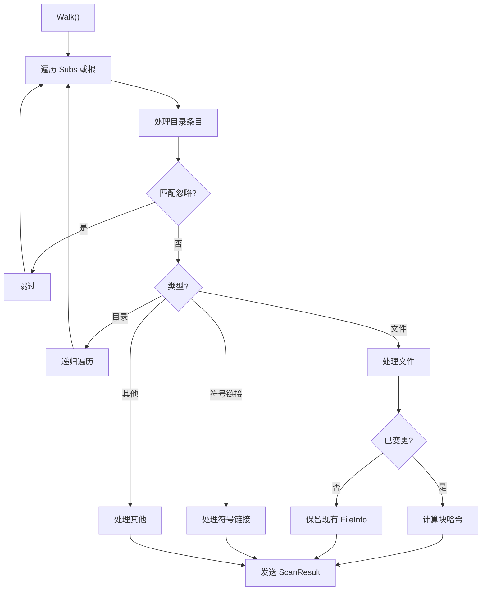
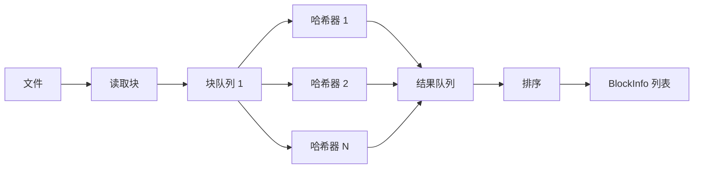

# 扫描器深入

## Walk 详细流程

`lib/scanner/walk.go` 的 `Walk()`：



## 文件变更检测

`Walk` 对比现有 FileInfo 和文件系统状态：

```go
func shouldHash(cur protocol.FileInfo, fi fs.FileInfo) bool {
    // mtime 变化
    if cur.Modified != fi.ModTime() {
        return true
    }
    // size 变化
    if cur.Size != fi.Size() {
        return true
    }
    // 权限位变化（如未忽略权限）
    if !ignorePerms && cur.Permissions != uint32(fi.Mode()) {
        return true
    }
    return false
}
```

## 块大小选择

`lib/scanner/blocks.go`：

```go
func blockSize(fileSize int64, cfg Config) int {
    if cfg.UseLargeBlocks {
        // 大块模式：根据文件大小动态调整
        blockSize := protocol.BlockSize(fileSize)
        if cfg.PerFileBlocksize {
            blockSize = clamp(blockSize, cfg.MinFileBlocksize, cfg.MaxFileBlocksize)
        }
        return blockSize
    }
    return protocol.MinBlockSize  // 128KB
}
```

`protocol.BlockSize(fileSize)`：

```go
func BlockSize(fileSize int64) int {
    // 目标：每文件约 2000 块
    blockSize := fileSize / DesiredPerFileBlocks
    // 限制在 [MinBlockSize, MaxBlockSize]
    return clamp(blockSize, MinBlockSize, MaxBlockSize)
}
```

## 并行哈希架构

`lib/scanner/blockqueue.go`：



### HashFile 实现

```go
func HashFile(ctx context.Context, tfs fs.Filesystem, name string, blockSize int, ...) ([]protocol.BlockInfo, error) {
    // 1. 打开文件
    f, _ := tfs.Open(name)

    // 2. 创建并行哈希器
    hasher := newParallelHasher(f, blockSize, hashers)

    // 3. 读取并哈希所有块
    var blocks []protocol.BlockInfo
    for {
        block, err := hasher.Next()
        if err == io.EOF {
            break
        }
        blocks = append(blocks, block)
    }

    return blocks, nil
}
```

## BufferPool

`lib/scanner/blocks.go`：

```go
var bufPool = sync.Pool{
    New: func() interface{} {
        return make([]byte, BlockSize)
    },
}
```

- 复用块缓冲，减少 GC
- `Get()` 获取缓冲
- `Put()` 归还缓冲

## HashPool

```go
var hashPool = sync.Pool{
    New: func() interface{} {
        return sha256.New()
    },
}
```

- 复用 SHA-256 哈希器
- `Reset()` 重置状态

## Progress 报告

`lib/scanner/walk.go`：

```go
type Progress struct {
    ...
}

func (p *Progress) Done(name string) {
    // 报告完成
}

func (p *Progress) Add(name string, size int64) {
    // 添加待处理
}
```

通过 `events.FolderScanProgress` 事件通知 UI。

## 临时文件处理

`TempLifetime` 配置：

- 扫描时检测 `.syncthing.*.tmp` 临时文件
- 超过 `TempLifetime` 的临时文件被清理
- 默认 24 小时

## 符号链接处理

`Walk` 对符号链接：

1. `Lstat` 获取链接信息
2. `ReadSymlink` 读取目标
3. 创建 FileInfo，type = `FileTypeSymlink`
4. 不递归跟随符号链接

## 错误处理

`Walk` 的错误容忍：

- 单个文件错误不中断扫描
- 错误记录到 `ScanResult.Error`
- 通过 `events.FolderErrors` 事件通知

## WalkPool 并行控制

`WalkPool` 限制并行扫描的 folder 数量：

```go
type WalkPool struct {
    sem chan struct{}
}

func (p *WalkPool) Acquire() {
    p.sem <- struct{}{}
}

func (p *WalkPool) Release() {
    <-p.sem
}
```

避免同时扫描过多 folder 导致资源耗尽。
